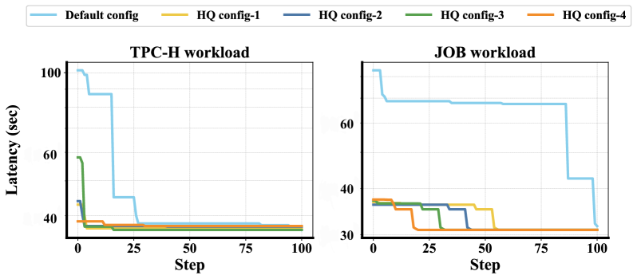
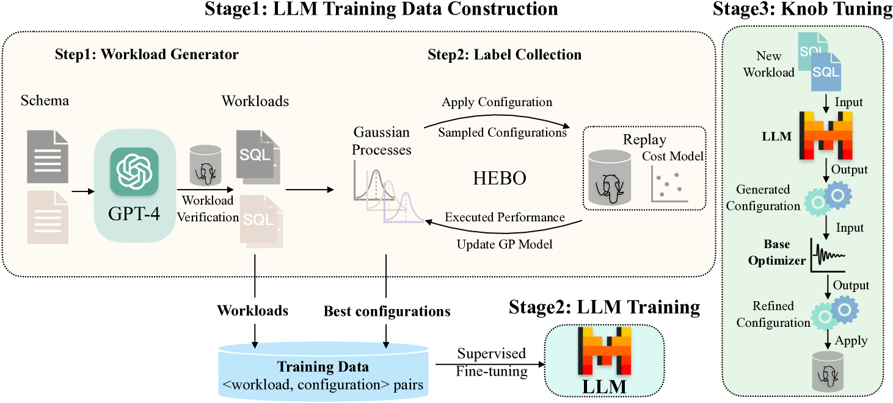

# LLMTune：借助大型语言模型，让数据库参数调优更高效。

发布时间：2024年04月17日

`LLM应用` `数据库管理` `机器学习`

> LLMTune: Accelerate Database Knob Tuning with Large Language Models

# 摘要

> 数据库参数优化在数据库领域是一项至关重要的挑战，目的在于调整参数以提升数据库在特定工作负载下的表现。DBMS 常备有数百个可调节参数，这对 DBA 来说是个不小的挑战，他们需要为这些参数找到最优设置。为了简化这一过程，众多基于机器学习的自动调优方法应运而生。然而，这些方法在实际应用中遇到了新难题：为了达到理想的性能，它们通常需要对工作负载进行多次运行，这一过程既耗时又耗费资源。这种低效主要是因为最优配置与默认设置往往相去甚远，需要在调优过程中进行多轮迭代。针对这一问题，我们提出了一个观点：一个高效的起始点可以显著减少在低效区域的无效探索，从而可能显著加快调优过程。基于此，我们推出了 LLMTune，这是一个基于大型语言模型的配置生成器，它能够为新工作负载生成一个高质量的初始配置。这些配置随后可以作为各种基础优化器的起点，以加速它们的调优流程。为了训练 LLMTune 的监督微调，我们开发了一个新的自动化数据生成框架，它能够高效地产生大量的工作负载与配置配对。我们通过一系列严格的实验，评估了 LLMTune 在不同工作负载（如 TPC-H 和 JOB）下的表现，并与当前领先的调优方法进行了比较。结果表明，LLMTune 在识别更优配置方面展现出更快的速度。以 TPC-H 这一具有挑战性的工作负载为例，LLMTune 在寻找最佳配置时的速度提升了惊人的 15.6 倍。

> Database knob tuning is a critical challenge in the database community, aiming to optimize knob values to enhance database performance for specific workloads. DBMS often feature hundreds of tunable knobs, posing a significant challenge for DBAs to recommend optimal configurations. Consequently, many machine learning-based tuning methods have been developed to automate this process. Despite the introduction of various optimizers, practical applications have unveiled a new problem: they typically require numerous workload runs to achieve satisfactory performance, a process that is both time-consuming and resource-intensive. This inefficiency largely stems from the optimal configuration often being substantially different from the default setting, necessitating multiple iterations during tuning. Recognizing this, we argue that an effective starting point could significantly reduce redundant exploration in less efficient areas, thereby potentially speeding up the tuning process for the optimizers. Based on this assumption, we introduce LLMTune, a large language model-based configuration generator designed to produce an initial, high-quality configuration for new workloads. These generated configurations can then serve as starting points for various base optimizers, accelerating their tuning processes. To obtain training data for LLMTune's supervised fine-tuning, we have devised a new automatic data generation framework capable of efficiently creating a large number of <workload, configuration> pairs. We have conducted thorough experiments to evaluate LLMTune's effectiveness with different workloads, such as TPC-H and JOB. In comparison to leading methods, LLMTune demonstrates a quicker ability to identify superior configurations. For instance, with the challenging TPC-H workload, our LLMTune achieves a significant 15.6x speed-up ratio in finding the best-performing configurations.

[Arxiv](https://arxiv.org/abs/2404.11581)