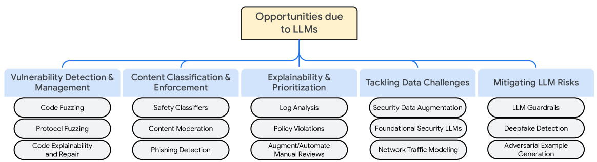

# 大型语言模型（LLM）在网络安全领域的应用：开启新机遇

发布时间：2024年04月17日

`LLM应用` `网络安全`

> LLMs for Cyber Security: New Opportunities

# 摘要

> 大型语言模型（LLMs）以其强大和多功能性，为众多行业带来了福音。随着这些模型的兴起，我们对网络安全领域进行了新的探索，深入挖掘并概述了 LLMs 在应对该领域中的复杂问题方面的潜在价值。

> Large language models (LLMs) are a class of powerful and versatile models that are beneficial to many industries. With the emergence of LLMs, we take a fresh look at cyber security, specifically exploring and summarizing the potential of LLMs in addressing challenging problems in the security and safety domains.

[Arxiv](https://arxiv.org/abs/2404.11338)