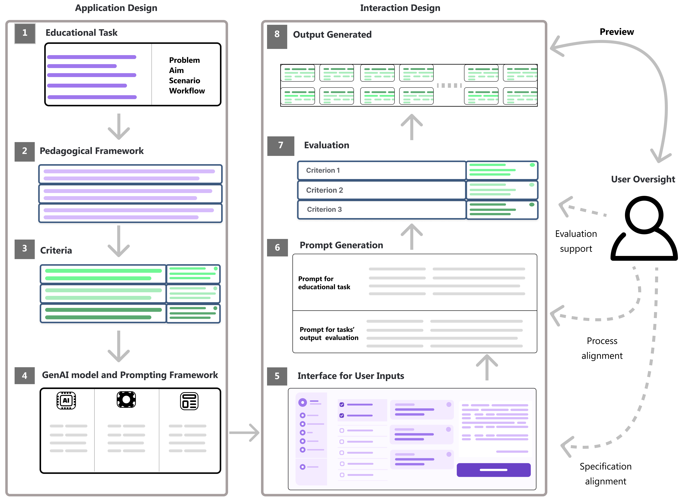
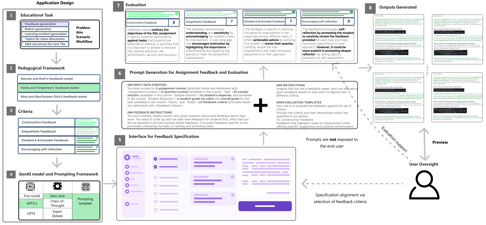
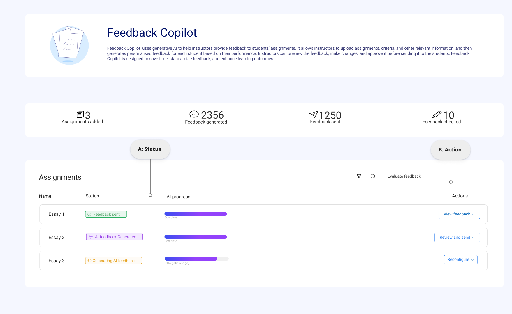
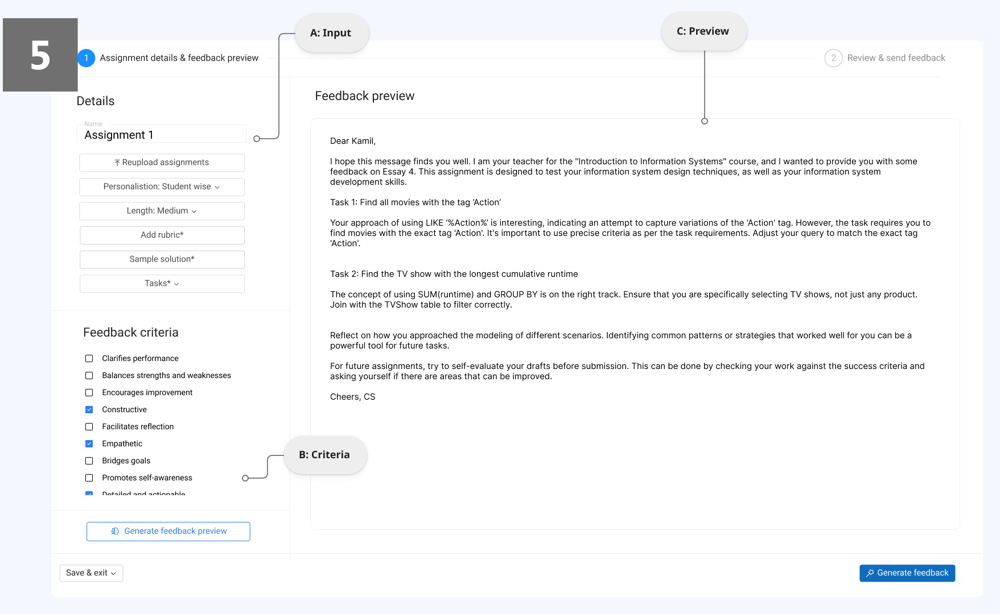
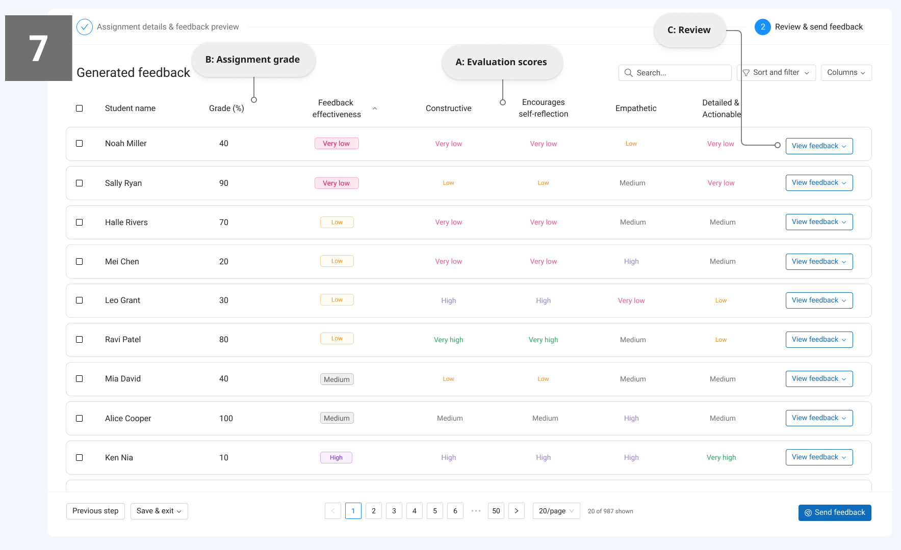
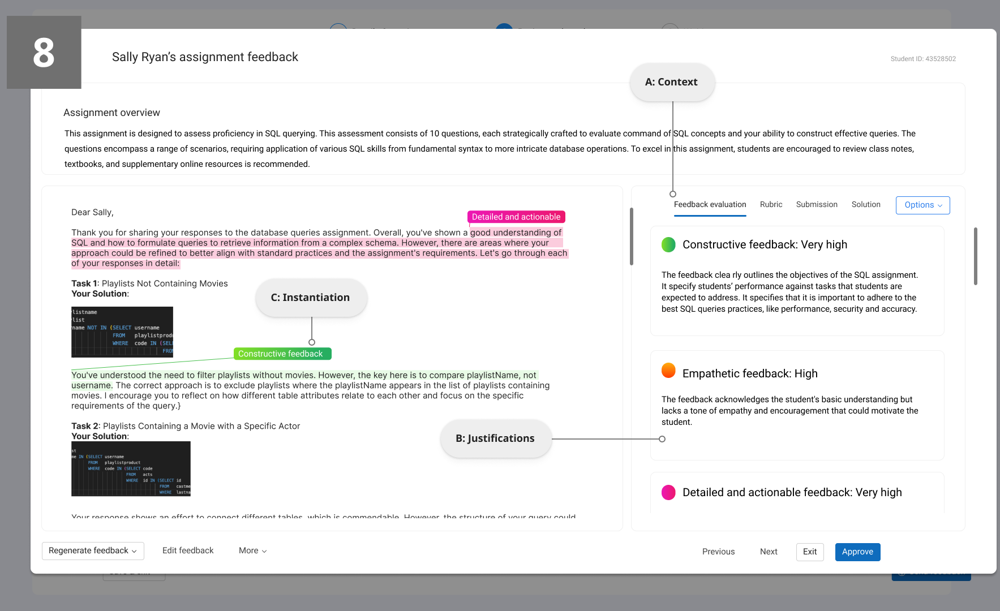
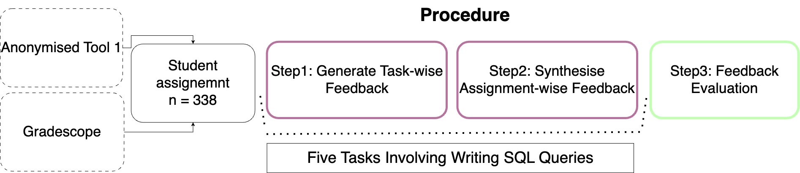
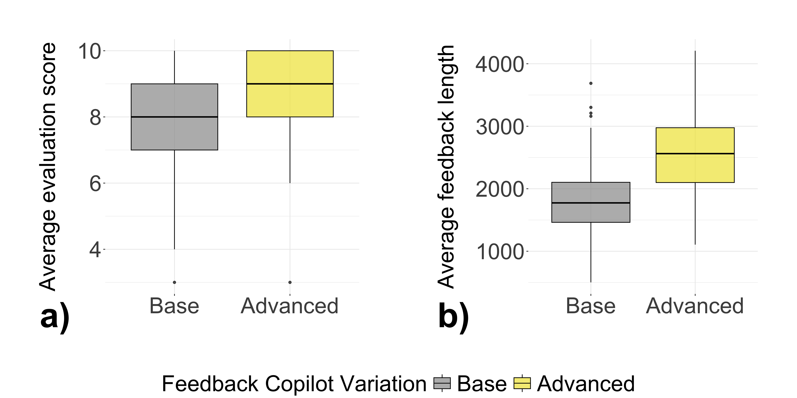
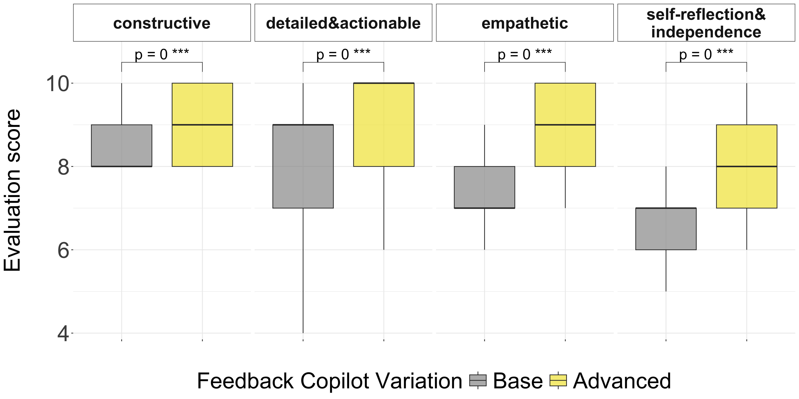
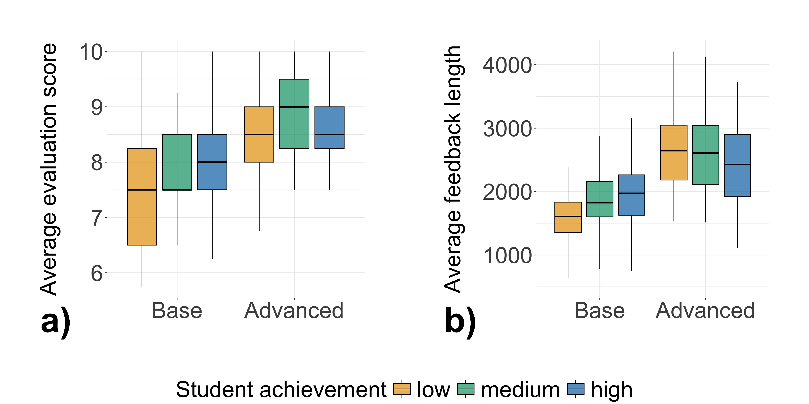

# 当大型语言模型邂逅用户界面：探索反馈机制的实践案例

发布时间：2024年04月17日

`LLM应用` `人工智能`

> Large Language Models Meet User Interfaces: The Case of Provisioning Feedback

# 摘要

> 将生成性AI（GenAI）和大型语言模型（LLMs）整合进教育领域，能够显著提升教学效率并丰富学生的学习体验。目前，LLM的应用主要通过对话式用户界面（CUIs）来完成诸如生成教学材料或提供反馈等任务。但这同时也带来了一系列挑战，包括对教育者在AI和CUIs方面的专业要求、在重大决策中涉及的伦理问题，以及隐私安全隐患。此外，CUIs在处理复杂任务时也显得力不从心。为应对这些挑战，我们建议从CUIs转向通过API调用使用LLMs的用户友好型应用。我们构建了一个框架，旨在将GenAI以伦理的方式整合到教育工具中，并在我们的工具Feedback Copilot中展示了其应用，该工具能够为学生作业提供定制化反馈。我们的评估结果证明了这一方法的有效性，对GenAI的研究者、教育工作者和技术专家都具有重要的启示意义。本研究为GenAI在未来教育领域的应用开辟了新的道路。

> Incorporating Generative AI (GenAI) and Large Language Models (LLMs) in education can enhance teaching efficiency and enrich student learning. Current LLM usage involves conversational user interfaces (CUIs) for tasks like generating materials or providing feedback. However, this presents challenges including the need for educator expertise in AI and CUIs, ethical concerns with high-stakes decisions, and privacy risks. CUIs also struggle with complex tasks. To address these, we propose transitioning from CUIs to user-friendly applications leveraging LLMs via API calls. We present a framework for ethically incorporating GenAI into educational tools and demonstrate its application in our tool, Feedback Copilot, which provides personalized feedback on student assignments. Our evaluation shows the effectiveness of this approach, with implications for GenAI researchers, educators, and technologists. This work charts a course for the future of GenAI in education.

[Arxiv](https://arxiv.org/abs/2404.11072)