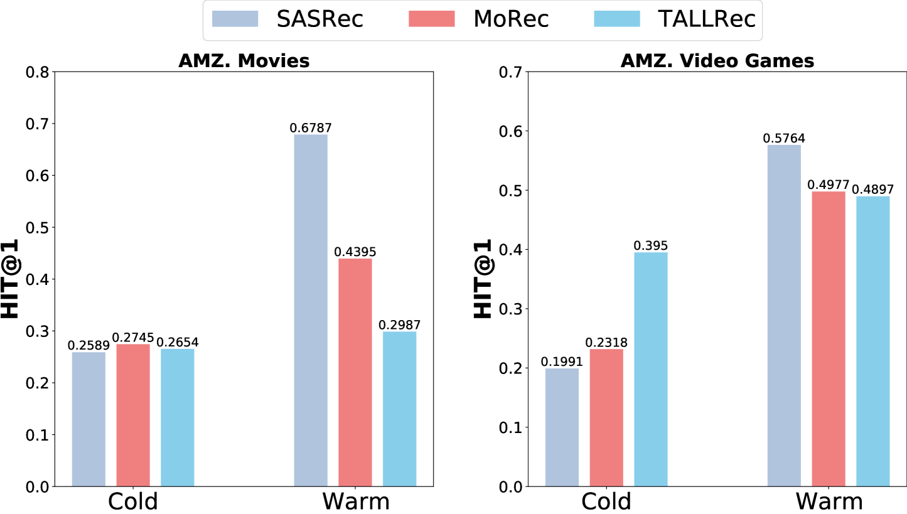
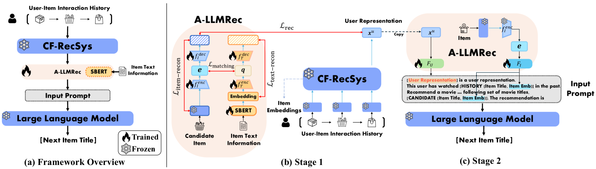
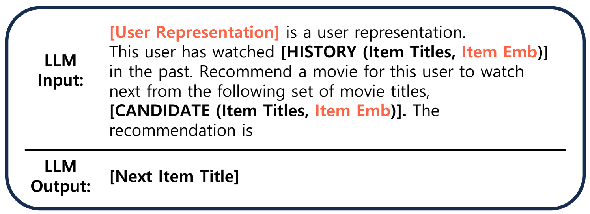
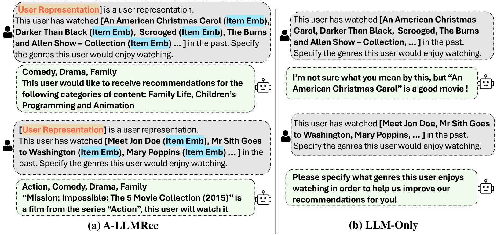
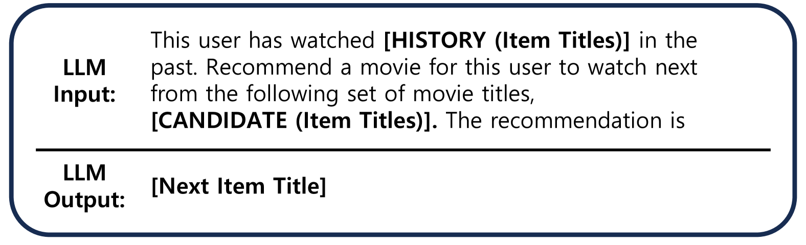
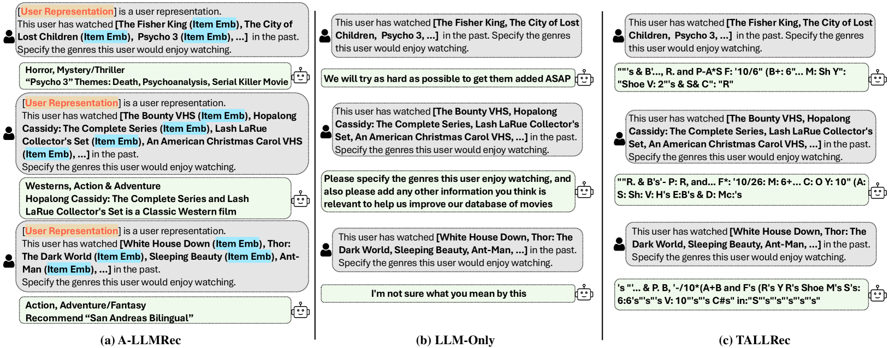

# 当大型语言模型邂逅协同过滤，便诞生了一个全面而高效的基于LLM的推荐系统。

发布时间：2024年04月17日

`LLM应用` `社交媒体` `电子商务`

> Large Language Models meet Collaborative Filtering: An Efficient All-round LLM-based Recommender System

# 摘要

> 协同过滤推荐系统（CF-RecSys）在社交媒体和电商平台上显著提升了用户体验。然而，面对用户与商品互动稀疏的冷启动挑战，CF-RecSys往往力不从心。新近的策略转而利用预训练的模态编码器和大型语言模型（LLMs），以用户/商品的模态信息（如文本或图片）为突破口。尽管这些策略在冷启动情境下效果显著，但在热启动情境下，由于缺少协作知识，它们的表现却不如传统的协同过滤模型。本研究提出了一种新型的全方位LLM驱动推荐系统——A-LLMRec，它不仅在冷启动情境下表现出色，热启动情境下同样表现优异。核心思想在于使LLM直接利用预训练的顶尖CF-RecSys中的协作知识，以此结合LLM的新兴能力和CF-RecSys训练出的高质量用户/商品嵌入。此方法具备两大优势：（1）模型通用性，便于与多种CF-RecSys集成；（2）高效率，省去了基于LLM推荐器通常所需的繁琐微调步骤。我们在多个真实世界数据集上进行的广泛实验证明了A-LLMRec在包括冷启动/热启动、少样本、冷用户和跨域等不同情境下的卓越性能。此外，A-LLMRec在理解协作知识的基础上，还展现出了在执行如预测用户喜好类型等任务时生成自然语言输出的潜力。相关代码已在 https://github.com/ghdtjr/A-LLMRec 上公开。

> Collaborative filtering recommender systems (CF-RecSys) have shown successive results in enhancing the user experience on social media and e-commerce platforms. However, as CF-RecSys struggles under cold scenarios with sparse user-item interactions, recent strategies have focused on leveraging modality information of user/items (e.g., text or images) based on pre-trained modality encoders and Large Language Models (LLMs). Despite their effectiveness under cold scenarios, we observe that they underperform simple traditional collaborative filtering models under warm scenarios due to the lack of collaborative knowledge. In this work, we propose an efficient All-round LLM-based Recommender system, called A-LLMRec, that excels not only in the cold scenario but also in the warm scenario. Our main idea is to enable an LLM to directly leverage the collaborative knowledge contained in a pre-trained state-of-the-art CF-RecSys so that the emergent ability of the LLM as well as the high-quality user/item embeddings that are already trained by the state-of-the-art CF-RecSys can be jointly exploited. This approach yields two advantages: (1) model-agnostic, allowing for integration with various existing CF-RecSys, and (2) efficiency, eliminating the extensive fine-tuning typically required for LLM-based recommenders. Our extensive experiments on various real-world datasets demonstrate the superiority of A-LLMRec in various scenarios, including cold/warm, few-shot, cold user, and cross-domain scenarios. Beyond the recommendation task, we also show the potential of A-LLMRec in generating natural language outputs based on the understanding of the collaborative knowledge by performing a favorite genre prediction task. Our code is available at https://github.com/ghdtjr/A-LLMRec .

[Arxiv](https://arxiv.org/abs/2404.11343)