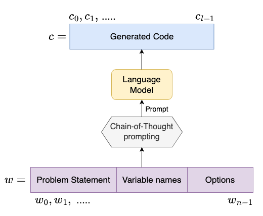
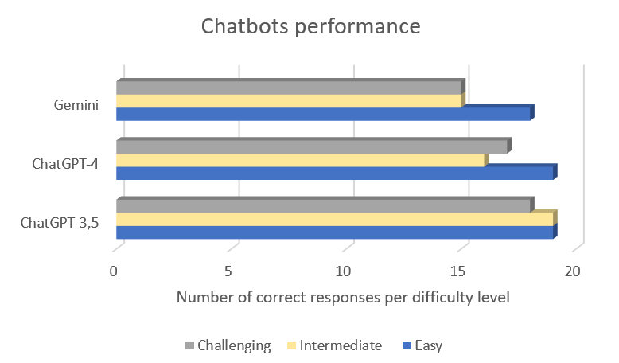
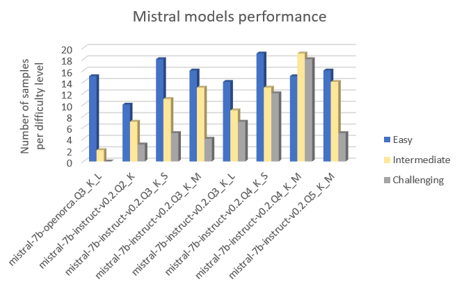
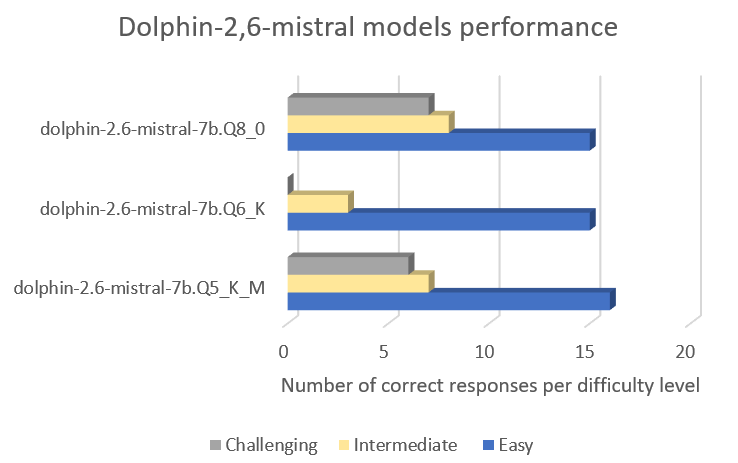
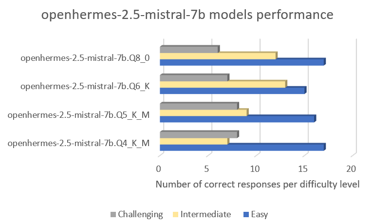

# 经济型语言模型：对 Python 代码生成任务的调研与性能测评。

发布时间：2024年04月17日

`LLM应用` `软件开发`

> Low-Cost Language Models: Survey and Performance Evaluation on Python Code Generation

# 摘要

> 大型语言模型（LLMs）因其出色的问题解决能力和高质量成果，在自然语言处理（NLP）领域成为众多任务的首选。它们特别被用于自动化代码生成，以此减轻开发人员处理重复性工作的负担。但这种质量上的飞跃也带来了对计算和内存资源的高需求，限制了资源受限用户对LLMs的访问。本文聚焦于中央处理单元（CPU）兼容模型，并通过半手动评估深入探讨了它们在Python代码生成任务中的优劣。我们引入了“思维链”提示，以指导模型进行问题解决，从而提升性能。此外，我们设计了一个包含60个难度不一编程问题的数据集，用于模型评估。我们还将在HumanEval和EvalPlus这两个前沿数据集上对模型进行测试。为了保持透明度，我们承诺将数据集和实验结果公之于众。

> Large Language Models (LLMs) have become the go-to solution for many Natural Language Processing (NLP) tasks due to their ability to tackle various problems and produce high-quality results. Specifically, they are increasingly used to automatically generate code, easing the burden on developers by handling repetitive tasks. However, this improvement in quality has led to high computational and memory demands, making LLMs inaccessible to users with limited resources. In this paper, we focus on Central Processing Unit (CPU)-compatible models and conduct a thorough semi-manual evaluation of their strengths and weaknesses in generating Python code. We enhance their performance by introducing a Chain-of-Thought prompt that guides the model in problem-solving. Additionally, we propose a dataset of 60 programming problems with varying difficulty levels for evaluation purposes. Our assessment also includes testing these models on two state-of-the-art datasets: HumanEval and EvalPlus. We commit to sharing our dataset and experimental results publicly to ensure transparency.

[Arxiv](https://arxiv.org/abs/2404.11160)