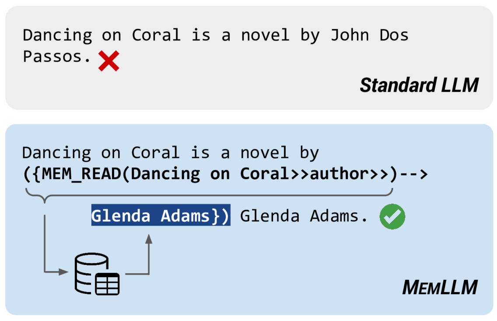
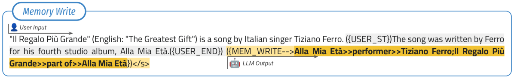
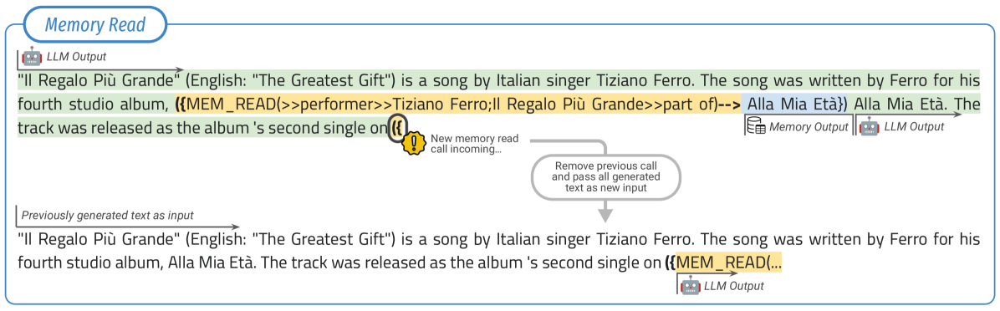
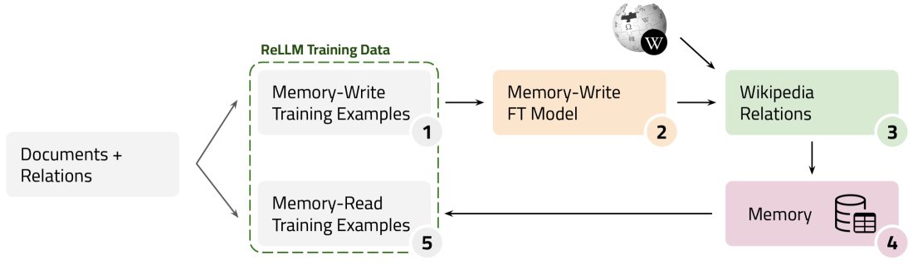

# MemLLM：为大型语言模型（LLM）定制优化，引入外显的读写记忆功能。

发布时间：2024年04月17日

`LLM理论` `人工智能` `知识管理`

> MemLLM: Finetuning LLMs to Use An Explicit Read-Write Memory

# 摘要

> 尽管现有的大型语言模型在知识密集型任务上展现了一定的潜力，但它们依赖于参数作为隐式存储机制，这限制了它们应对罕见知识和时间衰减的能力。参数记忆的不透明性也使得防止幻觉的发生变得困难。虽然参数记忆库和模型编辑提供了部分解决方案，但检索增强生成（RAG）作为一种非参数方法，也存在结构缺失、解释性复杂和知识管理困难等问题。本文提出了MemLLM，这是一种创新的方法，通过整合一个结构化且明确的读写记忆模块来提升LLMs的性能。MemLLM通过动态与记忆模块交互，增强了LLMs利用存储知识的能力，有效应对了前述挑战。实验结果证明，MemLLM不仅提升了LLMs在语言建模方面的性能，也增强了其在知识密集型任务中的可解释性。我们视MemLLM为推动LLMs通过记忆增强变得更加贴近实际和事实基础的重要进展。

> While current large language models (LLMs) demonstrate some capabilities in knowledge-intensive tasks, they are limited by relying on their parameters as an implicit storage mechanism. As a result, they struggle with infrequent knowledge and temporal degradation. In addition, the uninterpretable nature of parametric memorization makes it challenging to understand and prevent hallucination. Parametric memory pools and model editing are only partial solutions. Retrieval Augmented Generation (RAG) $\unicode{x2013}$ though non-parametric $\unicode{x2013}$ has its own limitations: it lacks structure, complicates interpretability and makes it hard to effectively manage stored knowledge. In this paper, we introduce MemLLM, a novel method of enhancing LLMs by integrating a structured and explicit read-and-write memory module. MemLLM tackles the aforementioned challenges by enabling dynamic interaction with the memory and improving the LLM's capabilities in using stored knowledge. Our experiments indicate that MemLLM enhances the LLM's performance and interpretability, in language modeling in general and knowledge-intensive tasks in particular. We see MemLLM as an important step towards making LLMs more grounded and factual through memory augmentation.

[Arxiv](https://arxiv.org/abs/2404.11672)