# 图神经网络（GNN）在处理分子图时的扩展性研究

发布时间：2024年04月17日

`分类：LLM理论` `药物发现` `图神经网络`

> On the Scalability of GNNs for Molecular Graphs

# 摘要

> 深度学习模型的扩展在语言建模和图像生成的革命中扮演了核心角色。研究者发现，模型规模、数据集规模与性能之间有着密切的联系。尽管如此，基于结构的架构，例如图神经网络（GNNs），由于稀疏操作效率低下、对大量数据的依赖以及对不同架构效果的认识不足，尚未能充分展现规模扩展的优势。为了克服这一局限，本研究深入探讨了 GNNs 的扩展特性。我们特别对消息传递网络、图变换器和混合架构在最大的 2D 分子图数据集上的表现进行了分析。我们首次发现，随着网络深度、宽度、分子数量、标签数量以及预训练数据集多样性的增加，GNNs 的性能显著提升，当模型参数扩展到 10 亿时性能提升了 30.25%，而当数据集规模扩大到原来的八倍时，性能提升了 28.98%。此外，我们在 38 个任务上展示了出色的微调扩展性能，超越了以往的大型模型。我们期望本研究能为基于基础 GNNs 的药物发现新时代奠定基础。

> Scaling deep learning models has been at the heart of recent revolutions in language modelling and image generation. Practitioners have observed a strong relationship between model size, dataset size, and performance. However, structure-based architectures such as Graph Neural Networks (GNNs) are yet to show the benefits of scale mainly due to the lower efficiency of sparse operations, large data requirements, and lack of clarity about the effectiveness of various architectures. We address this drawback of GNNs by studying their scaling behavior. Specifically, we analyze message-passing networks, graph Transformers, and hybrid architectures on the largest public collection of 2D molecular graphs. For the first time, we observe that GNNs benefit tremendously from the increasing scale of depth, width, number of molecules, number of labels, and the diversity in the pretraining datasets, resulting in a 30.25% improvement when scaling to 1 billion parameters and 28.98% improvement when increasing size of dataset to eightfold. We further demonstrate strong finetuning scaling behavior on 38 tasks, outclassing previous large models. We hope that our work paves the way for an era where foundational GNNs drive pharmaceutical drug discovery.

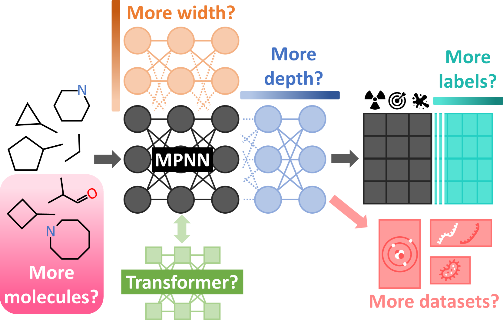

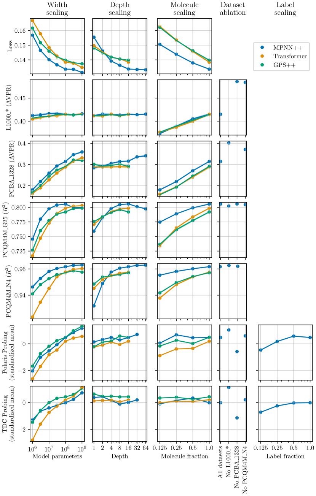

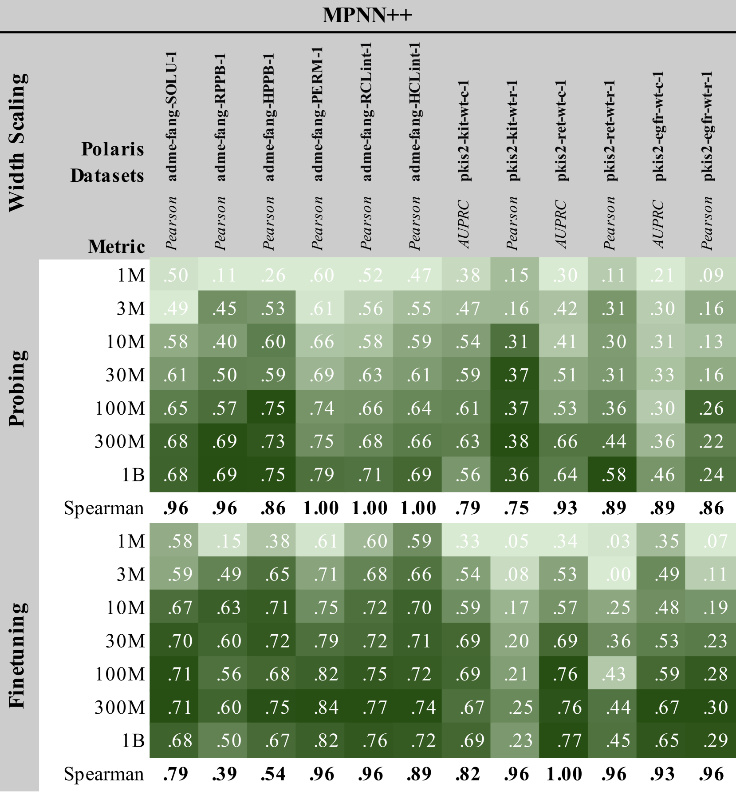

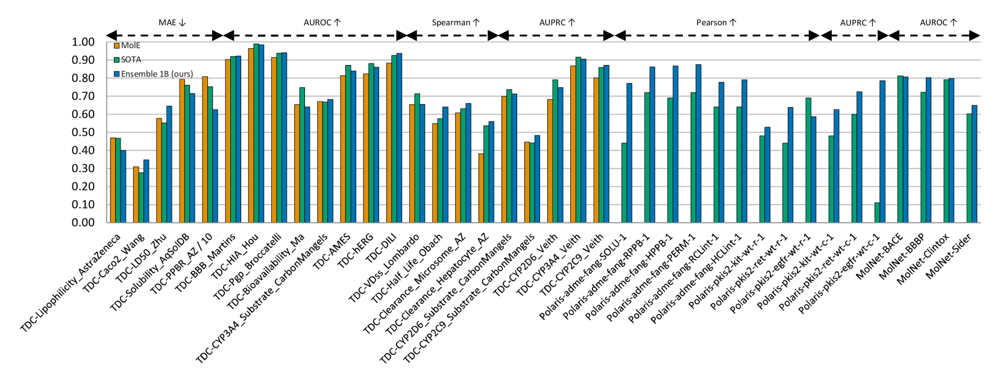

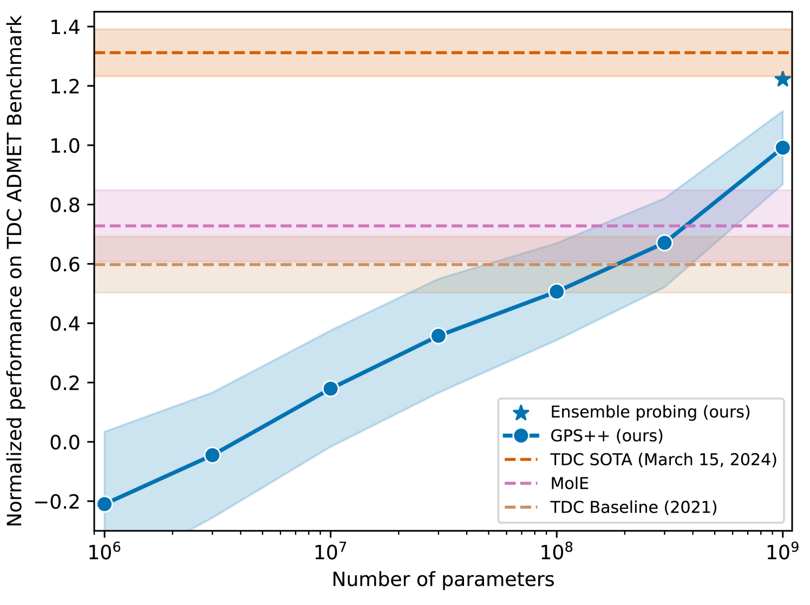

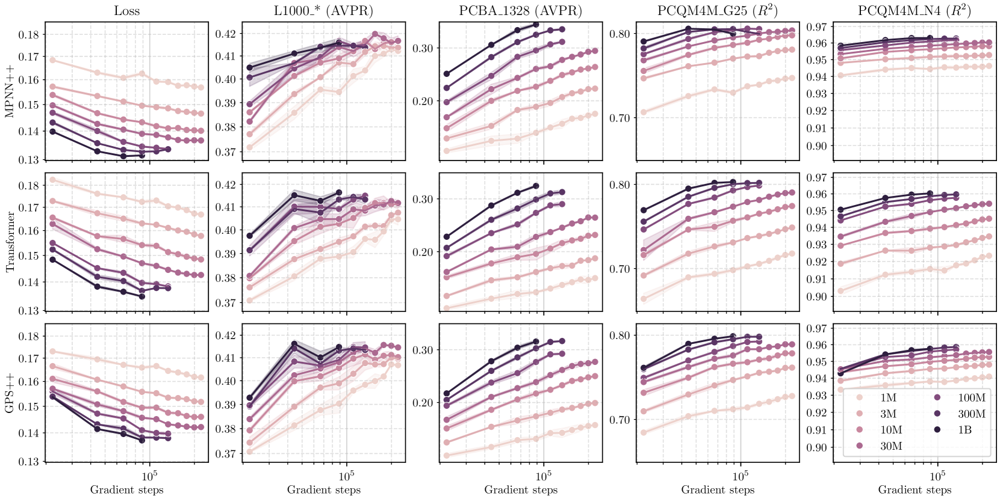

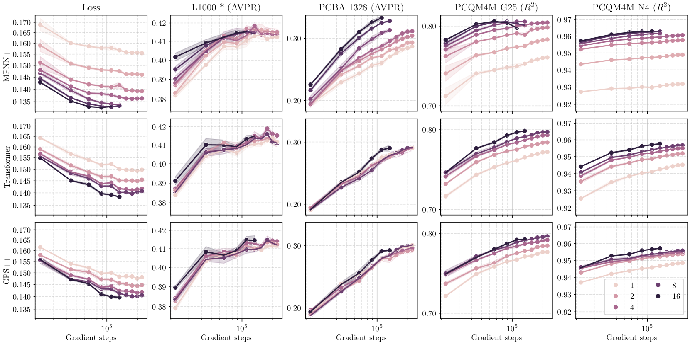

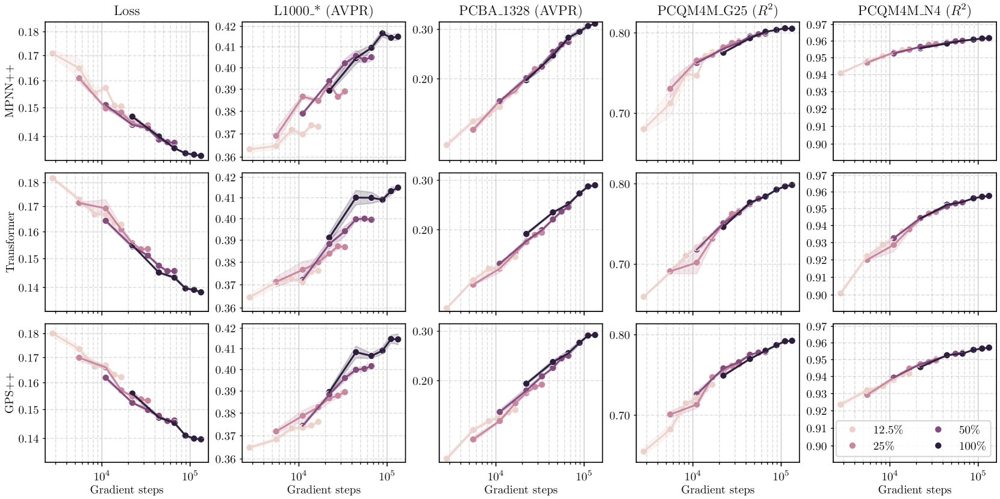

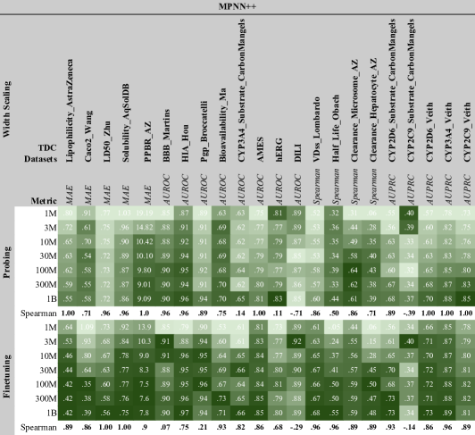

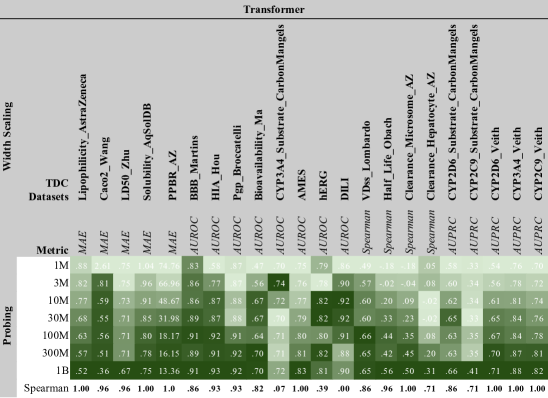

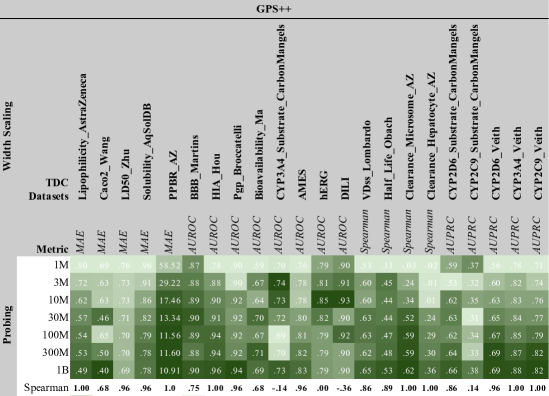

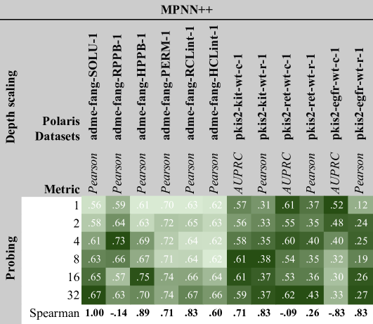

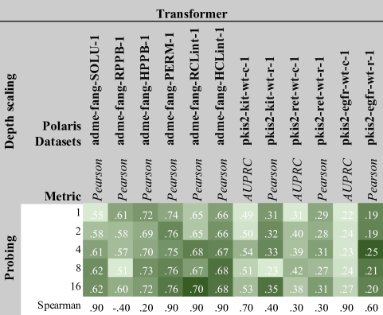

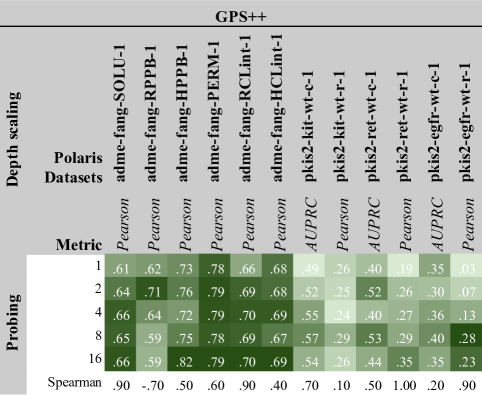

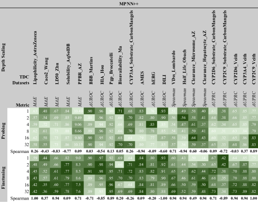

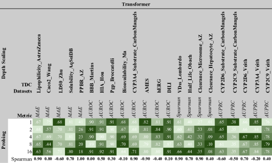

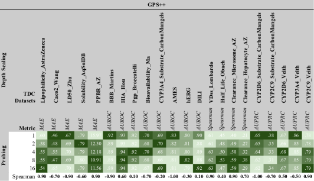

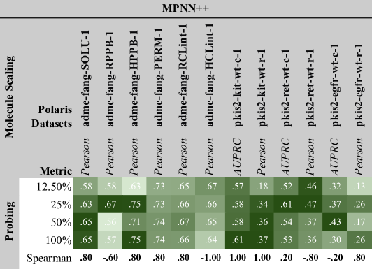

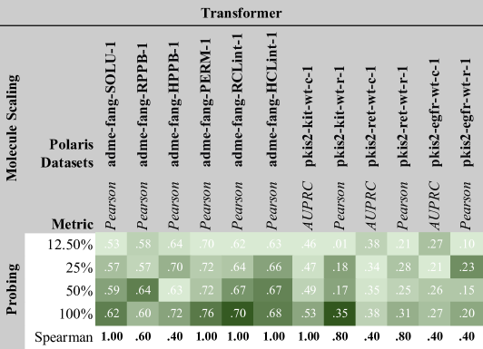

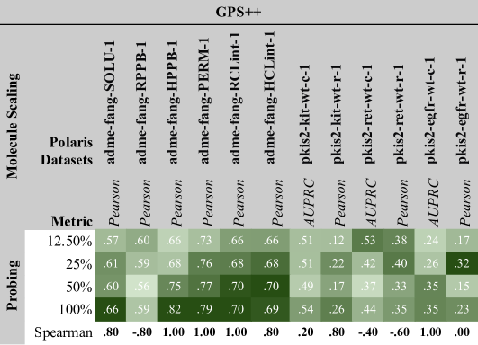

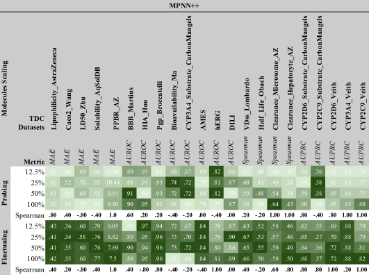

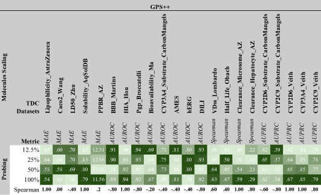

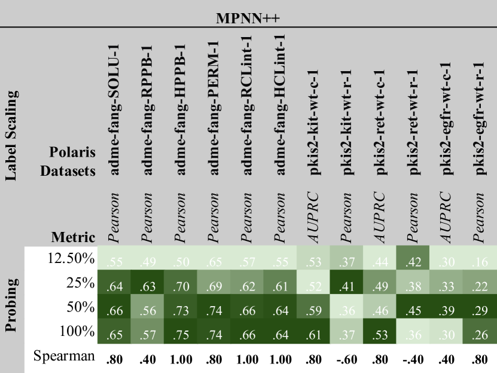

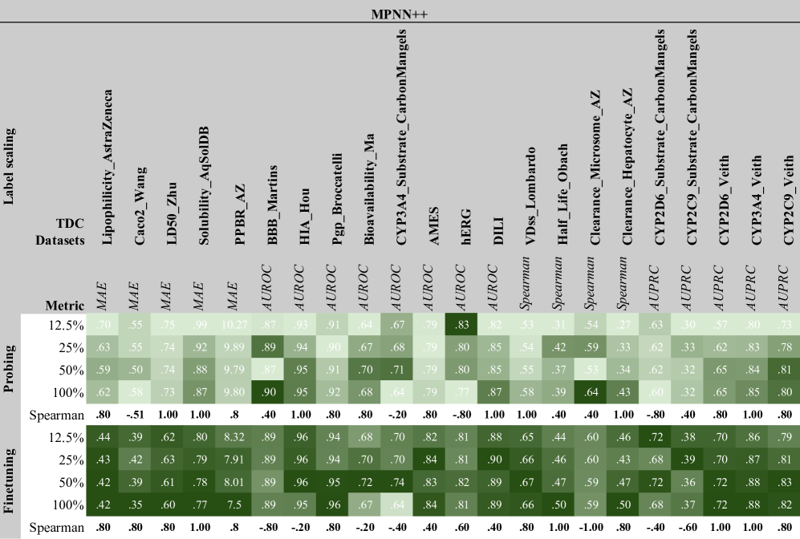

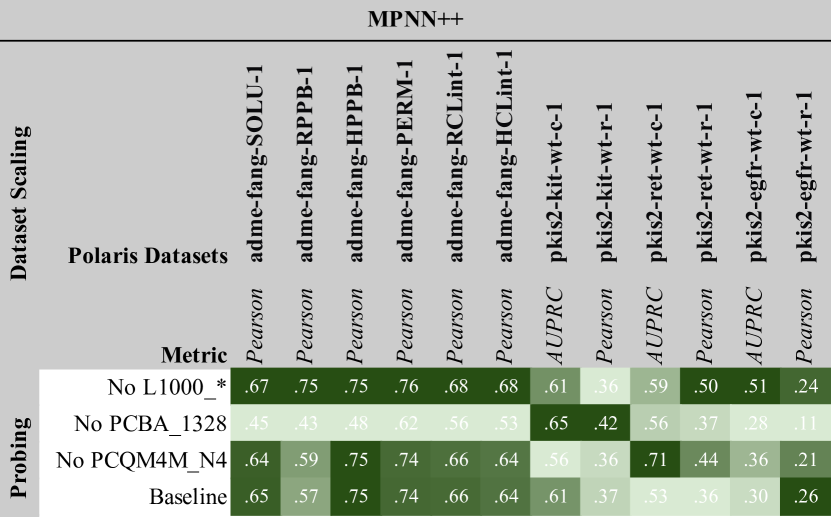

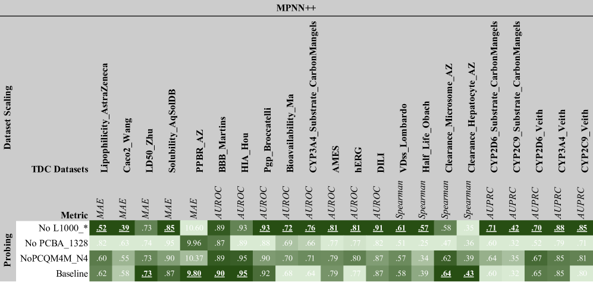

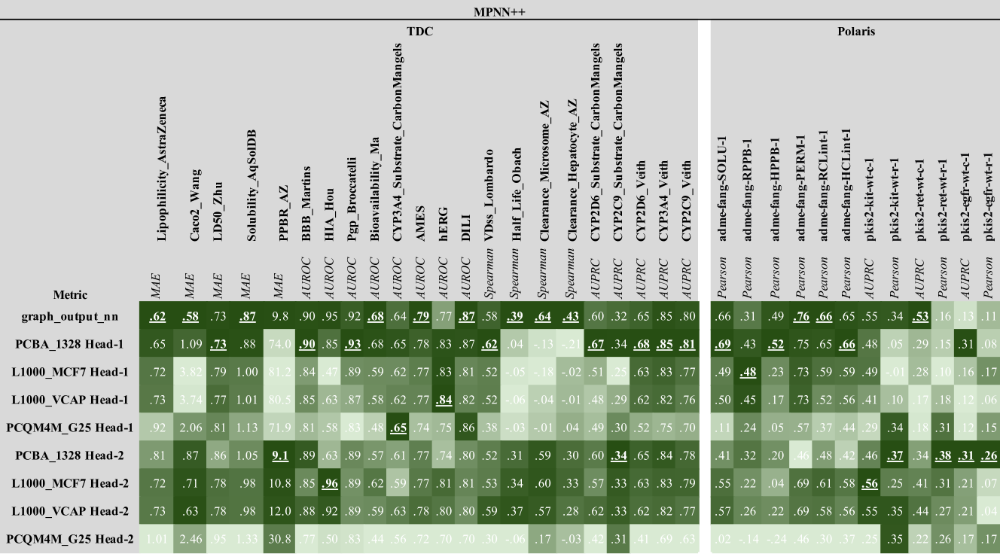

[Arxiv](https://arxiv.org/abs/2404.11568)