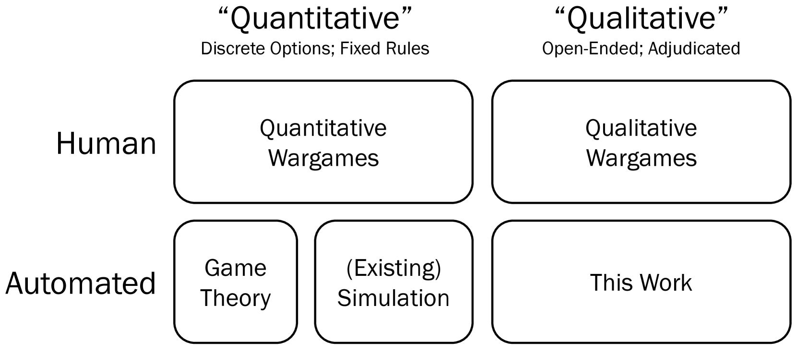
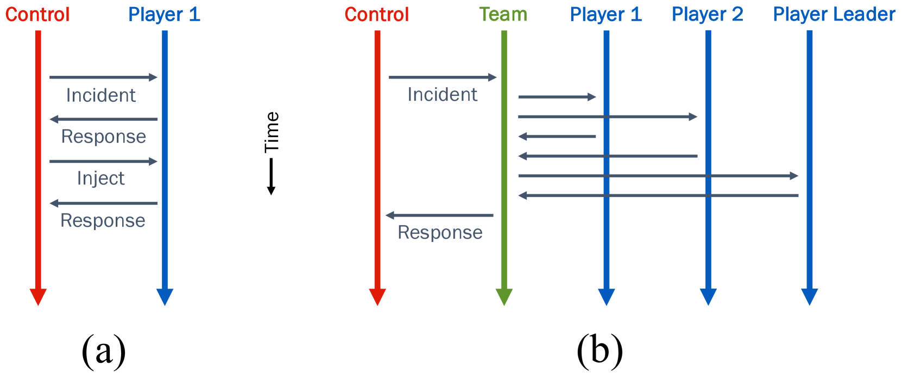

# 与大型语言模型进行开放式的兵棋推演

发布时间：2024年04月17日

`Agent` `军事模拟` `人工智能`

> Open-Ended Wargames with Large Language Models

# 摘要

> 兵棋推演作为洞察现实世界决策的模拟演练，其效用不容小觑。借助AI，兵棋推演能够实现人类游戏无法触及的境界，比如通过重复游戏来探索各种可能的结局。兵棋推演主要分为定量与定性两大类：前者的走法类型明确，后者则更侧重于开放式的回答。尽管过去自动化技术多应用于定量兵棋推演，但随着大型语言模型（LLMs）的发展，定性兵棋推演的自动化已成为可能。本文我们推出了“Snow Globe”，这是一个基于LLM的多智能体系统，专为定性兵棋推演设计。在Snow Globe的辅助下，从情景设定到战后分析，每一步都可选择由AI、人类或两者协作完成。我们不仅在理论上阐述了其软件架构，还发布了相应的开源实现。通过模拟AI应急响应的桌面演习和地缘政治危机的政治兵棋推演，我们展示了该系统的实战应用。此外，我们还探讨了这一方法的潜在用途，以及它是如何融入到更宏观的兵棋推演体系之中。

> Wargames are a powerful tool for understanding and rehearsing real-world decision making. Automated play of wargames using artificial intelligence (AI) enables possibilities beyond those of human-conducted games, such as playing the game many times over to see a range of possible outcomes. There are two categories of wargames: quantitative games, with discrete types of moves, and qualitative games, which revolve around open-ended responses. Historically, automation efforts have focused on quantitative games, but large language models (LLMs) make it possible to automate qualitative wargames. We introduce "Snow Globe," an LLM-powered multi-agent system for playing qualitative wargames. With Snow Globe, every stage of a text-based qualitative wargame from scenario preparation to post-game analysis can be optionally carried out by AI, humans, or a combination thereof. We describe its software architecture conceptually and release an open-source implementation alongside this publication. As case studies, we simulate a tabletop exercise about an AI incident response and a political wargame about a geopolitical crisis. We discuss potential applications of the approach and how it fits into the broader wargaming ecosystem.

[Arxiv](https://arxiv.org/abs/2404.11446)