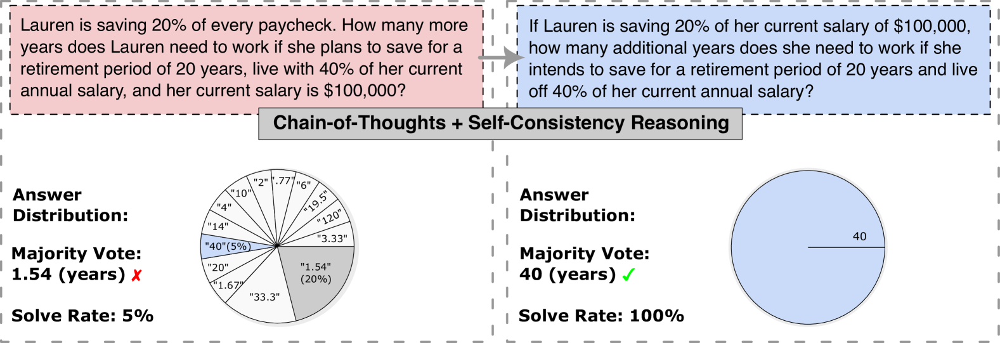
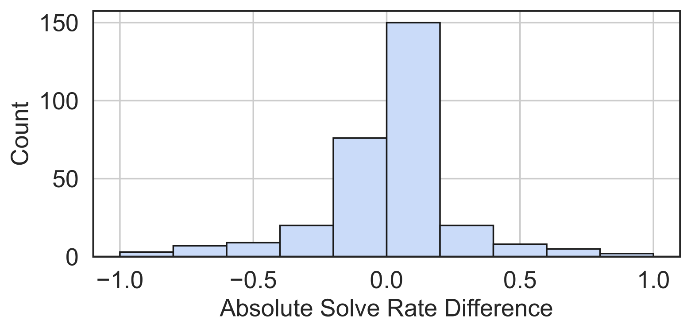

# 重构与求解：深入探究并发挥语言表层形式对大型语言模型数学推理能力的影响

发布时间：2024年04月17日

`LLM应用` `数学教育` `人工智能`

> Paraphrase and Solve: Exploring and Exploiting the Impact of Surface Form on Mathematical Reasoning in Large Language Models

# 摘要

> 本研究探讨了数学问题表述形式与大型语言模型解题能力之间的关系。研究发现，问题表述的微妙变化能显著影响答案分布和解题率，这揭示了语言模型在处理复杂问题时对表述形式的敏感性和鲁棒性的不足。为提升数学推理能力，我们提出了一种名为“多义性自我一致性”（SCoP）的方法，该方法通过多样化问题的不同表述形式来扩展推理路径。我们在三个大型语言模型上的四个数学推理基准测试中评估了该方法，并证明了SCoP在解决最初认为无解的问题时，其数学推理性能优于传统的自我一致性方法。此外，我们还就问题难度、表述形式、跨模型难度一致性、多义性转换以及用于评估语言模型的语言变化方差（VOV）进行了进一步的实验和讨论。

> This paper studies the relationship between the surface form of a mathematical problem and its solvability by large language models. We find that subtle alterations in the surface form can significantly impact the answer distribution and the solve rate, exposing the language model's lack of robustness and sensitivity to the surface form in reasoning through complex problems. To improve mathematical reasoning performance, we propose Self-Consistency-over-Paraphrases (SCoP), which diversifies reasoning paths from specific surface forms of the problem. We evaluate our approach on four mathematics reasoning benchmarks over three large language models and show that SCoP improves mathematical reasoning performance over vanilla self-consistency, particularly for problems initially deemed unsolvable. Finally, we provide additional experiments and discussion regarding problem difficulty and surface forms, including cross-model difficulty agreement and paraphrasing transferability, and Variance of Variations (VOV) for language model evaluation.

[Arxiv](https://arxiv.org/abs/2404.11500)