# 我们正致力于在前沿科技领域预训练规模达十亿级的地理空间基础模型。

发布时间：2024年04月17日

`分类：LLM应用` `地理空间数据处理` `高性能计算`

> Pretraining Billion-scale Geospatial Foundational Models on Frontier

# 摘要

> 随着AI应用领域的不断扩展，小型特定任务模型在泛化能力上面临挑战，对大量标注训练样本的需求也随之增长。与此同时，基础模型（FMs）通过自监督学习利用互联网规模的未标注数据进行训练，展现出了对多种任务的适应性，仅需极少量微调。尽管大型FMs在自然语言处理和计算机视觉领域取得了显著成效，但在地理空间应用方面，由于预训练大型模型需要巨大的计算资源和最先进的硬件加速器，因此进展有限。目前，卫星星座每天产生超过100TB的数据，生成的图像像素数以十亿计，且具有多模态特性，这些地理空间数据的独特挑战为FMs的发展带来了新的机遇。我们通过在公开数据上预训练，探索了适用于地理空间应用的十亿规模FMs和高性能计算（HPC）训练配置。我们的研究从端到端分析了模型规模扩展对解决方案性能和影响的提升，其中3B参数规模的模型在场景分类准确度上比100M参数模型提高了多达30%。此外，我们在Frontier超级计算机上进行了性能实验，这是美国首个E级计算系统，研究了使用PyTorch的Fully Sharded Data Parallel库的不同模型和数据并行方法。特别是，我们对视觉变换器架构（ViT）的变体进行了研究，并对高达15B参数的ViT模型进行了性能分析。通过讨论不同并行配置下的吞吐量和性能瓶颈，我们为如何利用顶级高性能计算资源开发地理空间图像应用的大型模型提供了洞见。

> As AI workloads increase in scope, generalization capability becomes challenging for small task-specific models and their demand for large amounts of labeled training samples increases. On the contrary, Foundation Models (FMs) are trained with internet-scale unlabeled data via self-supervised learning and have been shown to adapt to various tasks with minimal fine-tuning. Although large FMs have demonstrated significant impact in natural language processing and computer vision, efforts toward FMs for geospatial applications have been restricted to smaller size models, as pretraining larger models requires very large computing resources equipped with state-of-the-art hardware accelerators. Current satellite constellations collect 100+TBs of data a day, resulting in images that are billions of pixels and multimodal in nature. Such geospatial data poses unique challenges opening up new opportunities to develop FMs. We investigate billion scale FMs and HPC training profiles for geospatial applications by pretraining on publicly available data. We studied from end-to-end the performance and impact in the solution by scaling the model size. Our larger 3B parameter size model achieves up to 30% improvement in top1 scene classification accuracy when comparing a 100M parameter model. Moreover, we detail performance experiments on the Frontier supercomputer, America's first exascale system, where we study different model and data parallel approaches using PyTorch's Fully Sharded Data Parallel library. Specifically, we study variants of the Vision Transformer architecture (ViT), conducting performance analysis for ViT models with size up to 15B parameters. By discussing throughput and performance bottlenecks under different parallelism configurations, we offer insights on how to leverage such leadership-class HPC resources when developing large models for geospatial imagery applications.

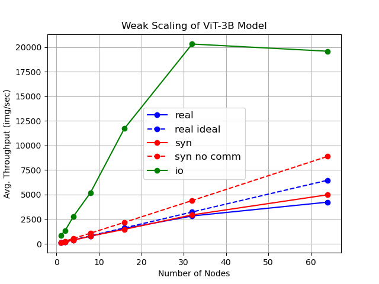

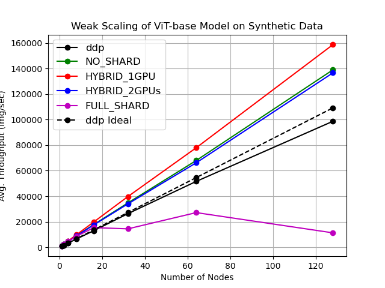

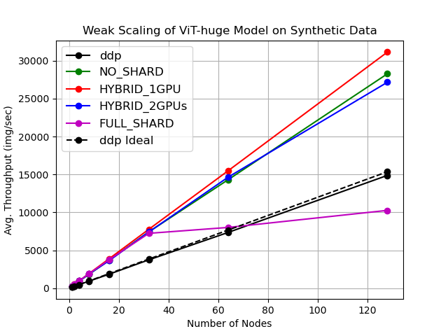

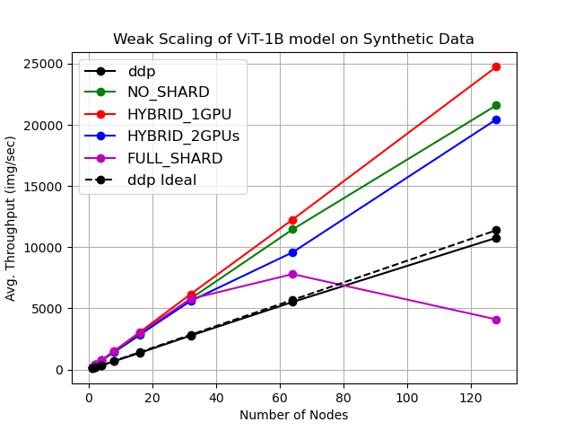

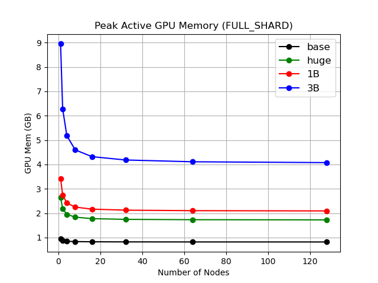

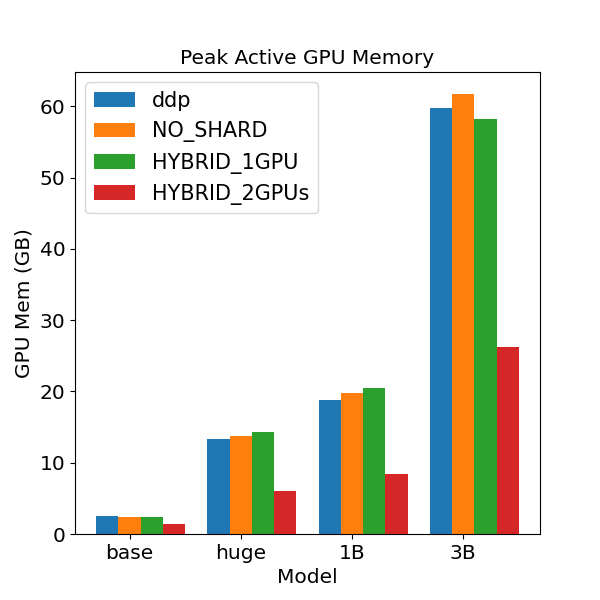

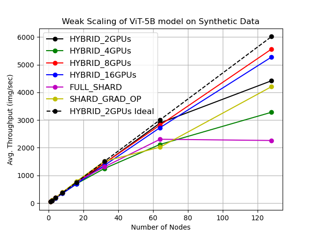

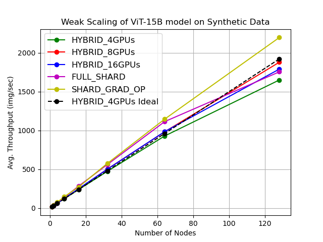

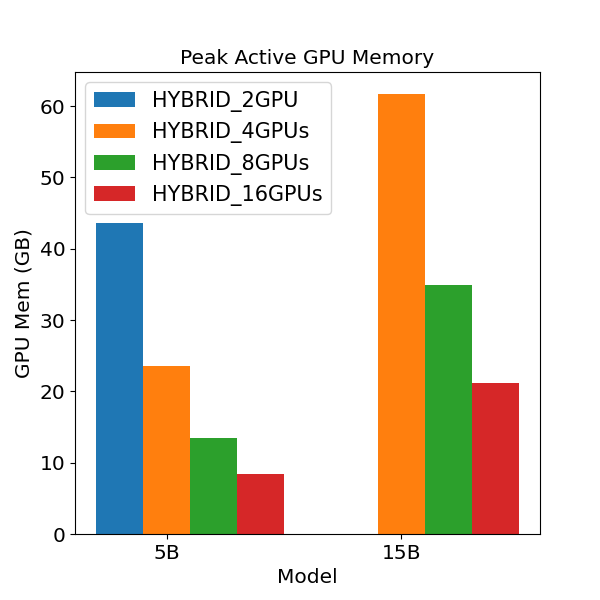

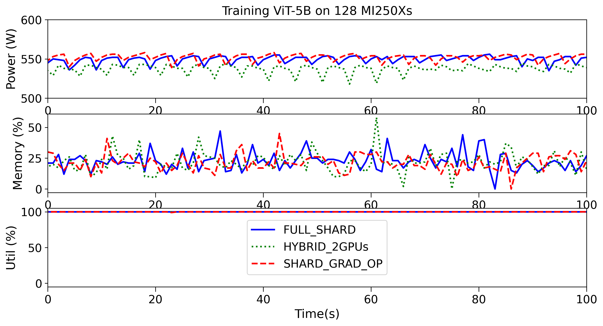

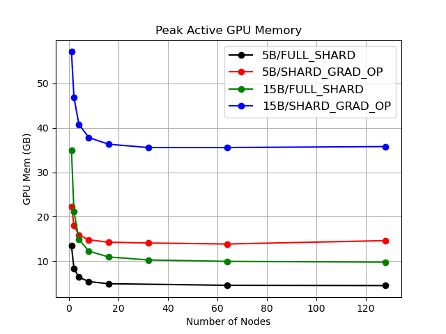

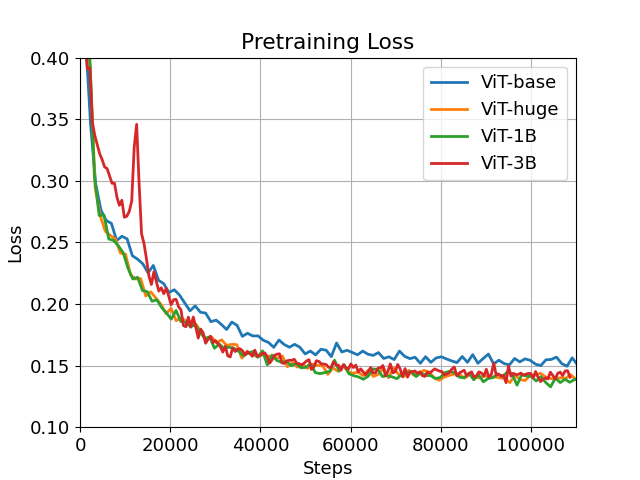

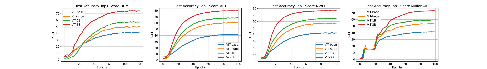

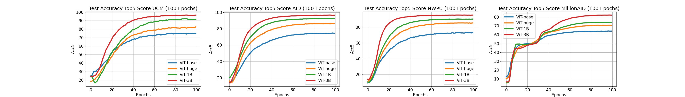

[Arxiv](https://arxiv.org/abs/2404.11706)