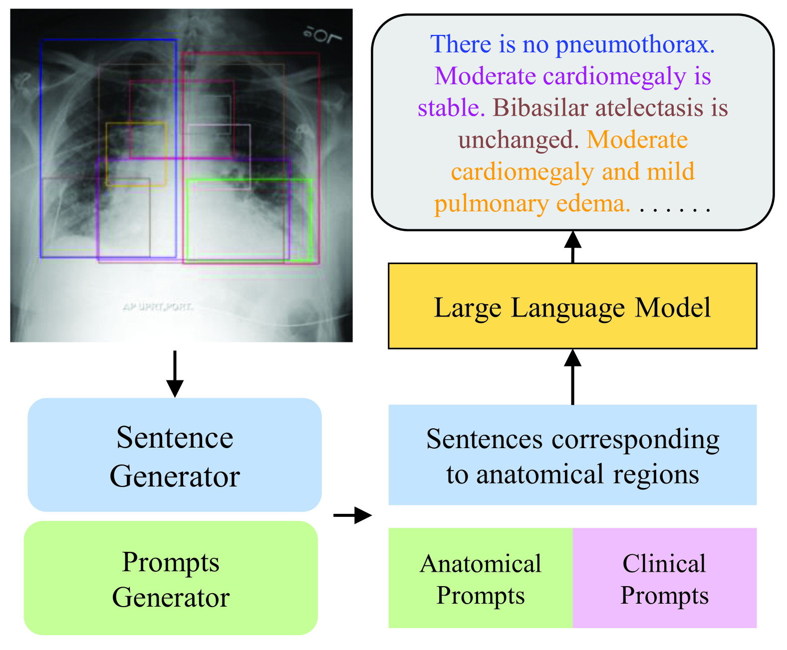
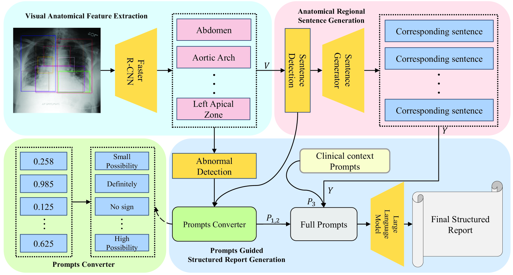
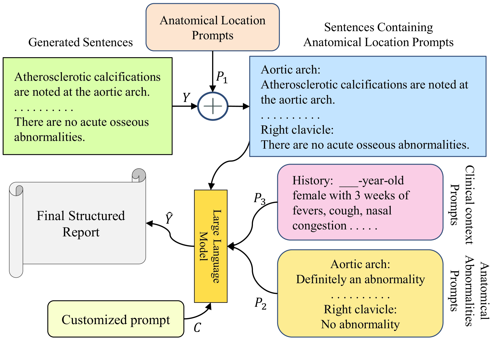
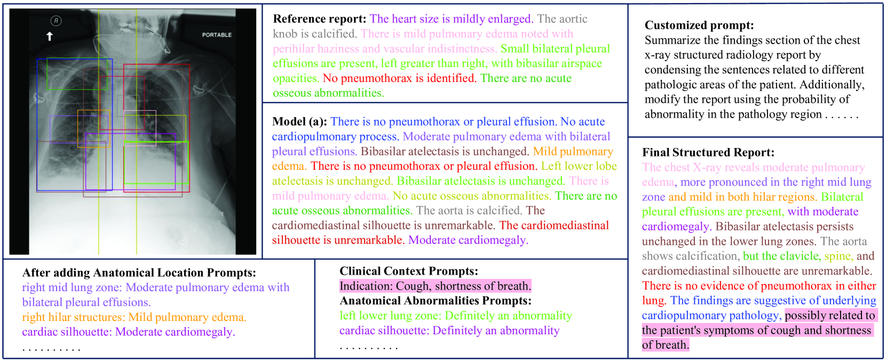

# 借助预训练的大型语言模型，通过引导式生成技术，自动撰写结构化的胸部X光报告。

发布时间：2024年04月17日

`LLM应用` `医学影像`

> Prompt-Guided Generation of Structured Chest X-Ray Report Using a Pre-trained LLM

# 摘要

> 医学报告自动生成技术通过图像解析放射学描述，为医生减压并减少错误。但现有技术在提供结构化输出和医生互动方面尚显不足，难以生成既清晰又具有临床相关性的报告。本研究提出了一种基于提示的方法，利用预训练的大型语言模型（LLM）来生成结构化的胸部X光报告。我们首先识别胸部X光片中的解剖区域，生成聚焦于关键视觉要素的精准句子，以此构建基于解剖学的结构化报告基础。同时，将检测到的解剖信息转化为文本提示，以增强LLM对解剖学的理解。此外，临床上下文的提示引导LLM关注互动性和临床需求。通过结合解剖学导向的句子和临床提示，预训练的LLM能够生成既符合特定解剖区域又满足临床情境需求的定制化胸部X光报告。我们通过语言生成和临床效果的指标进行评估，证实了该方法的卓越表现。

> Medical report generation automates radiology descriptions from images, easing the burden on physicians and minimizing errors. However, current methods lack structured outputs and physician interactivity for clear, clinically relevant reports. Our method introduces a prompt-guided approach to generate structured chest X-ray reports using a pre-trained large language model (LLM). First, we identify anatomical regions in chest X-rays to generate focused sentences that center on key visual elements, thereby establishing a structured report foundation with anatomy-based sentences. We also convert the detected anatomy into textual prompts conveying anatomical comprehension to the LLM. Additionally, the clinical context prompts guide the LLM to emphasize interactivity and clinical requirements. By integrating anatomy-focused sentences and anatomy/clinical prompts, the pre-trained LLM can generate structured chest X-ray reports tailored to prompted anatomical regions and clinical contexts. We evaluate using language generation and clinical effectiveness metrics, demonstrating strong performance.

[Arxiv](https://arxiv.org/abs/2404.11209)