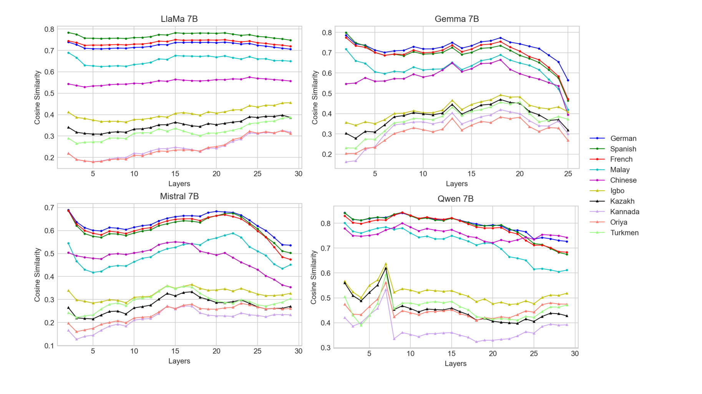
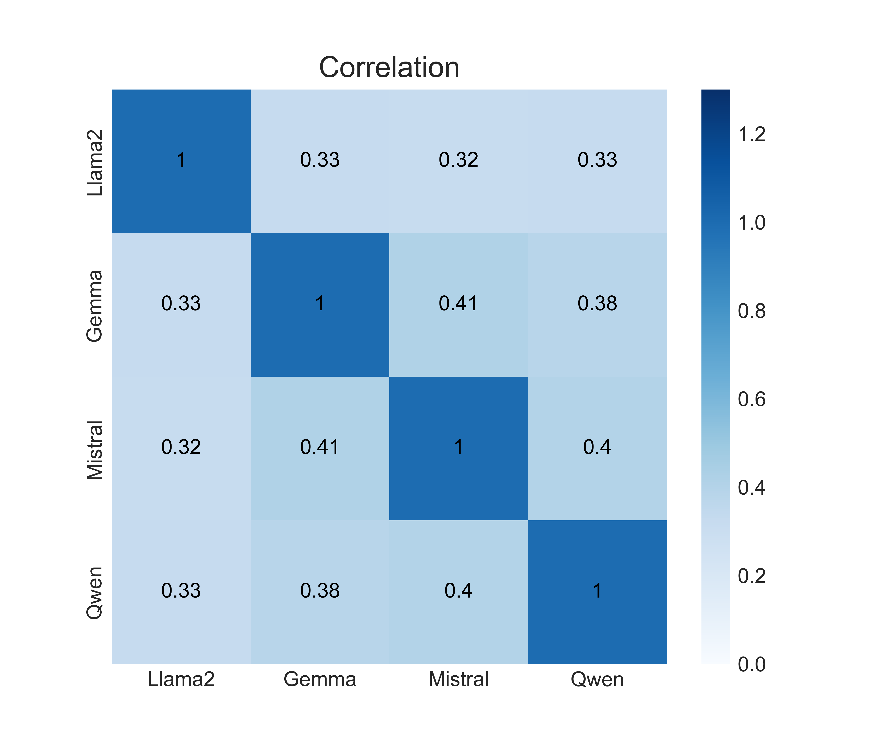
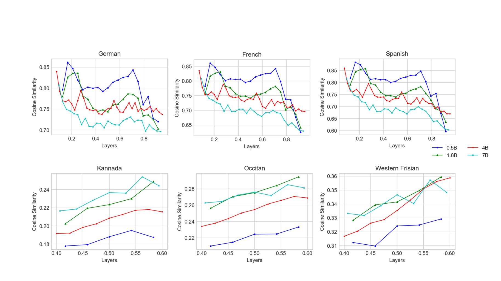
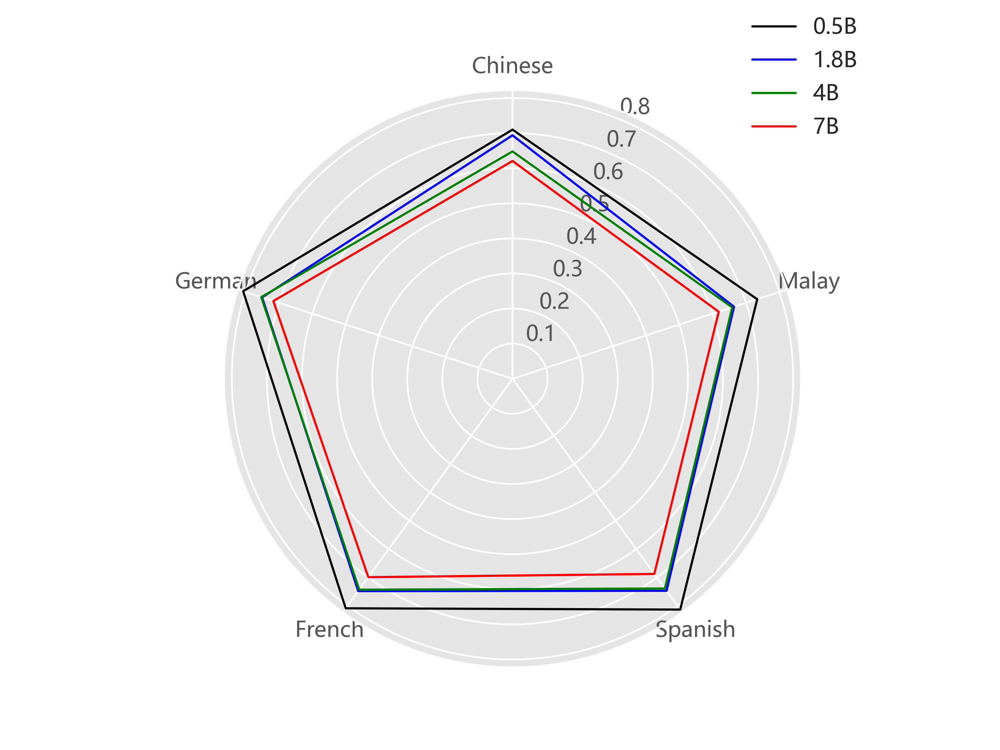
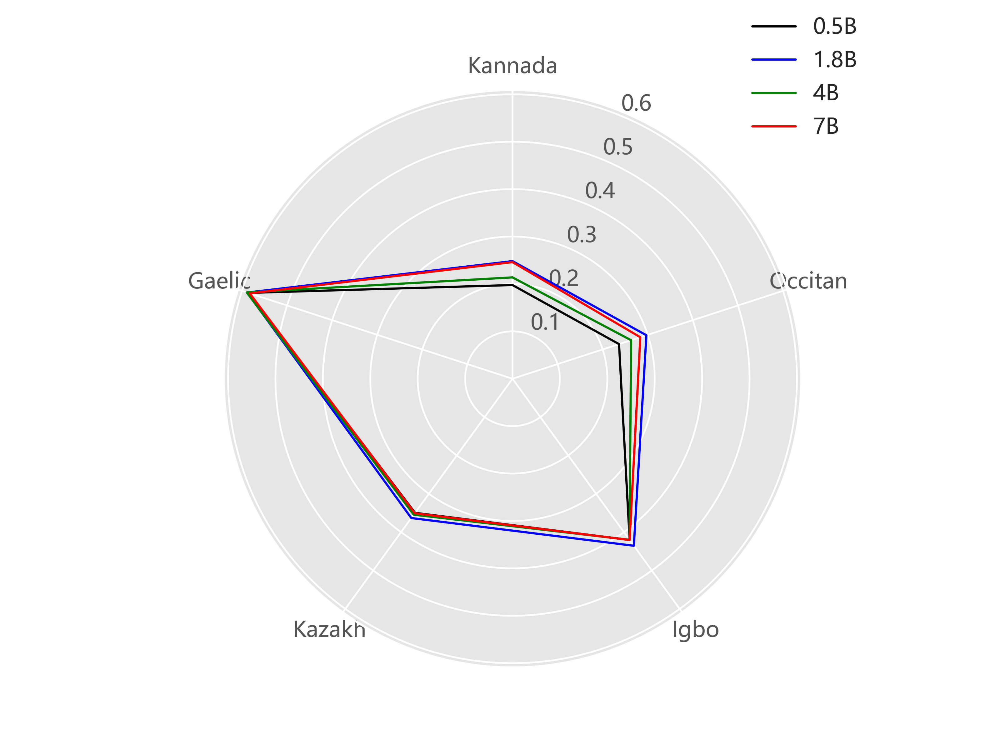

# 本文旨在量化并分析大型语言模型在跨语言应用中的多语言表现。

发布时间：2024年04月17日

`LLM应用` `机器学习`

> Quantifying Multilingual Performance of Large Language Models Across Languages

# 摘要

> 大型语言模型（LLMs）的训练依赖于庞大的文本资料库，但这些资料在不同语言中的分布往往不均衡。这导致LLMs在英语、德语、法语等主流语言上表现出色，而对资源稀缺语言则表现不佳。目前尚无研究定量评估LLMs在资源稀缺语言中的表现。为了解决这一问题，我们设计了“语言排名器”，旨在对不同语言进行基准测试和排名，依据LLMs在这些语言上的表现。我们将LLM在英语语料上的性能设为参照，以此对比其他语言与英语的性能差异。研究结果揭示了三点：1. 不同的LLM在所有语言上的性能排名基本一致。2. 不同规模的LLM性能排序相同。3. LlaMa2在不同语言上的性能与其预训练语料库的比例密切相关。这些发现说明“语言排名器”可作为衡量LLMs语言处理能力的有力工具。

> The training process of Large Language Models (LLMs) requires extensive text corpus. However, these data are often unevenly distributed in different languages. As a result, LLMs perform well on common languages, such as English, German, and French, but perform poorly on low-resource languages. However, currently there is no work to quantitatively measure the performance of LLMs in low-resource languages. To fill this gap, we proposed the Language Ranker that aims to benchmark and rank different languages according to the performance of LLMs on those languages. We employ the LLM's performance on the English corpus as a baseline to compare the performances of different languages and English. We have the following three findings: 1. The performance rankings of different LLMs in all languages are roughly the same. 2. LLMs with different sizes have the same partial order of performance. 3. There is a strong correlation between LlaMa2's performance in different languages and the proportion of the pre-training corpus. These findings illustrate that the Language Ranker can be used as an indicator to measure the language performance of LLMs.

[Arxiv](https://arxiv.org/abs/2404.11553)