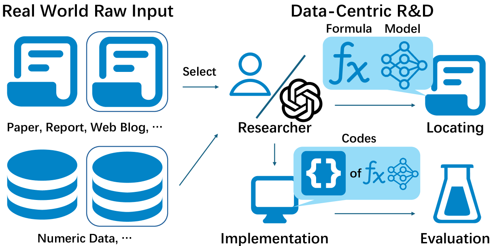
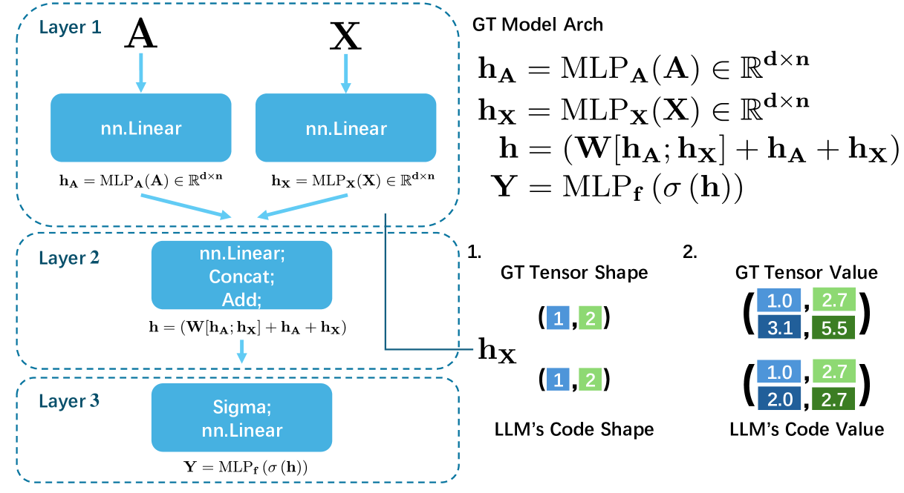

# RD2Bench：探索数据驱动的自动化研发新路径

发布时间：2024年04月17日

`LLM应用` `自动化研发` `数据分析`

> RD2Bench: Toward Data-Centric Automatic R&D

# 摘要

> 人类的发展往往源于那些在无数次失败尝试后取得的成功发现。科研人员通过阅读文献来探索可能的研究路径，并通过实验进行验证，这无疑增加了他们的工作负担。近十年来，基于数据的深度学习方法在多种实际应用场景中证明了其强大的效力，进一步加重了科研人员的实验压力，使得潜在的突破性发现变得更加难以捉摸。因此，实现研究与开发（R&D）过程的自动化成为了一个迫切的需求。本文中，我们首次提出了一个以现实世界数据为核心的自动化R&D基准测试平台——RD2Bench。该平台旨在全面评估数据驱动的自动化R&D（D-CARD）的各项操作，以直接推动未来研究工作向既定目标前进。我们专注于评估不同模型能力之间的互动和协同效应，并辅助选择性能卓越、值得信赖的模型。尽管RD2Bench对当前最先进的大型语言模型（LLM）GPT-4构成了巨大挑战，这不仅揭示了丰富的研究机会，也意味着需要更多的研究投入，但LLMs展现出了在D-CARD领域带来重大进步的巨大潜力：它们能够在不借助任何额外技术的情况下实现一些基础方法。我们呼吁未来的研究工作考虑开发应对自动化R&D挑战的技术，这将为人类生产力的潜在革命性提升带来无限可能。

> The progress of humanity is driven by those successful discoveries accompanied by countless failed experiments. Researchers often seek the potential research directions by reading and then verifying them through experiments. The process imposes a significant burden on researchers. In the past decade, the data-driven black-box deep learning method demonstrates its effectiveness in a wide range of real-world scenarios, which exacerbates the experimental burden of researchers and thus renders the potential successful discoveries veiled. Therefore, automating such a research and development (R&D) process is an urgent need. In this paper, we serve as the first effort to formalize the goal by proposing a Real-world Data-centric automatic R&D Benchmark, namely RD2Bench. RD2Bench benchmarks all the operations in data-centric automatic R&D (D-CARD) as a whole to navigate future work toward our goal directly. We focuses on evaluating the interaction and synergistic effects of various model capabilities and aiding to select the well-performed trustworthy models. Although RD2Bench is very challenging to the state-of-the-art (SOTA) large language model (LLM) named GPT-4, indicating ample research opportunities and more research efforts, LLMs possess promising potential to bring more significant development to D-CARD: They are able to implement some simple methods without adopting any additional techniques. We appeal to future work to take developing techniques for tackling automatic R&D into consideration, thus bringing the opportunities of the potential revolutionary upgrade to human productivity.

[Arxiv](https://arxiv.org/abs/2404.11276)