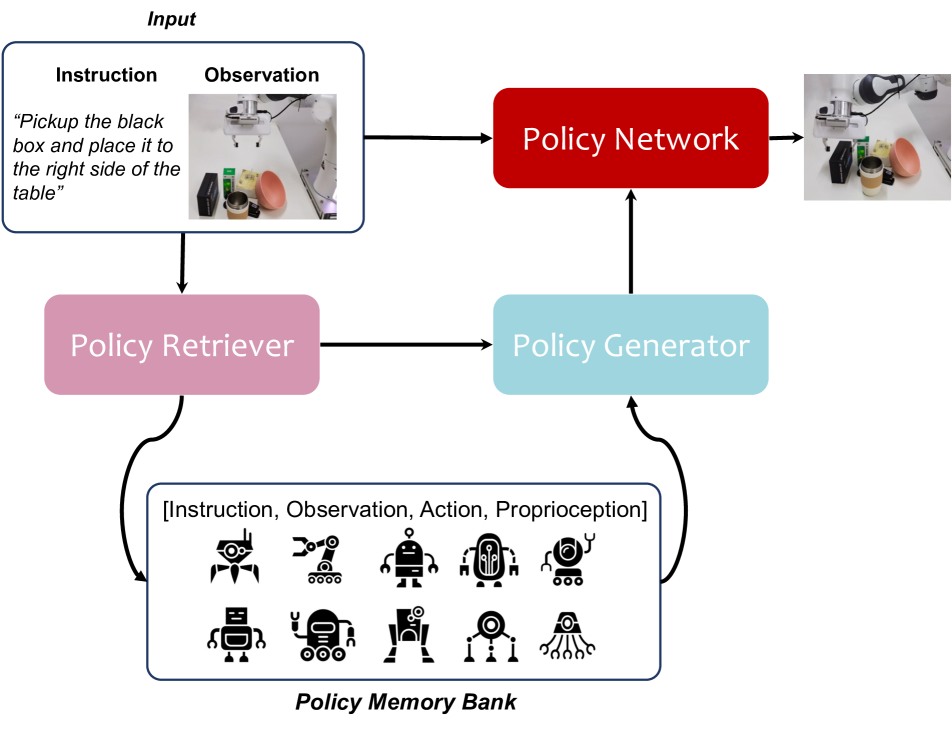
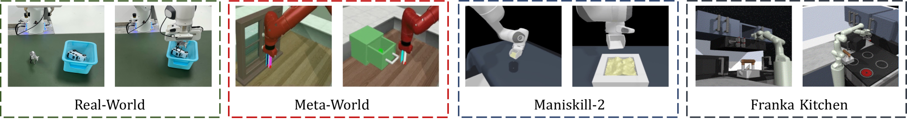
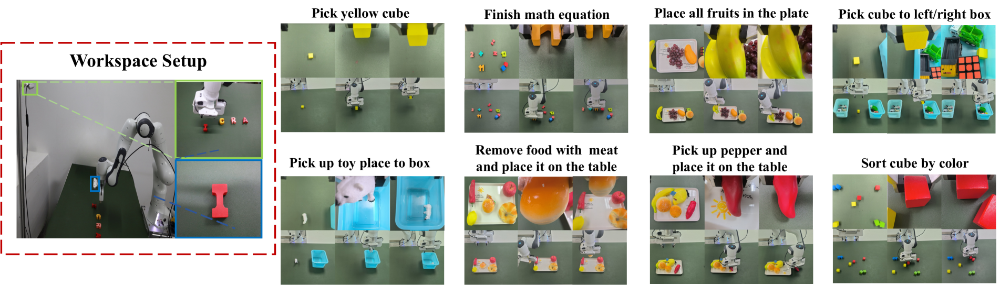
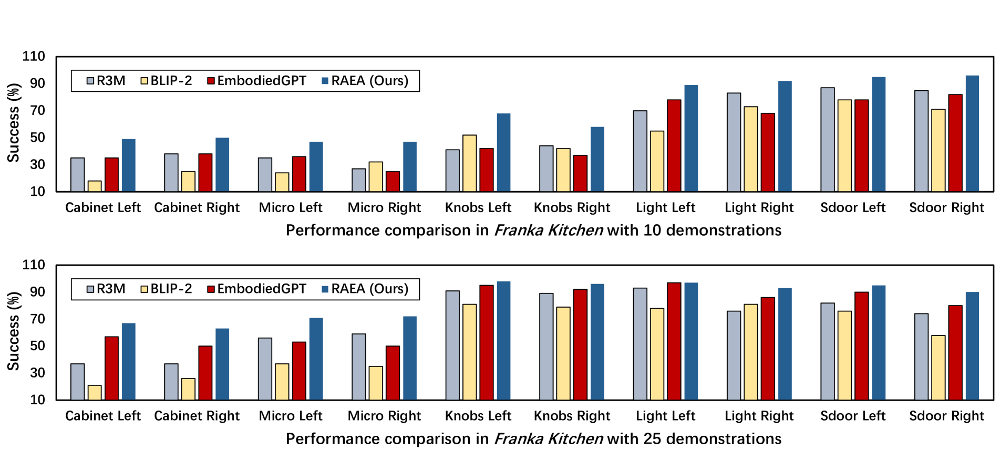
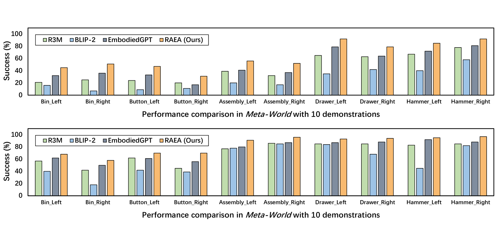

# 增强检索的具身智能代理

发布时间：2024年04月17日

`Agent` `机器人学` `人工智能`

> Retrieval-Augmented Embodied Agents

# 摘要

> 具身代理在复杂且不确定的环境中运作时，面临着巨大的挑战。尽管一些高级代理能够熟练地处理复杂的操作任务，但它们的成功往往建立在大量训练数据的基础上。与此相对，人类通常通过回忆过往经历和类似情境来解决新问题。为了在机器人学中模拟人类的这种解决问题的方式，我们提出了一种名为检索增强的具身代理（RAEA）。这一创新系统通过共享记忆的形式，显著提升了机器人的性能。我们的方案包括了一个策略检索器，使机器人能够基于多模态输入，从一个外部策略记忆库中检索到合适的策略。同时，我们还采用了策略生成器，将这些策略整合到学习过程中，从而使机器人能够对各种任务做出有效的应对。在模拟环境和现实世界中对RAEA进行的广泛测试显示，其性能超越了传统方法，这标志着机器人技术的一大飞跃。

> Embodied agents operating in complex and uncertain environments face considerable challenges. While some advanced agents handle complex manipulation tasks with proficiency, their success often hinges on extensive training data to develop their capabilities. In contrast, humans typically rely on recalling past experiences and analogous situations to solve new problems. Aiming to emulate this human approach in robotics, we introduce the Retrieval-Augmented Embodied Agent (RAEA). This innovative system equips robots with a form of shared memory, significantly enhancing their performance. Our approach integrates a policy retriever, allowing robots to access relevant strategies from an external policy memory bank based on multi-modal inputs. Additionally, a policy generator is employed to assimilate these strategies into the learning process, enabling robots to formulate effective responses to tasks. Extensive testing of RAEA in both simulated and real-world scenarios demonstrates its superior performance over traditional methods, representing a major leap forward in robotic technology.

[Arxiv](https://arxiv.org/abs/2404.11699)