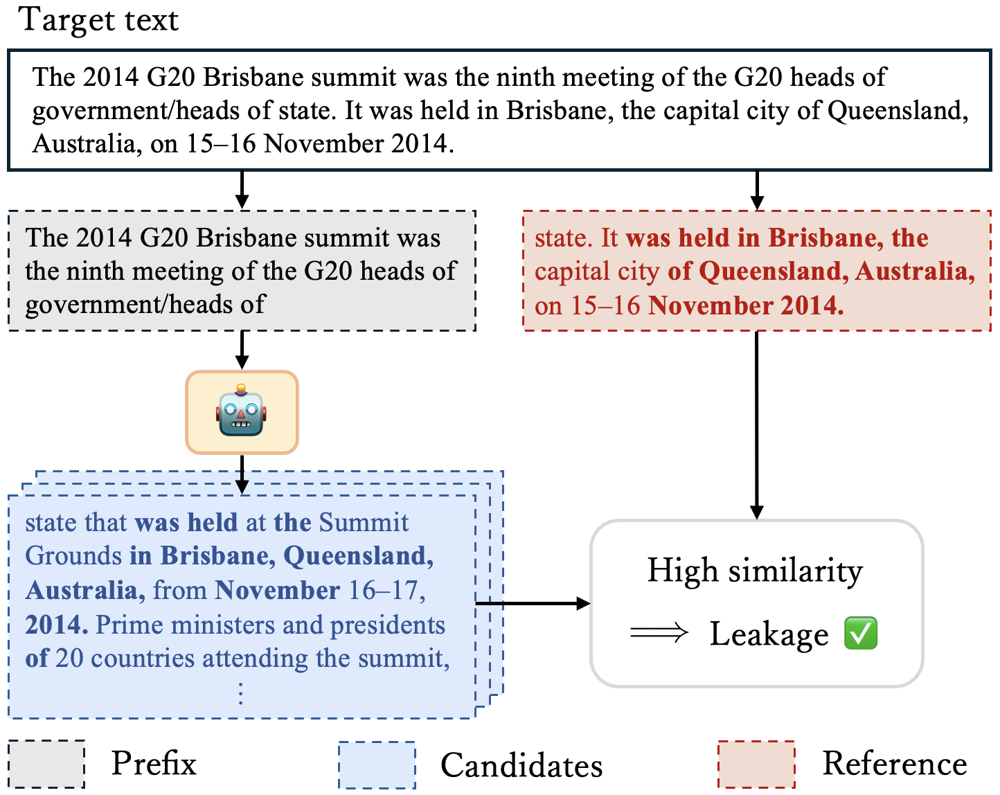
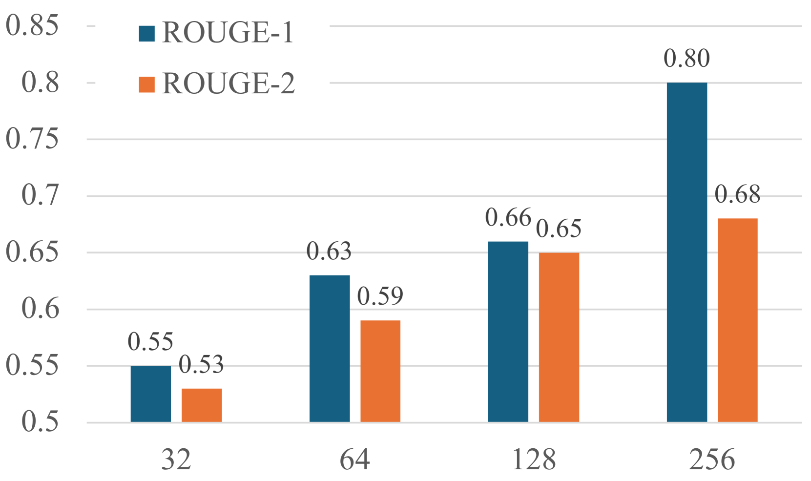
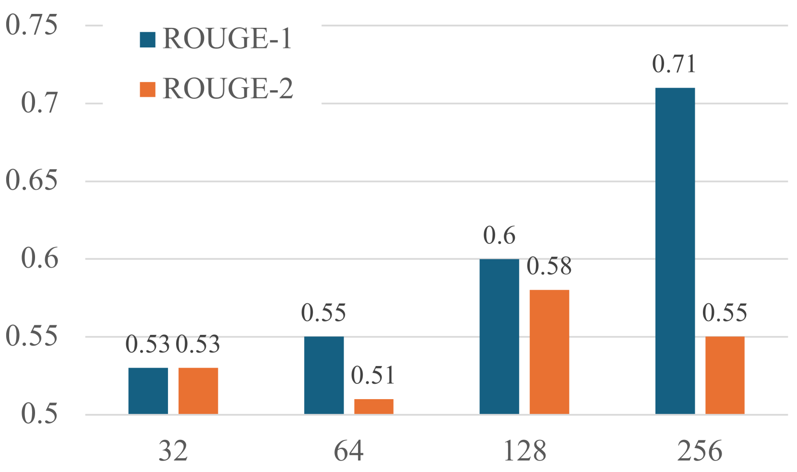
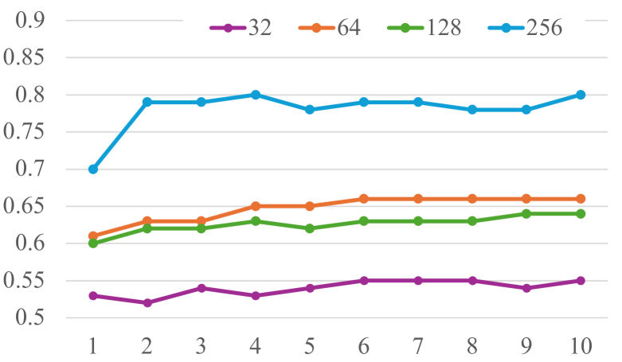
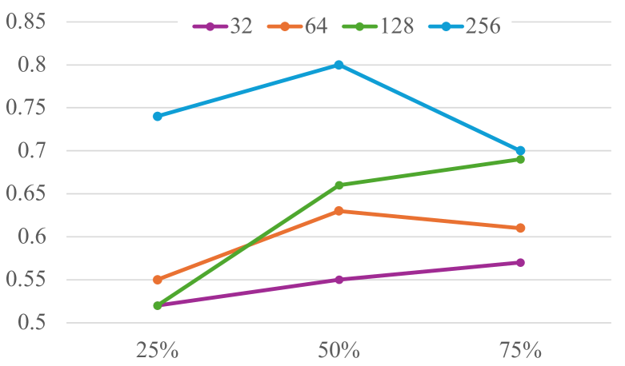
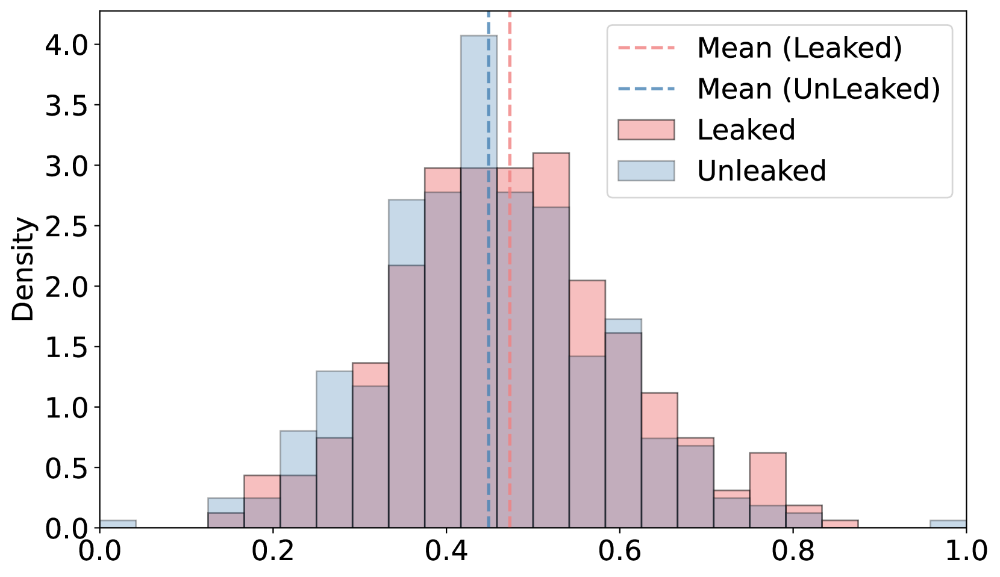
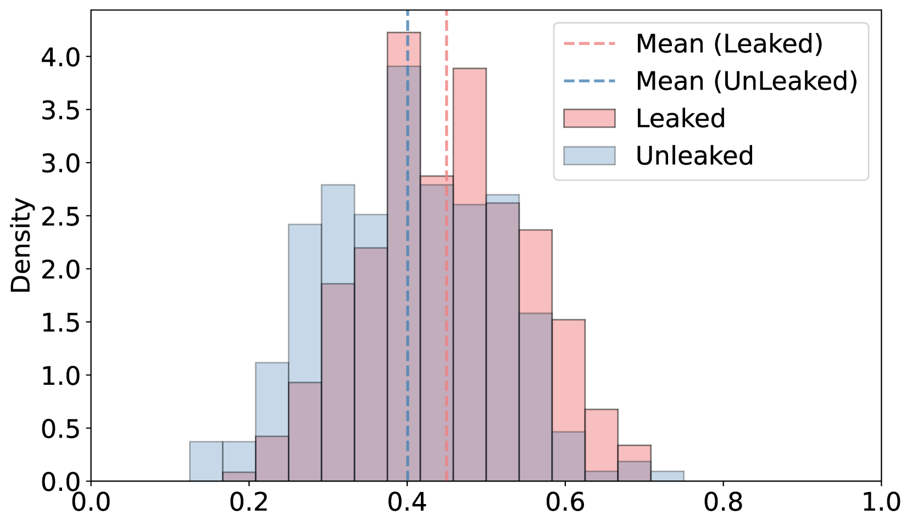
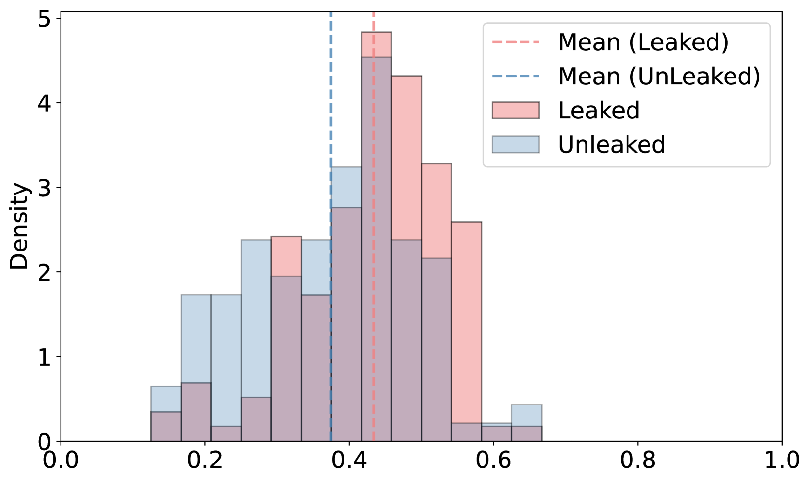
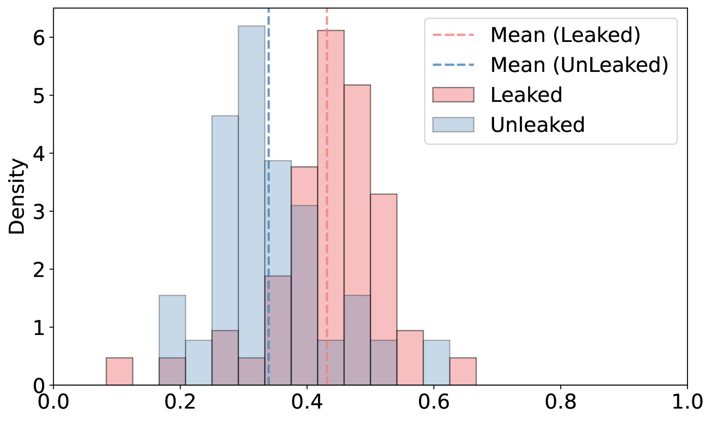

# 采用抽样方法构建的伪似然模型，用于执行成员推断攻击。

发布时间：2024年04月17日

`LLM应用` `网络安全` `数据隐私`

> Sampling-based Pseudo-Likelihood for Membership Inference Attacks

# 摘要

> 大型语言模型（LLMs）的训练依赖于海量网络数据，这让我们难以衡量每段文本的具体贡献，同时也增加了不当数据泄露的风险，如敏感的基准数据、个人信息以及受版权保护的文本。一种名为会员推断攻击（MIA）的技术，旨在判断某段文本是否曾被用于模型训练，正逐渐受到重视。过往对MIA的研究显示，基于似然的分类方法能有效发现LLMs中的信息泄露问题。但是，对于某些商业模型，比如ChatGPT或Claude 3，这种方法并不适用，因为用户无法获取似然值。本研究提出了一种新颖的基于采样的伪似然（SPL）方法，即SaMIA，它通过仅分析LLM生成的文本来计算SPL，以此来检测潜在的数据泄露。SaMIA将目标文本作为参照点，利用模型生成的多个文本样本，通过计算$n$-gram匹配的程度来评估SPL，进而推断文本是否曾经是训练数据的一部分。即便在缺乏似然值的情况下，SaMIA的表现也能与现有的基于似然的方法相媲美。

> Large Language Models (LLMs) are trained on large-scale web data, which makes it difficult to grasp the contribution of each text. This poses the risk of leaking inappropriate data such as benchmarks, personal information, and copyrighted texts in the training data. Membership Inference Attacks (MIA), which determine whether a given text is included in the model's training data, have been attracting attention. Previous studies of MIAs revealed that likelihood-based classification is effective for detecting leaks in LLMs. However, the existing methods cannot be applied to some proprietary models like ChatGPT or Claude 3 because the likelihood is unavailable to the user. In this study, we propose a Sampling-based Pseudo-Likelihood (\textbf{SPL}) method for MIA (\textbf{SaMIA}) that calculates SPL using only the text generated by an LLM to detect leaks. The SaMIA treats the target text as the reference text and multiple outputs from the LLM as text samples, calculates the degree of $n$-gram match as SPL, and determines the membership of the text in the training data. Even without likelihoods, SaMIA performed on par with existing likelihood-based methods.

[Arxiv](https://arxiv.org/abs/2404.11262)