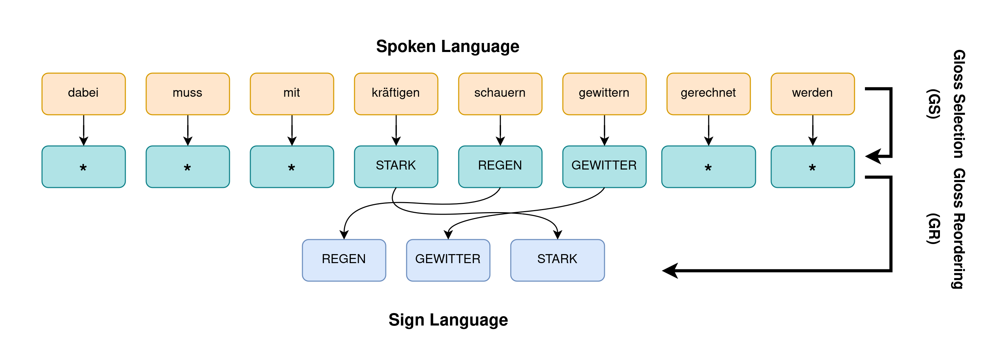
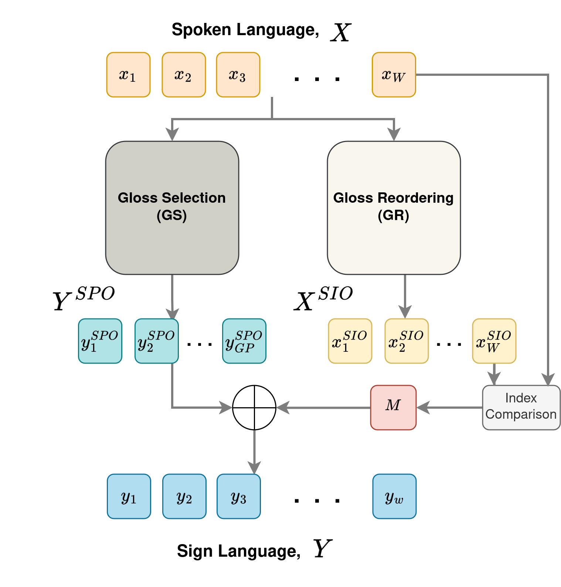
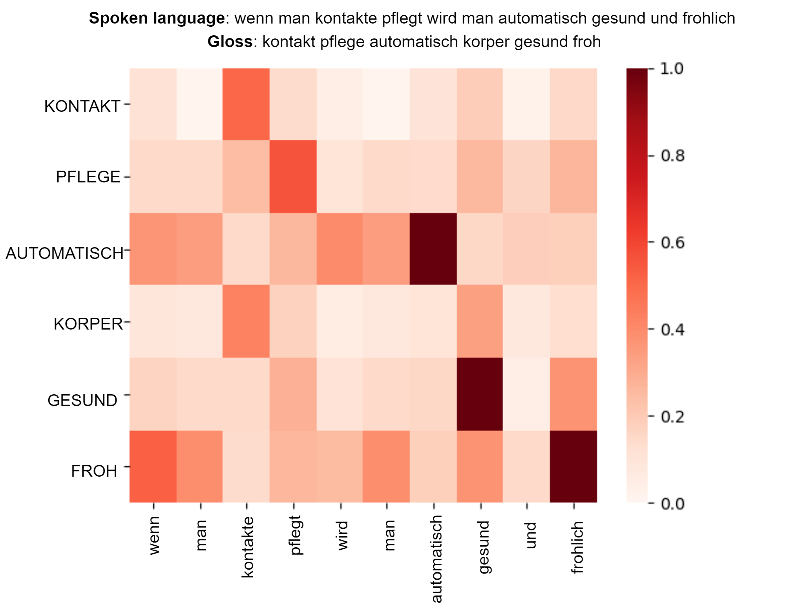
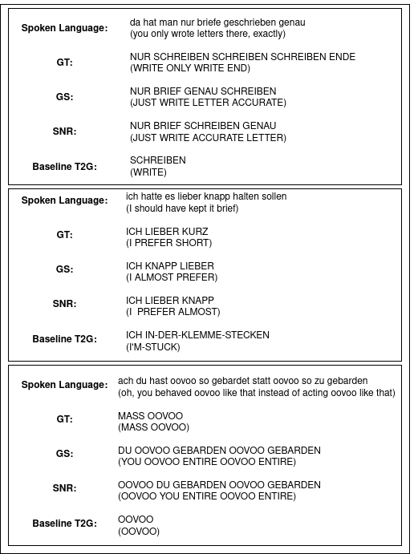

# 新颖方法：选择与重组，开启神经手语生成的新篇章

发布时间：2024年04月17日

`LLM应用` `手语翻译` `机器翻译`

> Select and Reorder: A Novel Approach for Neural Sign Language Production

# 摘要

> 手语作为一种资源稀缺的语言，因缺少并行标注数据集而在精确翻译上遇到重大难题。本篇论文提出了一种创新的“选择与重排”（S&R）策略，它通过将翻译流程划分为词汇选择（GS）和词汇重排（GR）两个独立步骤来应对数据不足的问题。该方法借助大型口语语言模型，并利用源口语和目标手语之间的广泛词汇相似性来确立初步对应关系。两个步骤均采用非自回归（NAR）解码技术，以降低计算成本并提高推理速度。通过这种任务分离，我们在 Mein DGS 注释（mDGS）数据集上取得了业界领先的BLEU和Rouge评分，文本到词汇（T2G）翻译的BLEU-1得分提升了37.88%。这一创新策略为手语翻译模型的发展开辟了新径，即便在资源受限的情境下也能有效应用。

> Sign languages, often categorised as low-resource languages, face significant challenges in achieving accurate translation due to the scarcity of parallel annotated datasets. This paper introduces Select and Reorder (S&R), a novel approach that addresses data scarcity by breaking down the translation process into two distinct steps: Gloss Selection (GS) and Gloss Reordering (GR). Our method leverages large spoken language models and the substantial lexical overlap between source spoken languages and target sign languages to establish an initial alignment. Both steps make use of Non-AutoRegressive (NAR) decoding for reduced computation and faster inference speeds. Through this disentanglement of tasks, we achieve state-of-the-art BLEU and Rouge scores on the Meine DGS Annotated (mDGS) dataset, demonstrating a substantial BLUE-1 improvement of 37.88% in Text to Gloss (T2G) Translation. This innovative approach paves the way for more effective translation models for sign languages, even in resource-constrained settings.

[Arxiv](https://arxiv.org/abs/2404.11532)