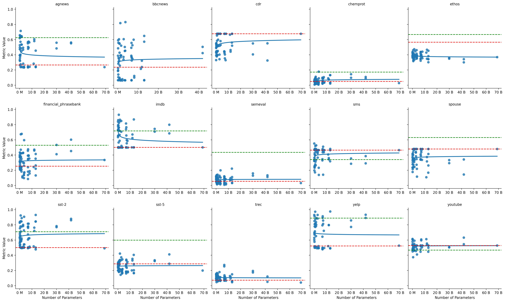
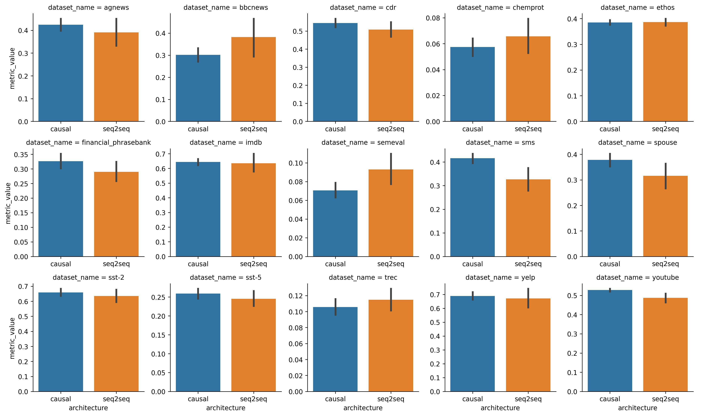
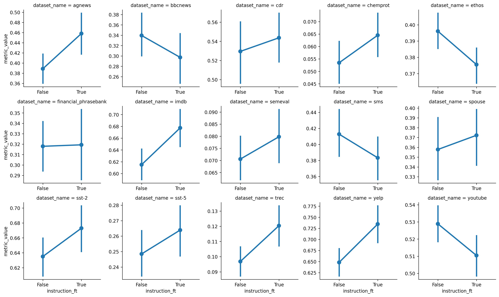
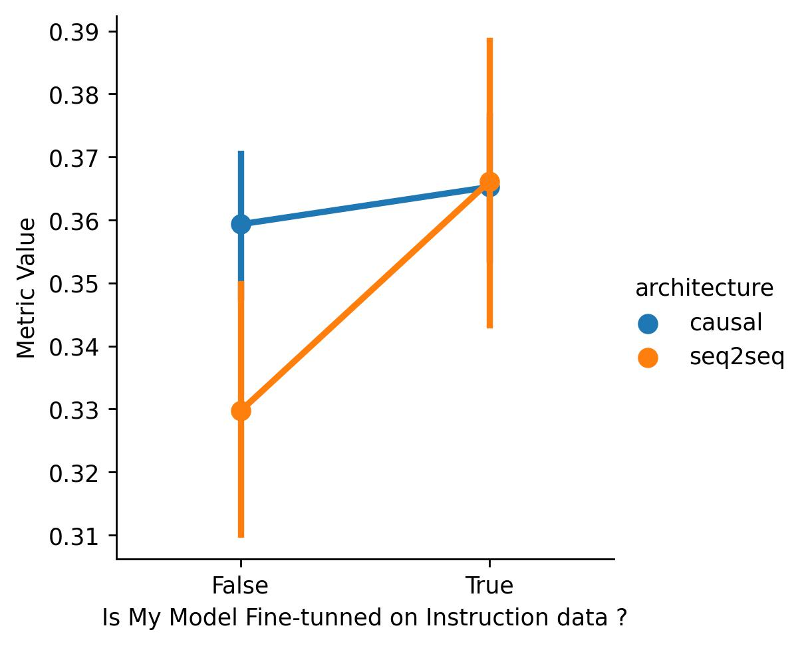

# 小型语言模型同样出色：一项关于零样本分类的实证研究

发布时间：2024年04月17日

`LLM应用` `文本分类` `机器学习`

> Small Language Models are Good Too: An Empirical Study of Zero-Shot Classification

# 摘要

> 本研究参与了关于大型与小型语言模型在文本分类任务中效率的讨论。我们对小型语言模型在零样本文本分类任务中的表现进行了评估，质疑了大型模型的普遍主导地位。通过在15个不同的数据集上，使用不同架构和评分函数对参数量从7700万到400亿的语言模型进行基准测试，我们的研究结果显示小型模型同样能够有效地进行文本分类，甚至在某些情况下能够匹敌或超越大型模型。为此，我们开发并公开了一个包含我们方法论的全面开源资源库。该研究突出了一个观点：规模并非总是决定性因素，资源节约型的小型模型可能为特定数据分类难题提供有效的解决途径。

> This study is part of the debate on the efficiency of large versus small language models for text classification by prompting.We assess the performance of small language models in zero-shot text classification, challenging the prevailing dominance of large models.Across 15 datasets, our investigation benchmarks language models from 77M to 40B parameters using different architectures and scoring functions. Our findings reveal that small models can effectively classify texts, getting on par with or surpassing their larger counterparts.We developed and shared a comprehensive open-source repository that encapsulates our methodologies. This research underscores the notion that bigger isn't always better, suggesting that resource-efficient small models may offer viable solutions for specific data classification challenges.

[Arxiv](https://arxiv.org/abs/2404.11122)