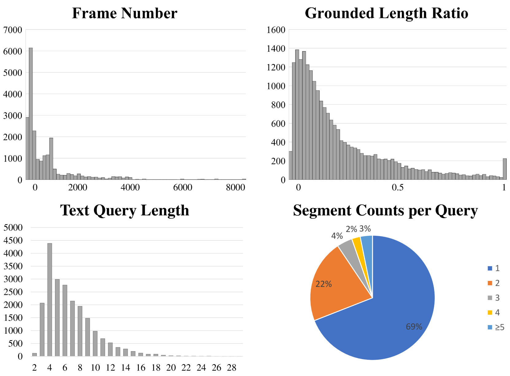
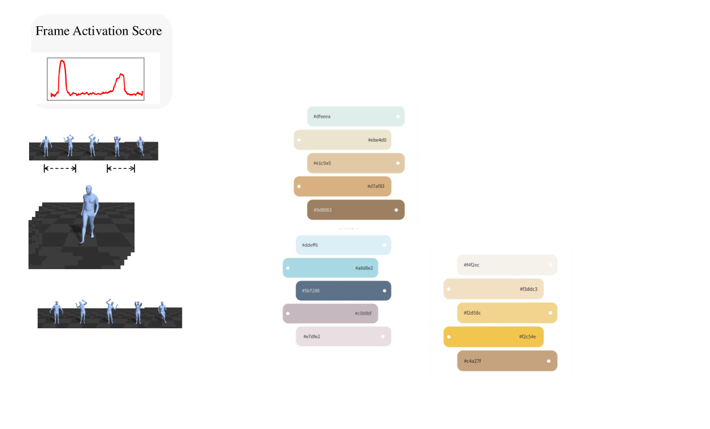
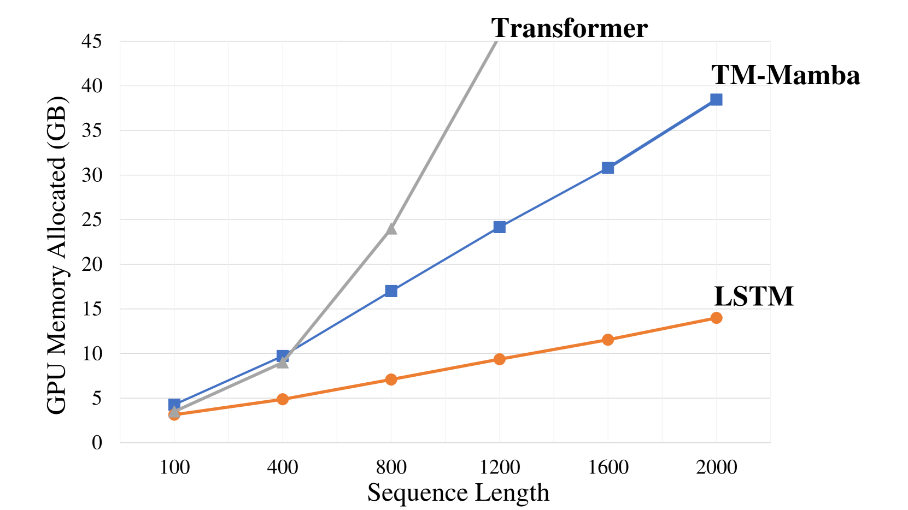
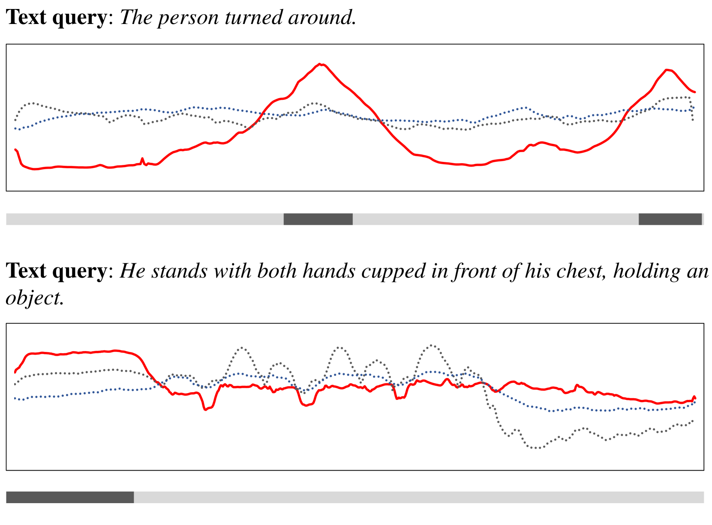
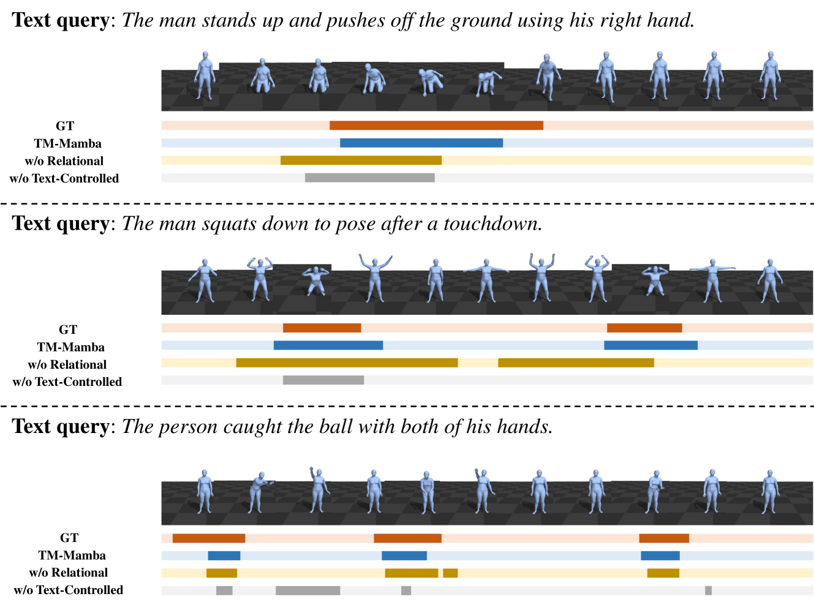

# 文本操控的“运动曼巴”：通过文本指令实现人体动作的时间定位

发布时间：2024年04月17日

`分类：RAG

这篇论文提出了一个新的任务——基于文本的人体运动定位（THMG），并设计了一个名为文本控制的运动曼巴（TM-Mamba）模型来解决这个任务。这个任务涉及到文本和人体运动之间的关系，而TM-Mamba模型结合了时间全局上下文、语言查询控制和空间图拓扑，以线性内存成本运行。这篇论文的研究内容和方法与RAG（Retrieval-Augmented Generation）相关，因为RAG是一种结合了检索（Retrieval）和生成（Generation）的方法，而TM-Mamba模型在处理文本和运动之间的关系时，也涉及到了类似的检索和生成过程。` `人体运动分析` `人工智能`

> Text-controlled Motion Mamba: Text-Instructed Temporal Grounding of Human Motion

# 摘要

> 理解人体运动是一项基础且应用广泛的任务，其实践应用得益于众多大规模运动捕捉数据集的支持。当前研究多聚焦于文本与运动相关的任务，包括基于文本的运动生成、编辑和问答等。本研究提出了一个新的任务——基于文本的人体运动定位（THMG），目标是在未剪辑的运动序列中精确识别与特定文本描述相匹配的时间片段。对于 THMG 而言，获取整体时间信息非常关键。但是，基于变换器的模型在处理长序列时，由于计算成本呈二次增长，面临重大挑战。为了应对这些挑战，我们设计了文本控制的运动曼巴（TM-Mamba）模型，它是一个集时间全局上下文、语言查询控制和空间图拓扑于一体的统一模型，且仅以线性内存成本运行。该模型的精髓在于其文本控制的选择机制，能够根据文本查询动态地整合全局时间信息，并通过融入关系嵌入进一步提升模型的拓扑感知能力。为了验证模型性能，我们创建了 BABEL-Grounding 数据集，这是首个提供详细文本描述及对应时间片段的文本-运动数据集。广泛的评估结果证明了 TM-Mamba 在 BABEL-Grounding 数据集上的有效性和优越性。

> Human motion understanding is a fundamental task with diverse practical applications, facilitated by the availability of large-scale motion capture datasets. Recent studies focus on text-motion tasks, such as text-based motion generation, editing and question answering. In this study, we introduce the novel task of text-based human motion grounding (THMG), aimed at precisely localizing temporal segments corresponding to given textual descriptions within untrimmed motion sequences. Capturing global temporal information is crucial for the THMG task. However, transformer-based models that rely on global temporal self-attention face challenges when handling long untrimmed sequences due to the quadratic computational cost. We address these challenges by proposing Text-controlled Motion Mamba (TM-Mamba), a unified model that integrates temporal global context, language query control, and spatial graph topology with only linear memory cost. The core of the model is a text-controlled selection mechanism which dynamically incorporates global temporal information based on text query. The model is further enhanced to be topology-aware through the integration of relational embeddings. For evaluation, we introduce BABEL-Grounding, the first text-motion dataset that provides detailed textual descriptions of human actions along with their corresponding temporal segments. Extensive evaluations demonstrate the effectiveness of TM-Mamba on BABEL-Grounding.

[Arxiv](https://arxiv.org/abs/2404.11375)