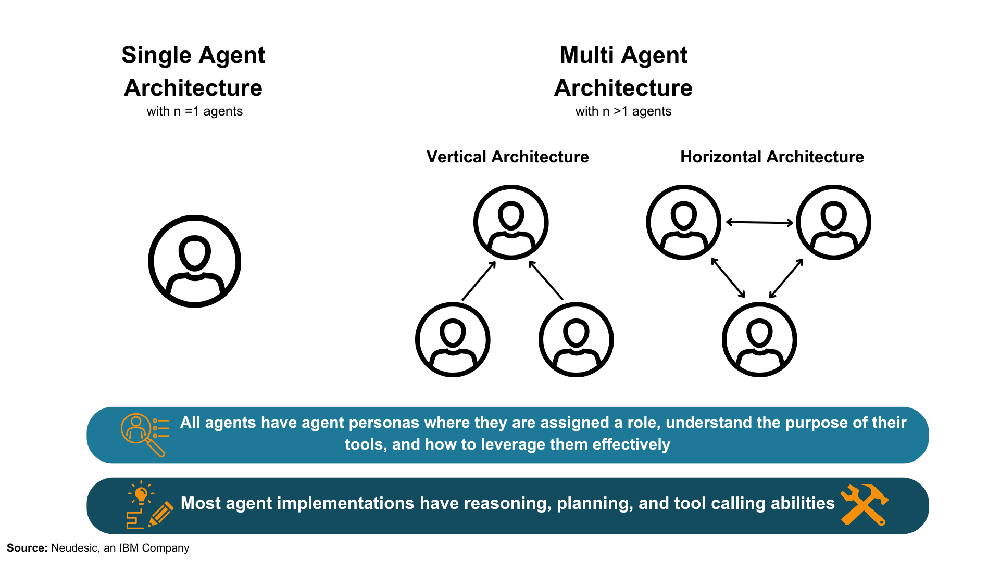
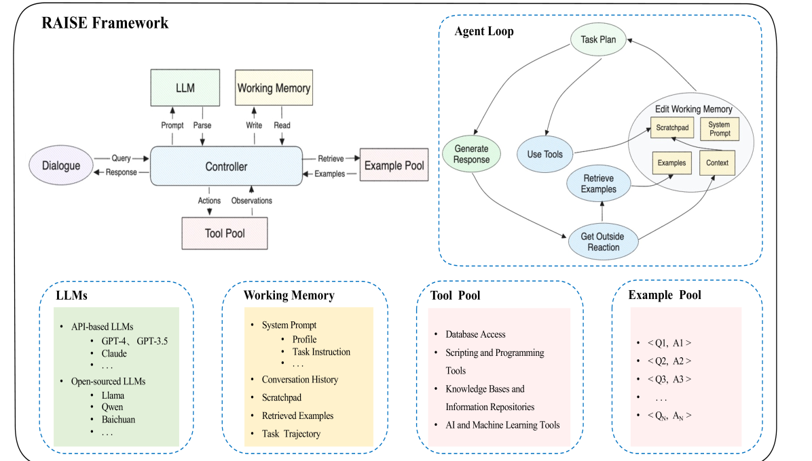
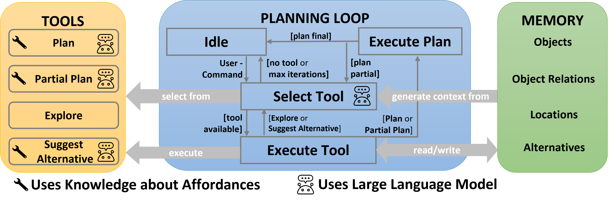
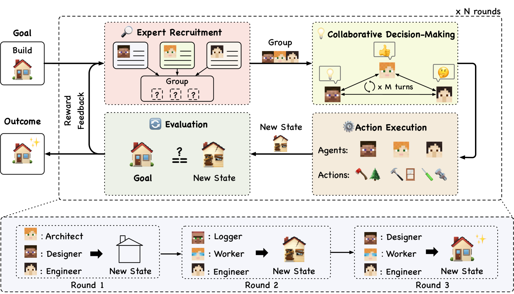

# 探索新兴AI代理架构：推理、规划与工具调用的全景调查

发布时间：2024年04月17日

`Agent` `人工智能` `自动化系统`

> The Landscape of Emerging AI Agent Architectures for Reasoning, Planning, and Tool Calling: A Survey

# 摘要

> 本篇综述性文章深入探讨了人工智能代理实现的近期进展，特别关注这些代理在实现复杂目标时所需的高级推理、规划和工具执行能力。文章旨在 a) 阐述当前人工智能代理实现的能力与局限，b) 分享我们在观察这些系统运作过程中获得的洞见，c) 对未来人工智能代理设计的发展提出建议。通过概述单代理和多代理架构，识别设计选择中的关键模式和差异，并评估这些设计对达成既定目标的整体影响，我们达成了这些目标。文章还概述了在选择代理架构时应考虑的关键要素，领导力对代理系统的影响，代理间的沟通方式，以及规划、执行和反思的关键阶段，这些都是构建强大人工智能代理系统的关键因素。

> This survey paper examines the recent advancements in AI agent implementations, with a focus on their ability to achieve complex goals that require enhanced reasoning, planning, and tool execution capabilities. The primary objectives of this work are to a) communicate the current capabilities and limitations of existing AI agent implementations, b) share insights gained from our observations of these systems in action, and c) suggest important considerations for future developments in AI agent design. We achieve this by providing overviews of single-agent and multi-agent architectures, identifying key patterns and divergences in design choices, and evaluating their overall impact on accomplishing a provided goal. Our contribution outlines key themes when selecting an agentic architecture, the impact of leadership on agent systems, agent communication styles, and key phases for planning, execution, and reflection that enable robust AI agent systems.

[Arxiv](https://arxiv.org/abs/2404.11584)