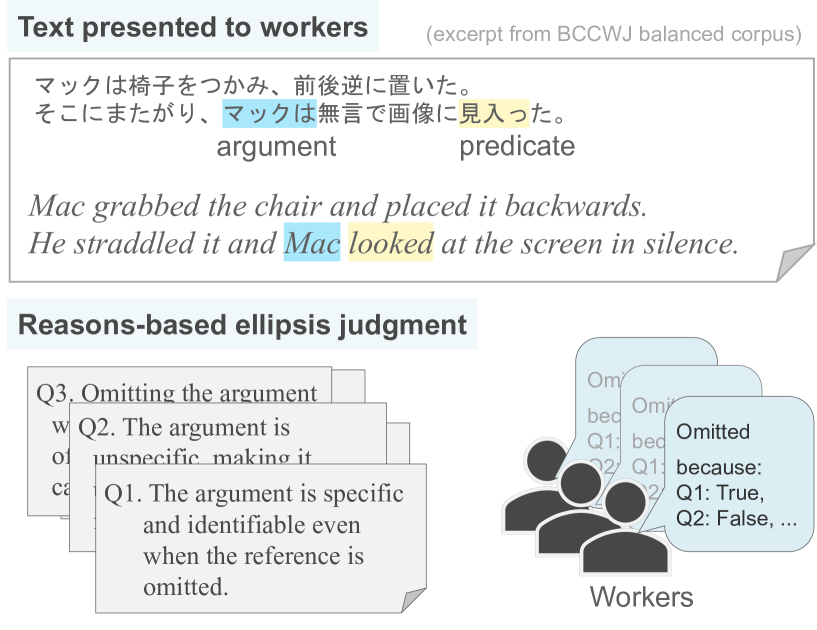
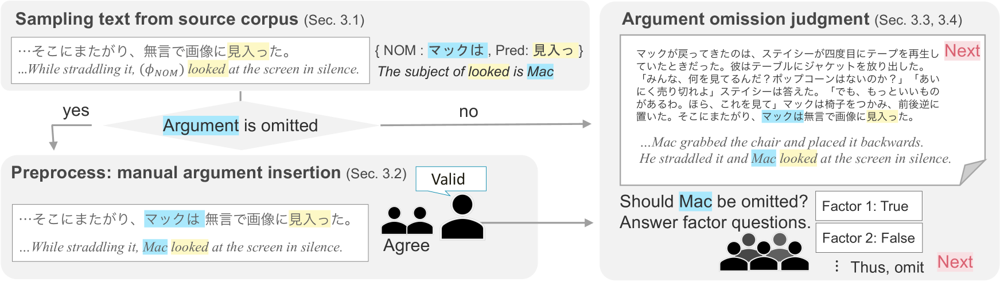
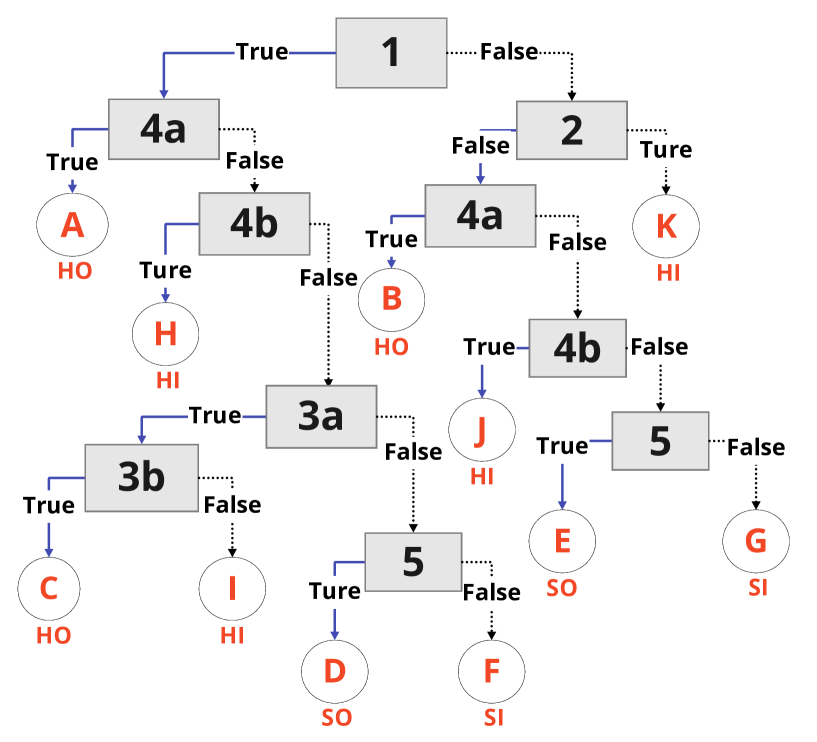
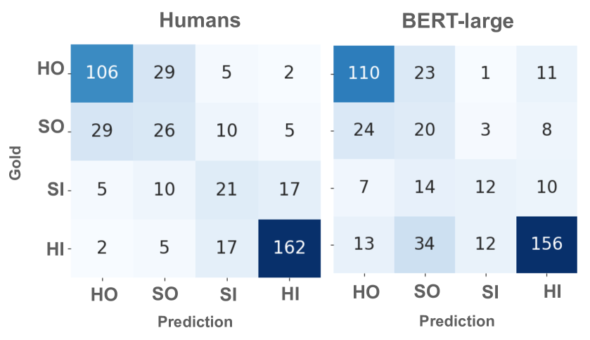
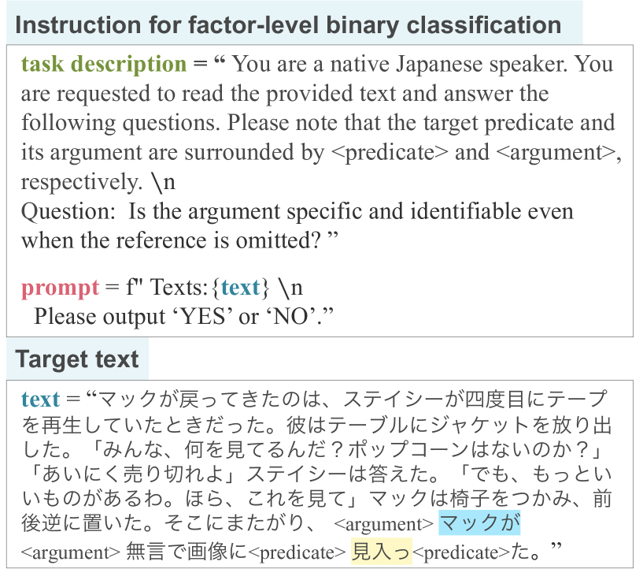

# 省略还是不省略？论元省略判断的预测：以日语为例

发布时间：2024年04月17日

`分类：LLM应用

这篇论文主要研究了日语中省略代词现象的动机和规律，并通过大规模的人类标注工作来确定何时以及为何省略特定论元。此外，论文还评估了基于语言模型的论元省略判断模型的表现。这些研究对于理解人类语言处理机制以及辅助写作工具的开发具有重要意义，因此可以归类为LLM应用。` `语言学研究`

> To Drop or Not to Drop? Predicting Argument Ellipsis Judgments: A Case Study in Japanese

# 摘要

> 在日常对话中，人们往往会省略句子中的一些谓词论元，尤其在那些允许省略代词的语言中，这种现象更为常见。本研究旨在探究省略现象背后的动机——即母语者为何会选择省略某些论元——这一问题的研究不仅对理解人类语言处理机制至关重要，也对辅助写作工具的开发具有重要意义。为此，我们首先对日语这一典型的省略代词语言进行了大规模的人类标注工作，涉及2000多个数据点，以确定何时以及为何省略特定论元。研究发现，母语者在做出这类判断时普遍遵循一套共同的标准，并且我们进一步揭示了这些标准的量化特征，如相关语言因素在语料库中的分布情况。此外，我们还评估了基于语言模型的论元省略判断模型的表现，并指出了系统预测与人类判断在特定语言特征上的差异。我们期望这项基础性的工作能够激发对人类自然省略判断行为的更多研究。

> Speakers sometimes omit certain arguments of a predicate in a sentence; such omission is especially frequent in pro-drop languages. This study addresses a question about ellipsis -- what can explain the native speakers' ellipsis decisions? -- motivated by the interest in human discourse processing and writing assistance for this choice. To this end, we first collect large-scale human annotations of whether and why a particular argument should be omitted across over 2,000 data points in the balanced corpus of Japanese, a prototypical pro-drop language. The data indicate that native speakers overall share common criteria for such judgments and further clarify their quantitative characteristics, e.g., the distribution of related linguistic factors in the balanced corpus. Furthermore, the performance of the language model-based argument ellipsis judgment model is examined, and the gap between the systems' prediction and human judgments in specific linguistic aspects is revealed. We hope our fundamental resource encourages further studies on natural human ellipsis judgment.

[Arxiv](https://arxiv.org/abs/2404.11315)