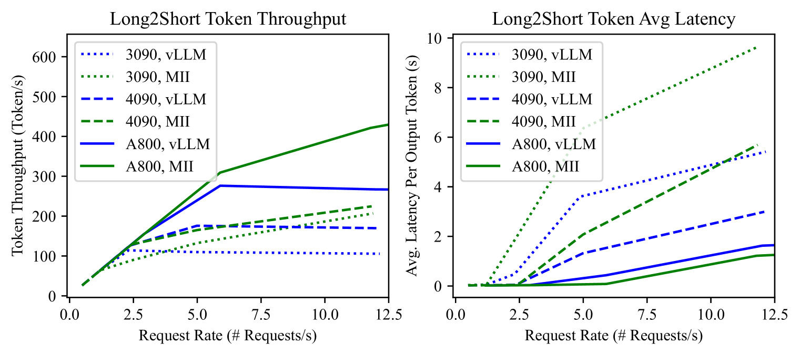
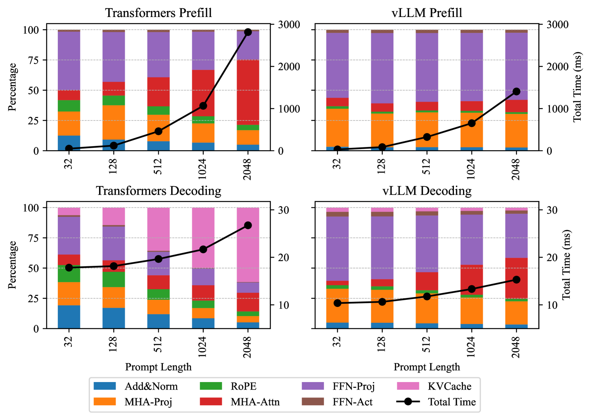
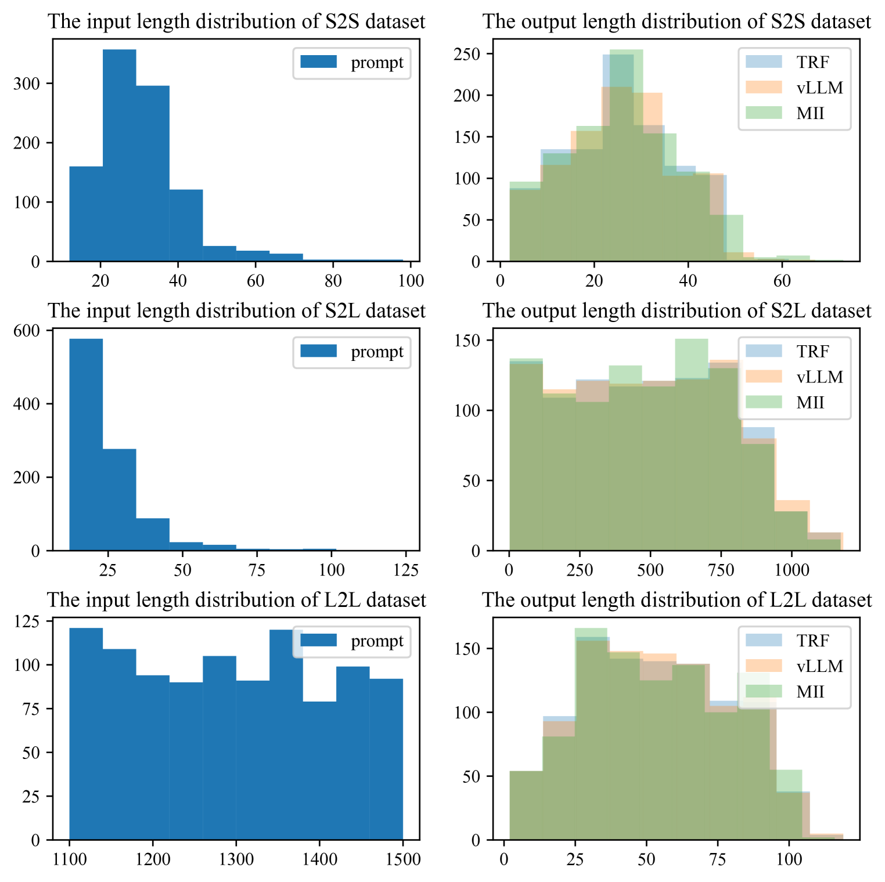
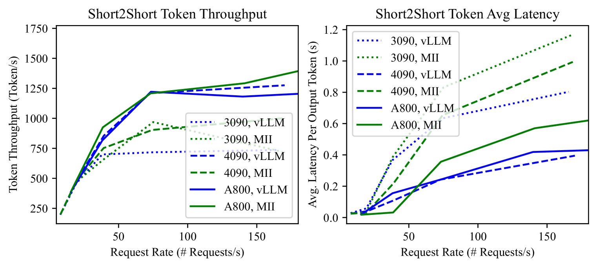
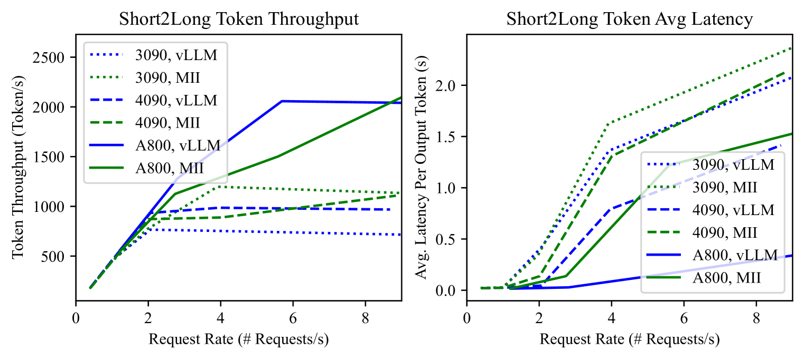
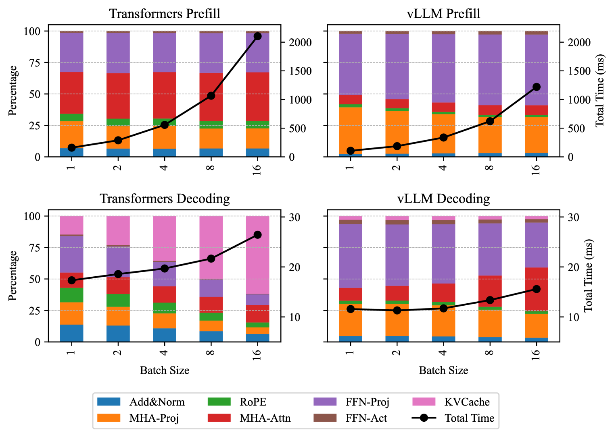

# 本研究提出了一种从宏观到微观的评估框架，用以细致考察大型语言模型在推理效率方面的表现。

发布时间：2024年04月17日

`分类：LLM应用` `机器学习`

> Towards Coarse-to-Fine Evaluation of Inference Efficiency for Large Language Models

# 摘要

> 在现实应用中，大型语言模型（LLMs）不仅能够辅助用户高效完成工作，还能推动高端应用的发展。尽管已有研究广泛探讨了提升LLMs推理效率的方法，并提出了众多优化算法与代码库，用户在比较这些方法的优劣和洞悉其内在机制时仍面临困难。本研究深入分析了多种代码库的推理性能，从宏观到微观逐层剖析。我们通过两个实际应用中的四种使用场景来评估整体效能，并针对Transformer架构的每个模块进行了理论和实证的细致分析。实验结果全面而深入，对研究人员评估代码库性能和优化推理策略提供了宝贵参考。

> In real world, large language models (LLMs) can serve as the assistant to help users accomplish their jobs, and also support the development of advanced applications. For the wide application of LLMs, the inference efficiency is an essential concern, which has been widely studied in existing work, and numerous optimization algorithms and code libraries have been proposed to improve it. Nonetheless, users still find it challenging to compare the effectiveness of all the above methods and understand the underlying mechanisms. In this work, we perform a detailed coarse-to-fine analysis of the inference performance of various code libraries. To evaluate the overall effectiveness, we examine four usage scenarios within two practical applications. We further provide both theoretical and empirical fine-grained analyses of each module in the Transformer architecture. Our experiments yield comprehensive results that are invaluable for researchers to evaluate code libraries and improve inference strategies.

[Arxiv](https://arxiv.org/abs/2404.11502)