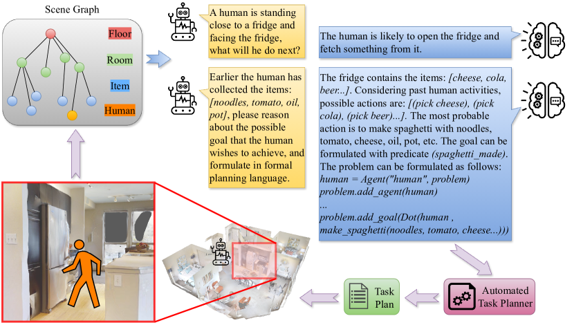

# 借助大型语言模型，机器人任务规划正逐步迈向具备人类意识的新阶段。

发布时间：2024年04月17日

`分类：LLM应用` `机器人技术` `人工智能`

> Towards Human Awareness in Robot Task Planning with Large Language Models

# 摘要

> 近期大型语言模型（LLMs）研究的进展在多个领域引发了技术革新。特别是在机器人任务与运动规划（TAMP）方面，LLMs的应用显著提升了性能。但现有研究往往忽视了动态环境因素，例如人类等动态对象的考量。本文提出了一种创新方法，通过将人类因素纳入基于LLM的机器人任务规划，来填补这一研究空白。我们的方法通过将人类信息整合进分层场景图，以获得动态环境的有效表征，并利用LLMs将环境结构和行动知识转化为正式的规划语言，确保计划的可行性。关键的是，我们利用LLMs来预测人类的未来行为，并据此为机器人规划任务。本研究的成果不仅推动了将人类意识融入LLM驱动的机器人任务规划的进程，也为机器人在动态环境中的主动决策提供了新思路。

> The recent breakthroughs in the research on Large Language Models (LLMs) have triggered a transformation across several research domains. Notably, the integration of LLMs has greatly enhanced performance in robot Task And Motion Planning (TAMP). However, previous approaches often neglect the consideration of dynamic environments, i.e., the presence of dynamic objects such as humans. In this paper, we propose a novel approach to address this gap by incorporating human awareness into LLM-based robot task planning. To obtain an effective representation of the dynamic environment, our approach integrates humans' information into a hierarchical scene graph. To ensure the plan's executability, we leverage LLMs to ground the environmental topology and actionable knowledge into formal planning language. Most importantly, we use LLMs to predict future human activities and plan tasks for the robot considering the predictions. Our contribution facilitates the development of integrating human awareness into LLM-driven robot task planning, and paves the way for proactive robot decision-making in dynamic environments.

[Arxiv](https://arxiv.org/abs/2404.11267)