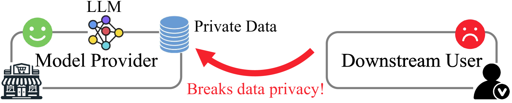
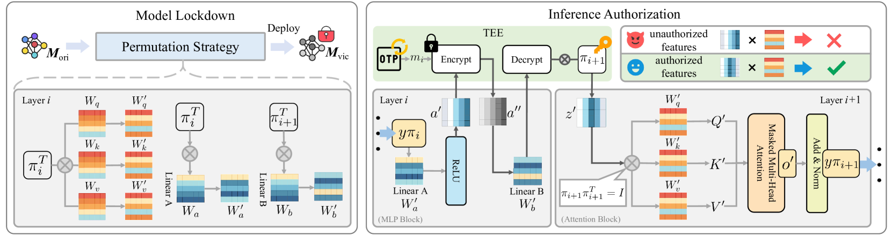
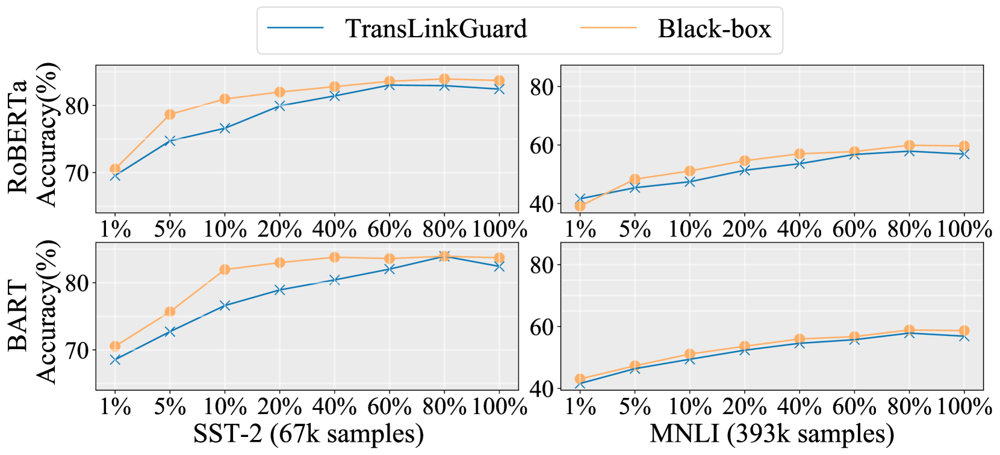

# TransLinkGuard：在边缘计算环境中，为 Transformer 模型提供防护，防止模型被窃取。

发布时间：2024年04月17日

`分类：LLM应用` `边缘计算` `网络安全`

> TransLinkGuard: Safeguarding Transformer Models Against Model Stealing in Edge Deployment

# 摘要

> 专有的大型语言模型（LLMs）在多种应用场景中发挥着重要作用，并且为了提高效率和保护隐私，将这些模型部署在边缘设备上的做法日益流行。但这种做法也带来了新的安全问题：边缘部署的模型容易被用户以白盒方式访问，从而使得潜在的攻击者有机会实施模型窃取（MS）攻击。目前，现有的防御措施还无法有效抵御这类攻击。我们发现，现有方法在四个关键的安全属性上存在不足：（1）模型被物理复制后仍能保持安全；（2）能够在请求级别控制模型访问权限；（3）防止运行时的逆向工程；（4）在几乎不影响运行效率的前提下提供高安全保障。为了应对这些挑战，我们设计了TransLinkGuard，这是一种易于集成的模型保护方案，专门针对边缘设备上的模型窃取问题。TransLinkGuard的亮点是一个小巧的授权模块，它位于如可信执行环境（TEE）这样的安全区域，能够根据请求的输入实时进行授权。大量实验证明，TransLinkGuard在几乎不影响运行效率的情况下，提供了与黑盒安全相当的保护水平。

> Proprietary large language models (LLMs) have been widely applied in various scenarios. Additionally, deploying LLMs on edge devices is trending for efficiency and privacy reasons. However, edge deployment of proprietary LLMs introduces new security challenges: edge-deployed models are exposed as white-box accessible to users, enabling adversaries to conduct effective model stealing (MS) attacks. Unfortunately, existing defense mechanisms fail to provide effective protection. Specifically, we identify four critical protection properties that existing methods fail to simultaneously satisfy: (1) maintaining protection after a model is physically copied; (2) authorizing model access at request level; (3) safeguarding runtime reverse engineering; (4) achieving high security with negligible runtime overhead. To address the above issues, we propose TransLinkGuard, a plug-and-play model protection approach against model stealing on edge devices. The core part of TransLinkGuard is a lightweight authorization module residing in a secure environment, e.g., TEE. The authorization module can freshly authorize each request based on its input. Extensive experiments show that TransLinkGuard achieves the same security protection as the black-box security guarantees with negligible overhead.

[Arxiv](https://arxiv.org/abs/2404.11121)