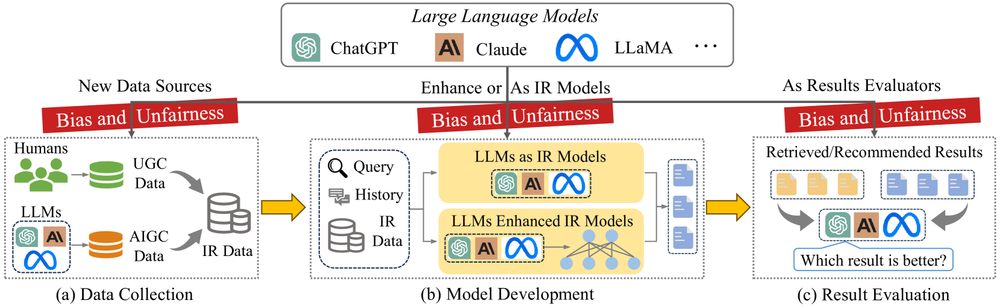
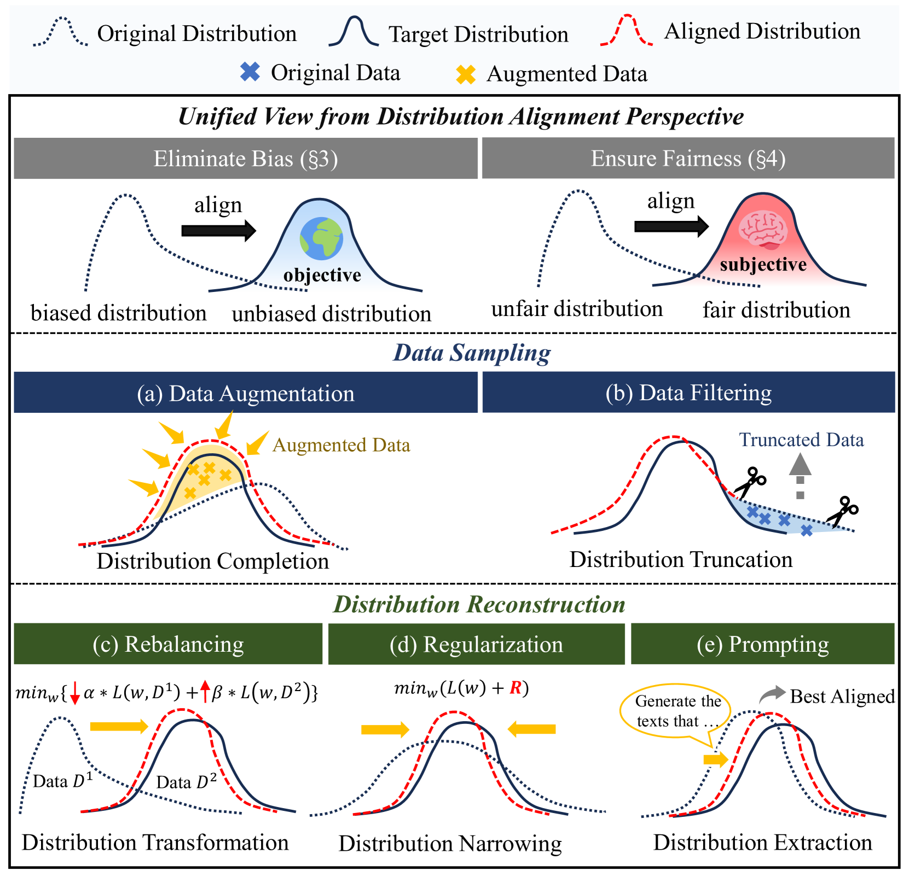

# 探索信息检索中的偏见与不公：大型语言模型面临的挑战与机遇综述

发布时间：2024年04月17日

`LLM应用` `信息检索` `偏见与公平性`

> Unifying Bias and Unfairness in Information Retrieval: A Survey of Challenges and Opportunities with Large Language Models

# 摘要

> 大型语言模型（LLMs）的迅猛进展引领了信息检索（IR）系统，包括搜索引擎和推荐系统的一场范式革命。这场变革虽开启新机遇，却也引发新挑战，尤其是在偏见和不公平问题上，这些问题可能对信息生态构成威胁。本文综述了LLMs融入IR系统时所引发的偏见和不公平问题的现有研究。我们首先将偏见和不公平视为分布不匹配的问题，为通过分布校准对多种缓解策略进行分类奠定了基础。然后，我们系统性地分析了LLMs整合进IR系统的三个关键环节——数据收集、模型构建和结果评估——所带来的具体偏见和不公平问题。我们对相关文献进行了细致的回顾与分析，聚焦于这些问题的定义、特点及其缓解策略。文章最后，我们指出并强调了未来研究中的一些未解决问题和挑战，以期激发IR领域及其他相关领域研究者和决策者对LLM时代IR偏见和不公平问题更深入的理解和有效缓解。我们还持续更新一个GitHub仓库，收录了这一新兴研究方向的相关论文和资源，具体可在 https://github.com/KID-22/LLM-IR-Bias-Fairness-Survey 查看。

> With the rapid advancement of large language models (LLMs), information retrieval (IR) systems, such as search engines and recommender systems, have undergone a significant paradigm shift. This evolution, while heralding new opportunities, introduces emerging challenges, particularly in terms of biases and unfairness, which may threaten the information ecosystem. In this paper, we present a comprehensive survey of existing works on emerging and pressing bias and unfairness issues in IR systems when the integration of LLMs. We first unify bias and unfairness issues as distribution mismatch problems, providing a groundwork for categorizing various mitigation strategies through distribution alignment. Subsequently, we systematically delve into the specific bias and unfairness issues arising from three critical stages of LLMs integration into IR systems: data collection, model development, and result evaluation. In doing so, we meticulously review and analyze recent literature, focusing on the definitions, characteristics, and corresponding mitigation strategies associated with these issues. Finally, we identify and highlight some open problems and challenges for future work, aiming to inspire researchers and stakeholders in the IR field and beyond to better understand and mitigate bias and unfairness issues of IR in this LLM era. We also consistently maintain a GitHub repository for the relevant papers and resources in this rising direction at https://github.com/KID-22/LLM-IR-Bias-Fairness-Survey.

[Arxiv](https://arxiv.org/abs/2404.11457)