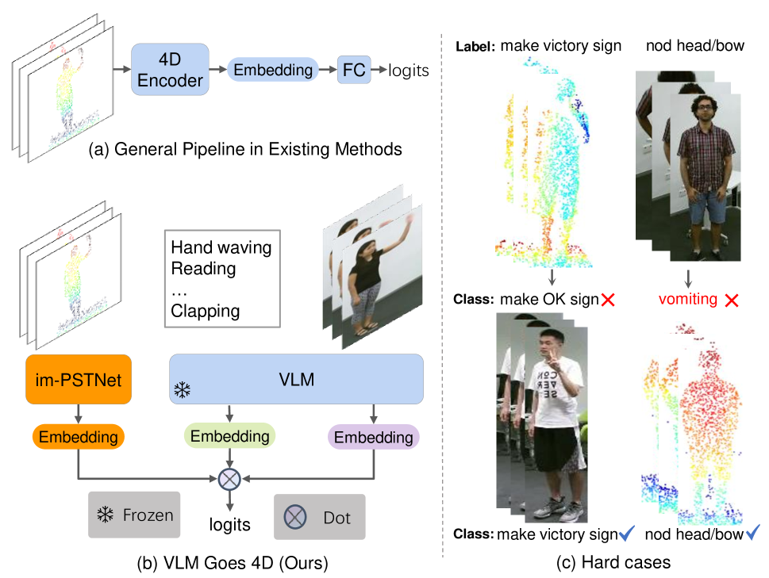
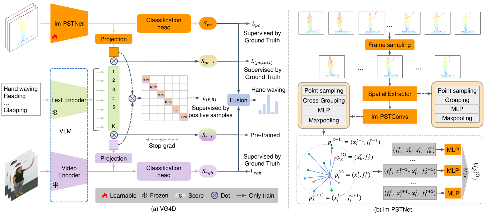
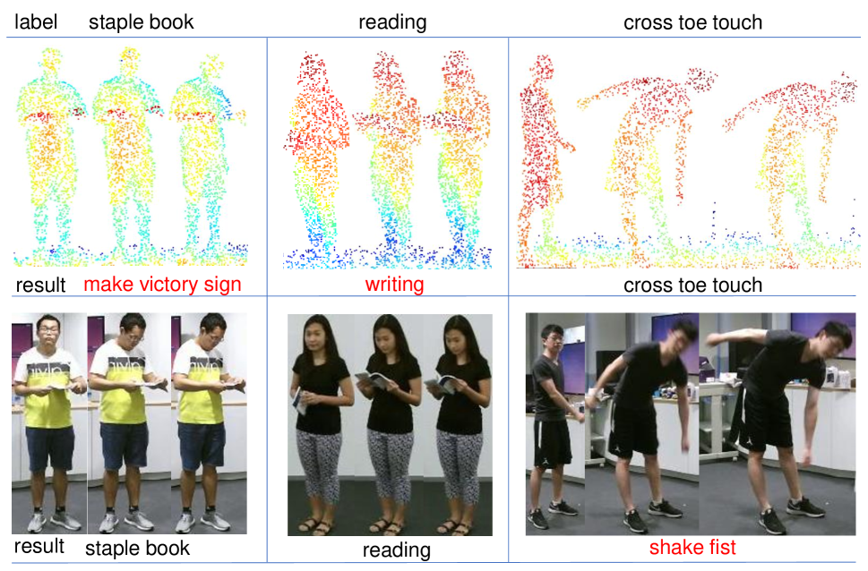

# VG4D：视觉与语言模型跨入四维视频识别的新纪元

发布时间：2024年04月17日

`分类：LLM应用` `机器人学` `自动驾驶`

> VG4D: Vision-Language Model Goes 4D Video Recognition

# 摘要

> 探索点云视频以洞察现实世界，对于机器人学和自动驾驶技术至关重要。但现有4D点云识别技术因传感器分辨率不足而受限，缺乏细节信息。最新研究显示，预训练于海量图文数据集的视觉-语言模型（VLM）能够掌握精细的视觉概念，并应用于多样的下游任务。然而，如何将VLM整合至4D点云领域，仍是一大挑战。本研究提出了“视觉-语言模型走向4D”（VG4D）框架，将VLM的知识迁移至4D点云网络。该方法通过将4D编码器的表示与VLM对齐，共同学习大规模图像-文本对的视觉与文本空间。结合VLM的知识，我们的VG4D在4D编码器上实现了更优的识别效果。为进一步提升4D编码器性能，我们对经典的动态点云框架进行了现代化改造，并提出了PSTNet的增强版im-PSTNet，以高效处理点云视频。实验结果表明，VG4D在NTU RGB+D 60和NTU RGB+D 120数据集上的动作识别任务中均达到了行业领先水平。相关代码已在\url{https://github.com/Shark0-0/VG4D}发布。

> Understanding the real world through point cloud video is a crucial aspect of robotics and autonomous driving systems. However, prevailing methods for 4D point cloud recognition have limitations due to sensor resolution, which leads to a lack of detailed information. Recent advances have shown that Vision-Language Models (VLM) pre-trained on web-scale text-image datasets can learn fine-grained visual concepts that can be transferred to various downstream tasks. However, effectively integrating VLM into the domain of 4D point clouds remains an unresolved problem. In this work, we propose the Vision-Language Models Goes 4D (VG4D) framework to transfer VLM knowledge from visual-text pre-trained models to a 4D point cloud network. Our approach involves aligning the 4D encoder's representation with a VLM to learn a shared visual and text space from training on large-scale image-text pairs. By transferring the knowledge of the VLM to the 4D encoder and combining the VLM, our VG4D achieves improved recognition performance. To enhance the 4D encoder, we modernize the classic dynamic point cloud backbone and propose an improved version of PSTNet, im-PSTNet, which can efficiently model point cloud videos. Experiments demonstrate that our method achieves state-of-the-art performance for action recognition on both the NTU RGB+D 60 dataset and the NTU RGB+D 120 dataset. Code is available at \url{https://github.com/Shark0-0/VG4D}.

[Arxiv](https://arxiv.org/abs/2404.11605)