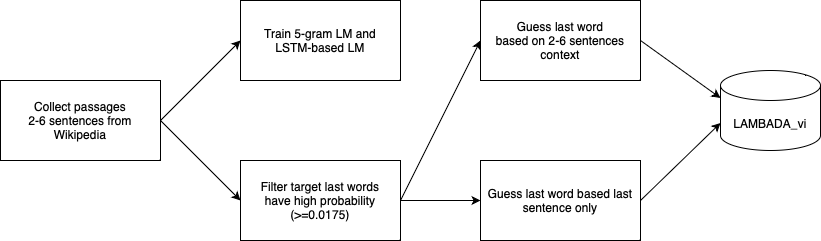
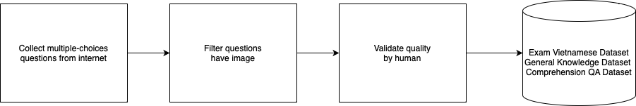

# ViLLM-Eval：为越南大型语言模型量身定制的全面评估工具集

发布时间：2024年04月17日

`LLM应用` `评估工具`

> ViLLM-Eval: A Comprehensive Evaluation Suite for Vietnamese Large Language Models

# 摘要

> 随着大型语言模型（LLMs）的迅猛发展，迫切需要新的评价标准来精准衡量它们的表现。针对越南语的这一需求，本研究致力于推出ViLLM-Eval——一套全面的评估工具，用以测试基础模型在越南语环境中的知识深度和推理能力。ViLLM-Eval包括多选题和单词预测任务，覆盖了从人文到科学与工程等多个领域的不同难度层次。对顶尖LLMs在ViLLM-Eval上进行的全面评估显示，即便是表现最佳的模型在理解和处理越南语任务上也有很大的提升空间。ViLLM-Eval被寄予厚望，能够关键地识别出基础模型的优势与不足，从而推动它们的进步，提升对越南用户的服务质量。

> The rapid advancement of large language models (LLMs) necessitates the development of new benchmarks to accurately assess their capabilities. To address this need for Vietnamese, this work aims to introduce ViLLM-Eval, the comprehensive evaluation suite designed to measure the advanced knowledge and reasoning abilities of foundation models within a Vietnamese context. ViLLM-Eval consists of multiple-choice questions and predict next word tasks spanning various difficulty levels and diverse disciplines, ranging from humanities to science and engineering. A thorough evaluation of the most advanced LLMs on ViLLM-Eval revealed that even the best performing models have significant room for improvement in understanding and responding to Vietnamese language tasks. ViLLM-Eval is believed to be instrumental in identifying key strengths and weaknesses of foundation models, ultimately promoting their development and enhancing their performance for Vietnamese users.

[Arxiv](https://arxiv.org/abs/2404.11086)