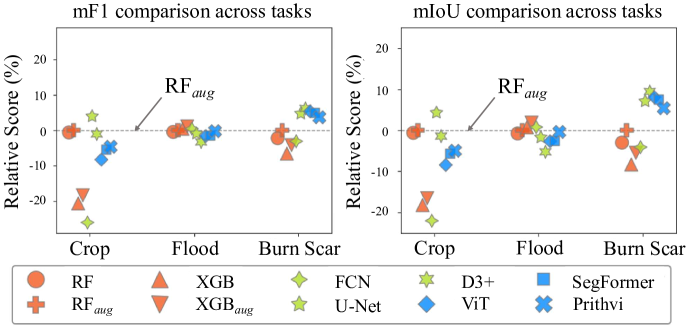

# 何时基础模型更有效？深入探究其在多光谱图像像素级分类任务中的适用性。

发布时间：2024年04月17日

`LLM应用`

> When are Foundation Models Effective? Understanding the Suitability for Pixel-Level Classification Using Multispectral Imagery

# 摘要

> 大型深度学习模型，也称为基础模型，在语言和视觉任务上展现了非凡的成果，这些成果对于小型模型来说通常难以企及。GPT类语言模型的显著成就特别引人注目，激发了人们对这类模型在卫星遥感等其他领域应用潜力的期待。为了探索基础模型在更广泛场景中的潜力，已经有许多努力投入到构建和测试这些模型的能力中，例如NASA-IBM合作的Prithvi、Segment-Anything-Model和ViT等。这引发了一个问题：基础模型是否总是遥感任务的最佳选择，它们在何时何地更为适用？本研究的目的是通过与传统机器学习和常规规模深度学习模型的对比，深化我们对基础模型在中等分辨率多光谱图像的像素级分类任务中的适用性和现状的理解。研究发现，在许多情况下，传统机器学习模型在性能上与基础模型相当甚至更优，特别是在纹理特征对于分类帮助不大的任务中。而在纹理特征对标签有一定影响的任务（如烧伤疤痕识别）中，深度学习模型则展现出更显著的优势，但基础模型与深度学习模型之间的性能差异并不明确。这些发现与我们的分析相符：基础模型的适用性取决于其自监督学习任务与实际应用任务的契合度，而且典型的掩码自编码器框架并非总是适用于遥感领域的各种问题。

> Foundation models, i.e., very large deep learning models, have demonstrated impressive performances in various language and vision tasks that are otherwise difficult to reach using smaller-size models. The major success of GPT-type of language models is particularly exciting and raises expectations on the potential of foundation models in other domains including satellite remote sensing. In this context, great efforts have been made to build foundation models to test their capabilities in broader applications, and examples include Prithvi by NASA-IBM, Segment-Anything-Model, ViT, etc. This leads to an important question: Are foundation models always a suitable choice for different remote sensing tasks, and when or when not? This work aims to enhance the understanding of the status and suitability of foundation models for pixel-level classification using multispectral imagery at moderate resolution, through comparisons with traditional machine learning (ML) and regular-size deep learning models. Interestingly, the results reveal that in many scenarios traditional ML models still have similar or better performance compared to foundation models, especially for tasks where texture is less useful for classification. On the other hand, deep learning models did show more promising results for tasks where labels partially depend on texture (e.g., burn scar), while the difference in performance between foundation models and deep learning models is not obvious. The results conform with our analysis: The suitability of foundation models depend on the alignment between the self-supervised learning tasks and the real downstream tasks, and the typical masked autoencoder paradigm is not necessarily suitable for many remote sensing problems.

[Arxiv](https://arxiv.org/abs/2404.11797)