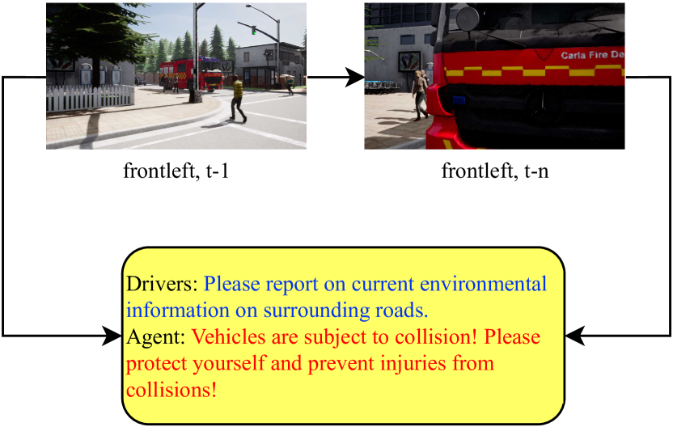
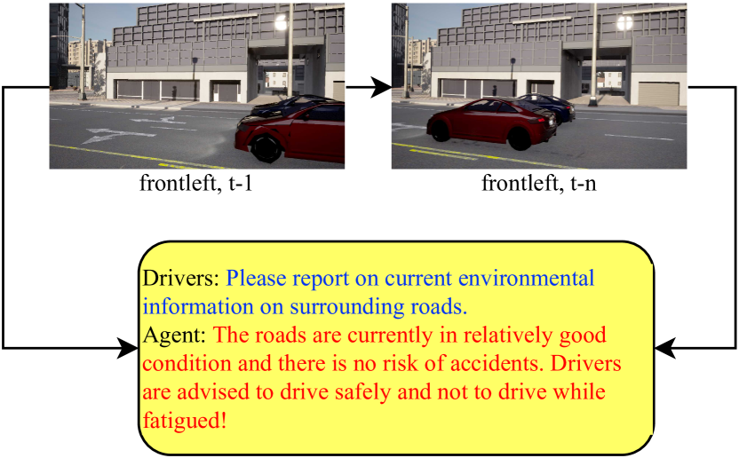
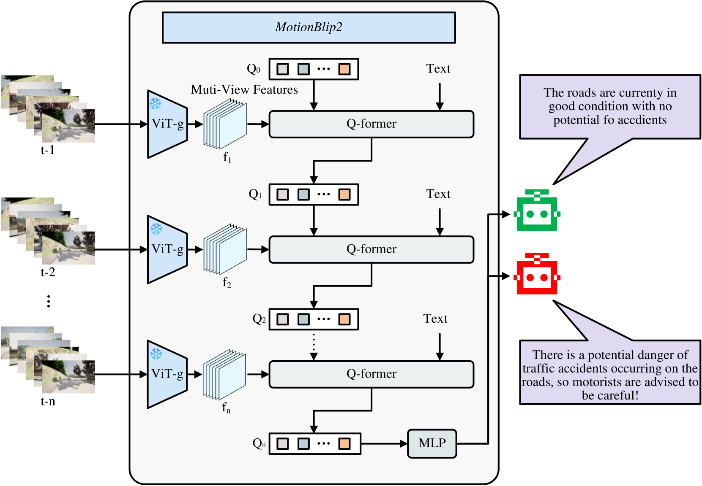
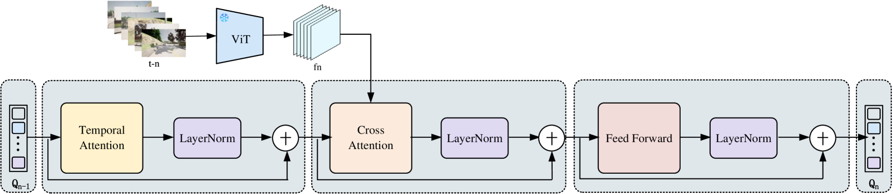

# AccidentBlip2：运用多视角 MotionBlip2 技术进行事故识别。

发布时间：2024年04月18日

`LLM应用` `自动驾驶` `交通管理`

> AccidentBlip2: Accident Detection With Multi-View MotionBlip2

# 摘要

> 多模态大型语言模型（MLLMs）在多模态推理的众多领域展现了卓越能力。本研究利用这一能力，针对复杂交通环境中的环境描述与场景理解进行深入分析。本文介绍了AccidentBlip2，一款能够实时预测事故风险的多模态大型语言模型。该模型采用六视图环绕视图的时间场景特征提取，并结合视觉变换器，通过时间blip框架进行时间推理。随后，将生成的时间令牌输入MLLMs进行推理，以判断事故是否可能发生。AccidentBlip2不依赖于BEV图像和LiDAR数据，有效减少了MLLMs的推理参数和成本，同时在训练过程中避免了高额开销。在DeepAccident数据集上，AccidentBlip2的性能超越了现有解决方案，并为自动驾驶事故预测提供了一种端到端的参考方案。

> Multimodal Large Language Models (MLLMs) have shown outstanding capabilities in many areas of multimodal reasoning. Therefore, we use the reasoning ability of Multimodal Large Language Models for environment description and scene understanding in complex transportation environments. In this paper, we propose AccidentBlip2, a multimodal large language model that can predict in real time whether an accident risk will occur. Our approach involves feature extraction based on the temporal scene of the six-view surround view graphs and temporal inference using the temporal blip framework through the vision transformer. We then input the generated temporal token into the MLLMs for inference to determine whether an accident will occur or not. Since AccidentBlip2 does not rely on any BEV images and LiDAR, the number of inference parameters and the inference cost of MLLMs can be significantly reduced, and it also does not incur a large training overhead during training. AccidentBlip2 outperforms existing solutions on the DeepAccident dataset and can also provide a reference solution for end-to-end automated driving accident prediction.

[Arxiv](https://arxiv.org/abs/2404.12149)