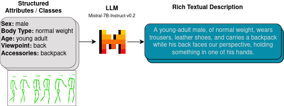
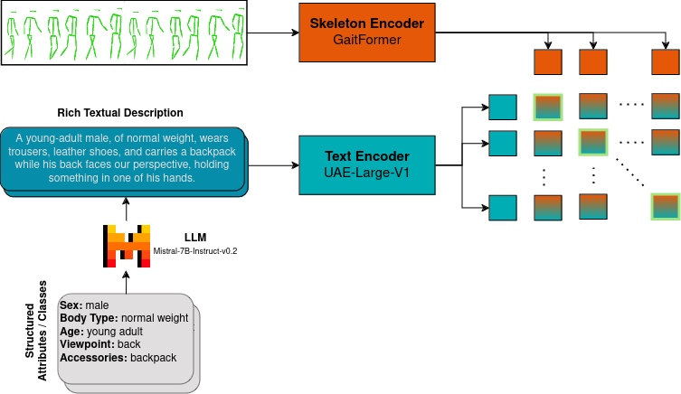
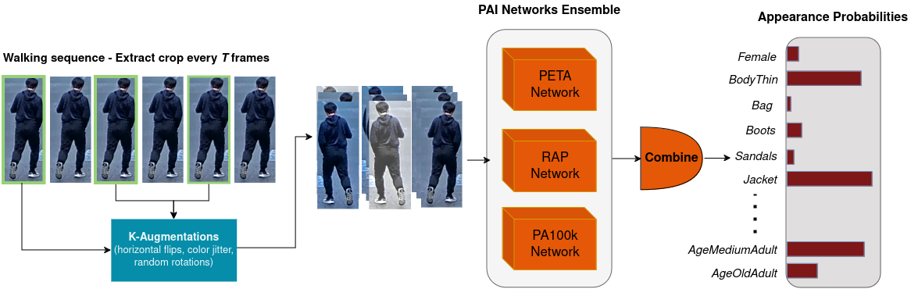
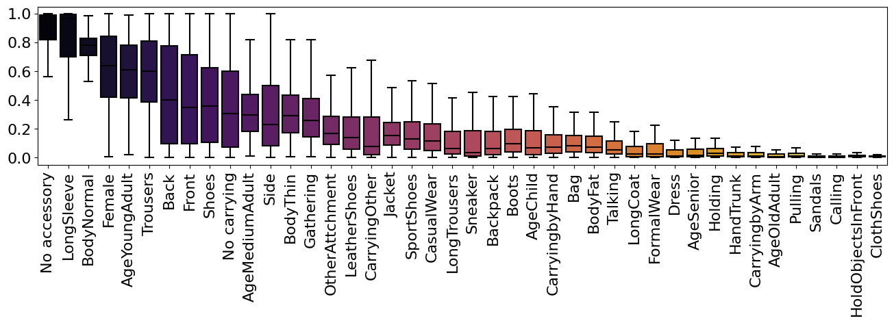
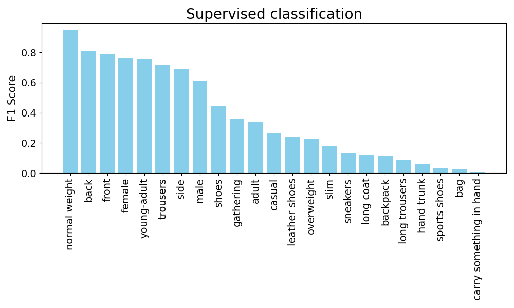
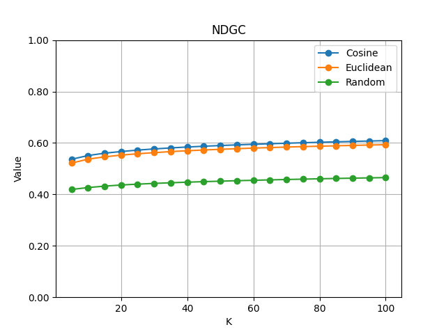
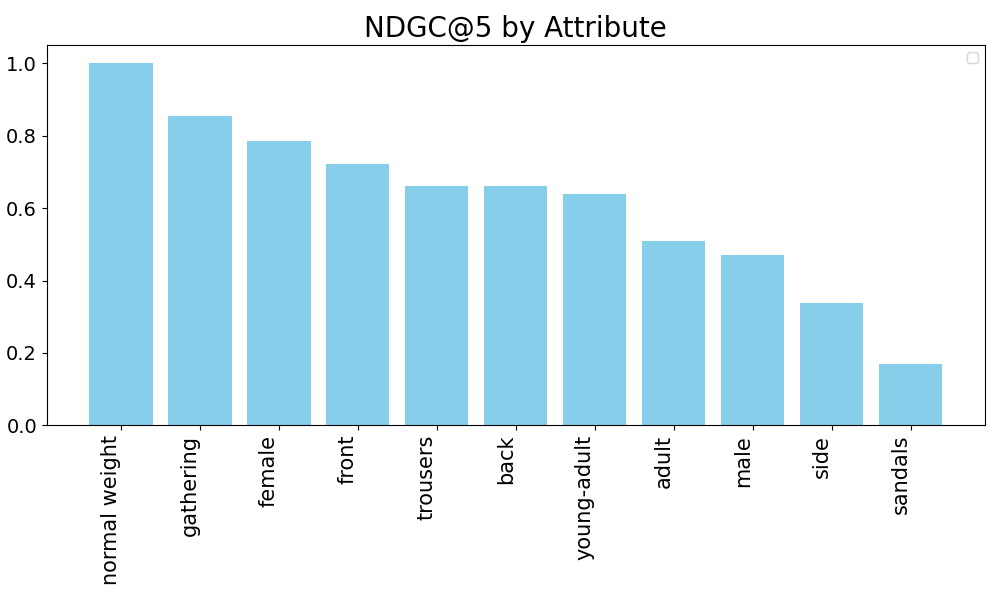

# 将行动和行走与大型语言模型（LLM）生成的文本描述进行匹配。

发布时间：2024年04月18日

`LLM应用` `动作识别` `步态分析`

> Aligning Actions and Walking to LLM-Generated Textual Descriptions

# 摘要

> 大型语言模型（LLMs）在多个领域展现了非凡的才能，尤其是在数据扩充和合成数据创造方面。本项研究着眼于利用LLMs为动作序列创造详尽的文本描述，这不仅包括各种动作，还涵盖了不同的行走模式。我们借助LLMs的强大表达力，将动作特征与高层次的语言信号相结合，以应对两大任务：动作识别和基于外观特征的步态序列检索。在动作识别方面，我们在BABEL-60数据集上运用LLMs生成动作的文本描述，以便将动作序列与语言描述精准匹配。在步态分析领域，我们通过LLMs对DenseGait数据集中的动作序列进行文本描述，深入探究外观特征如衣着和鞋履对行走模式的影响。这些描述能够捕捉到由各种因素引起的行走风格上的微妙差别。我们的研究方法彰显了LLMs在增强结构化动作特征和整合多模态表示方面的潜力。这些研究成果不仅推动了全面动作理解的发展，也为未来在动作分析中运用LLMs进行多模态对齐和数据扩充提供了新思路。相关代码已在 https://github.com/Radu1999/WalkAndText 公开。

> Large Language Models (LLMs) have demonstrated remarkable capabilities in various domains, including data augmentation and synthetic data generation. This work explores the use of LLMs to generate rich textual descriptions for motion sequences, encompassing both actions and walking patterns. We leverage the expressive power of LLMs to align motion representations with high-level linguistic cues, addressing two distinct tasks: action recognition and retrieval of walking sequences based on appearance attributes. For action recognition, we employ LLMs to generate textual descriptions of actions in the BABEL-60 dataset, facilitating the alignment of motion sequences with linguistic representations. In the domain of gait analysis, we investigate the impact of appearance attributes on walking patterns by generating textual descriptions of motion sequences from the DenseGait dataset using LLMs. These descriptions capture subtle variations in walking styles influenced by factors such as clothing choices and footwear. Our approach demonstrates the potential of LLMs in augmenting structured motion attributes and aligning multi-modal representations. The findings contribute to the advancement of comprehensive motion understanding and open up new avenues for leveraging LLMs in multi-modal alignment and data augmentation for motion analysis. We make the code publicly available at https://github.com/Radu1999/WalkAndText

[Arxiv](https://arxiv.org/abs/2404.12192)