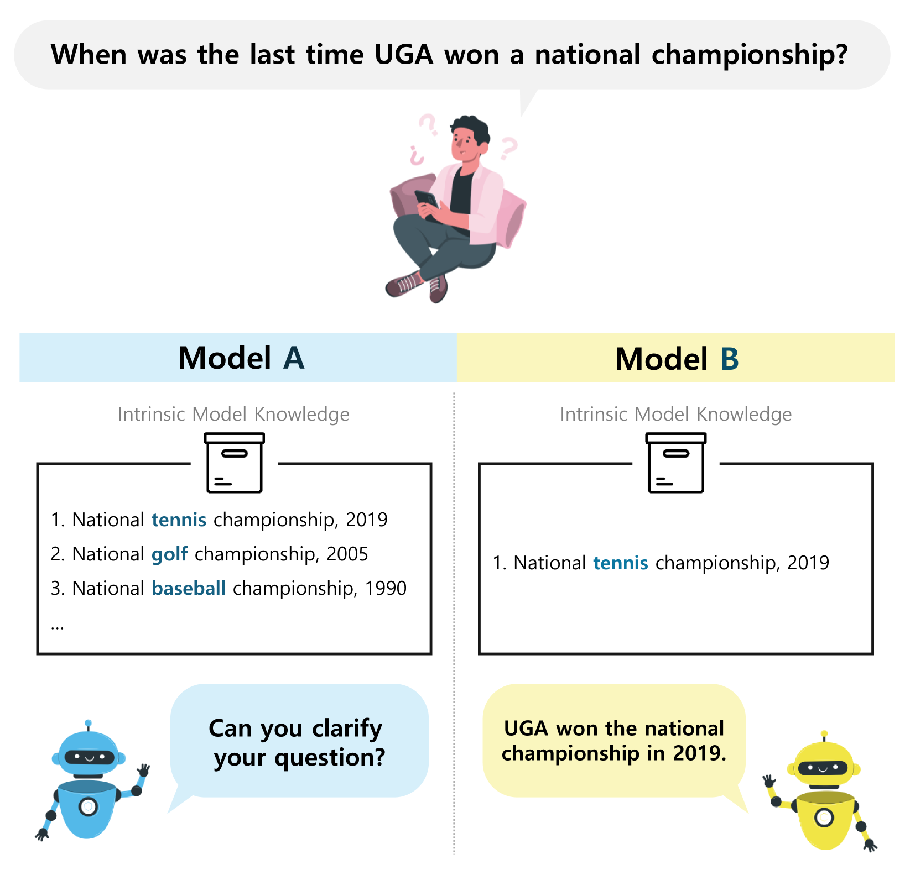
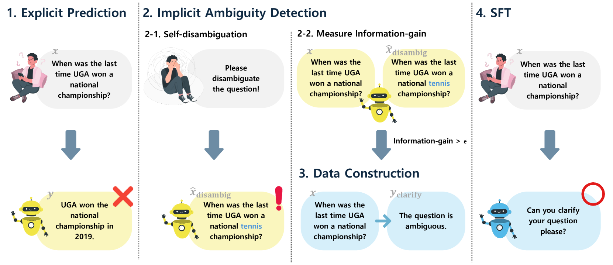

# 对齐语言模型，明确处理歧义

发布时间：2024年04月18日

`LLM应用` `对话系统`

> Aligning Language Models to Explicitly Handle Ambiguity

# 摘要

> 在日常对话中，为了高效沟通，人们常使语句故意不完整或含糊其辞，这自然会导致对同一话语的不同解读。在这样的情境下，要实现用户与模型之间的可靠互动，模型必须能够巧妙地应对用户提问中的模糊性。但是，即便是基于最新大型语言模型（LLMs）构建的对话系统，在解析这些含糊不清的输入时也遇到了难题，主要受制于两点：一是LLMs并未被专门训练来处理那些过于模糊的输入；二是输入的模糊性会因模型自身的知识水平而异，这使得问题的探究变得复杂。为了应对这些挑战，本文提出了一种新方法，旨在让LLMs能够明确地处理这些模糊的输入。具体而言，我们设计了一个代理任务，激励LLMs运用其内在知识对输入进行自我消歧。我们通过量化消歧过程中的信息增益，来衡量模型对输入模糊性的感知程度。这一度量标准被用作筛选模型眼中模糊样本的依据，进而用于模型的进一步训练。多个问答数据集的实验结果显示，采用我们方法进行微调的LLMs不仅能够有效处理模糊输入，而且在处理明确问题时也保持了竞争力。

> In spoken languages, utterances are often shaped to be incomplete or vague for efficiency. This can lead to varying interpretations of the same input, based on different assumptions about the context. To ensure reliable user-model interactions in such scenarios, it is crucial for models to adeptly handle the inherent ambiguity in user queries. However, conversational agents built upon even the most recent large language models (LLMs) face challenges in processing ambiguous inputs, primarily due to the following two hurdles: (1) LLMs are not directly trained to handle inputs that are too ambiguous to be properly managed; (2) the degree of ambiguity in an input can vary according to the intrinsic knowledge of the LLMs, which is difficult to investigate. To address these issues, this paper proposes a method to align LLMs to explicitly handle ambiguous inputs. Specifically, we introduce a proxy task that guides LLMs to utilize their intrinsic knowledge to self-disambiguate a given input. We quantify the information gain from the disambiguation procedure as a measure of the extent to which the models perceive their inputs as ambiguous. This measure serves as a cue for selecting samples deemed ambiguous from the models' perspectives, which are then utilized for alignment. Experimental results from several question-answering datasets demonstrate that the LLMs fine-tuned with our approach are capable of handling ambiguous inputs while still performing competitively on clear questions within the task.

[Arxiv](https://arxiv.org/abs/2404.11972)