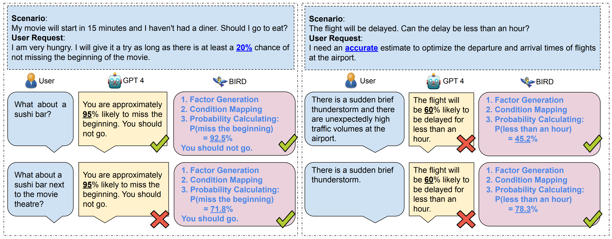
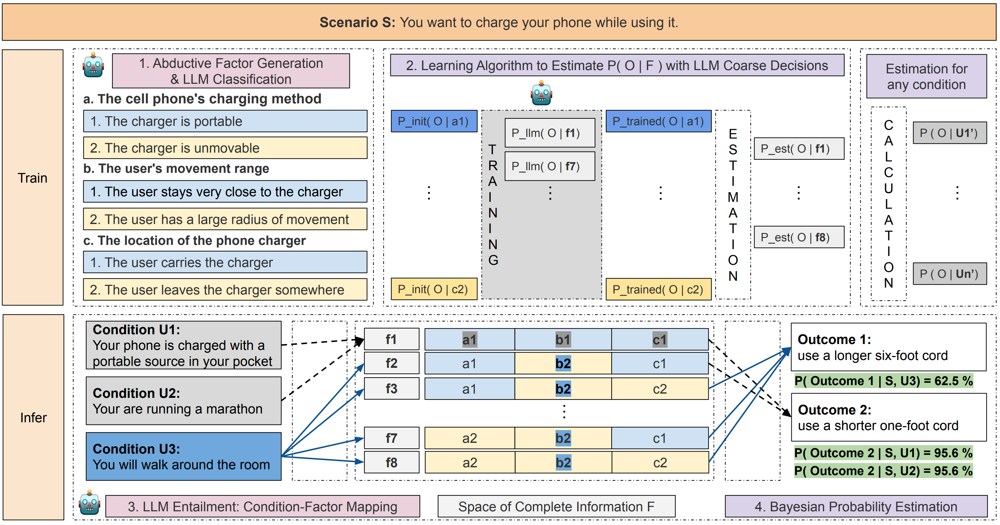
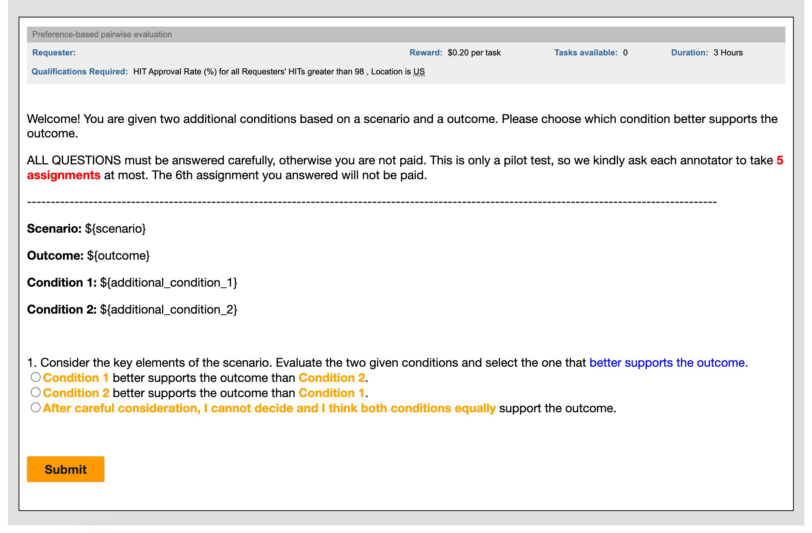
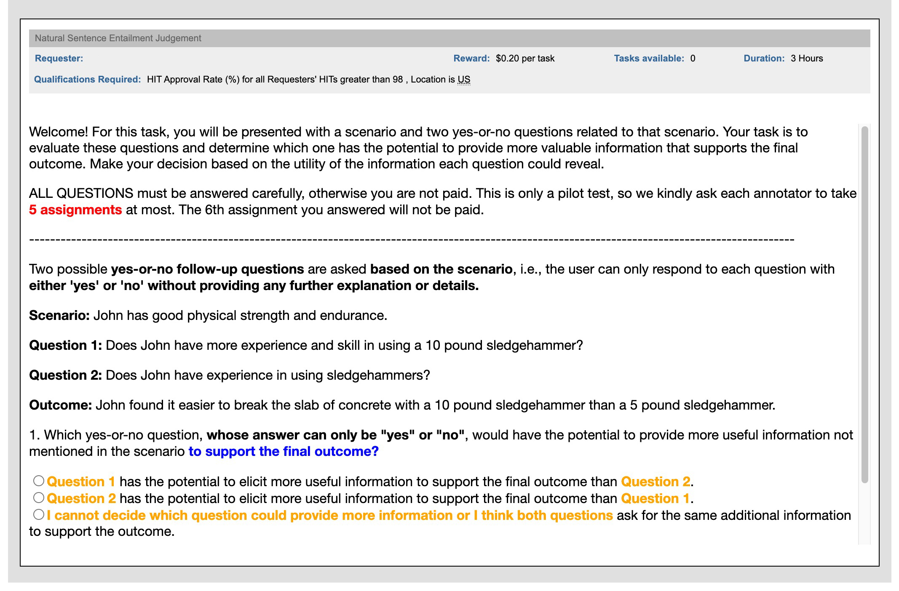
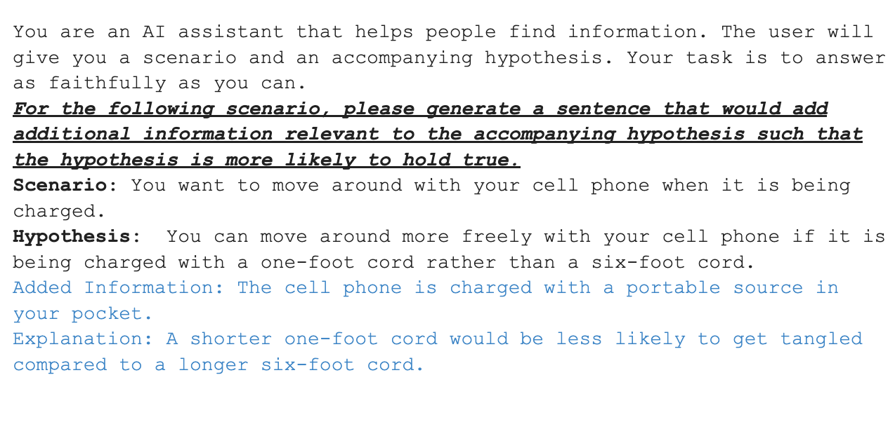
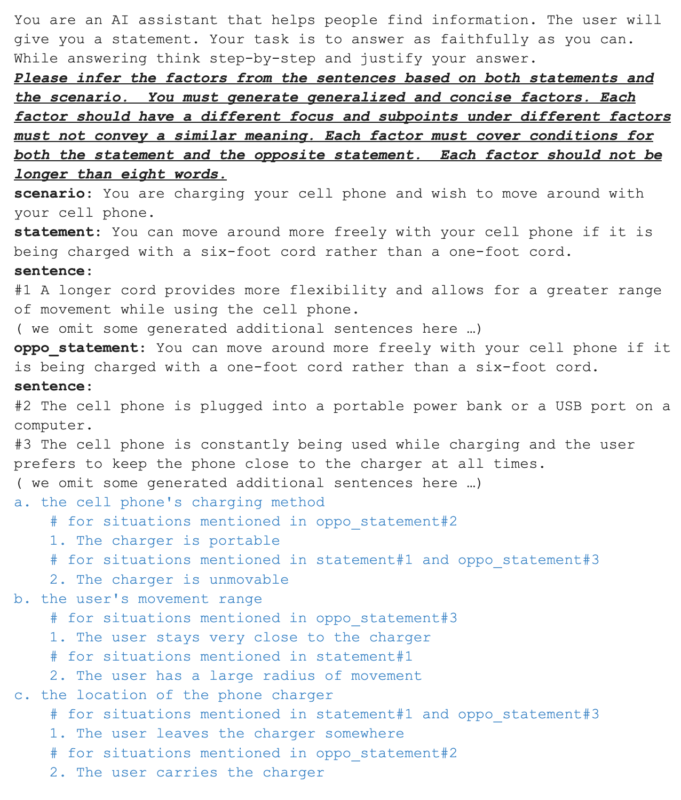
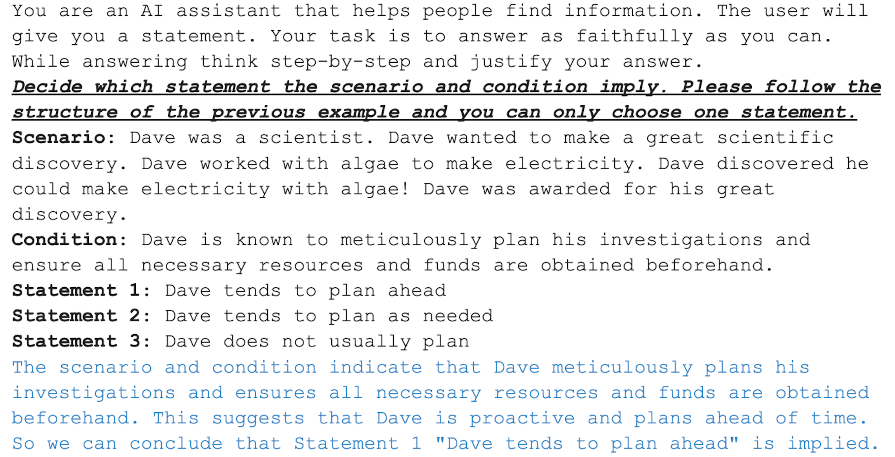
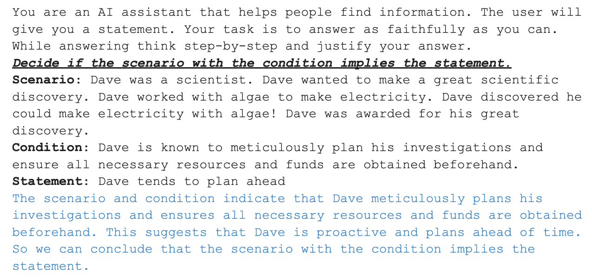
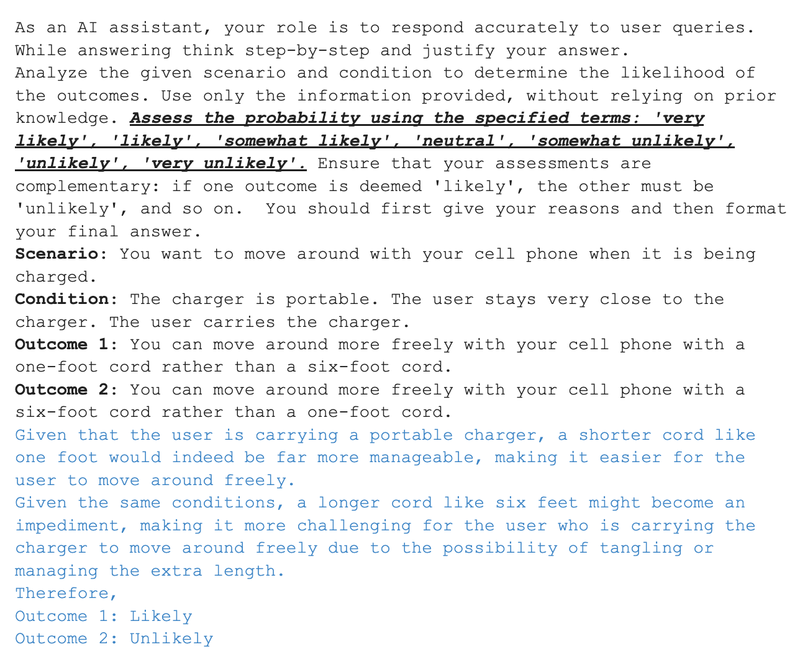

# BIRD：为大型语言模型量身打造的可信贝叶斯推断框架

发布时间：2024年04月18日

`LLM应用` `人工智能` `决策支持系统`

> BIRD: A Trustworthy Bayesian Inference Framework for Large Language Models

# 摘要

> 大型语言模型在决策时主要采用归纳推理，但面对现实世界任务中常见的不完整信息，这可能导致决策不稳。为了提升决策的准确性，文章提出了一种贝叶斯推断框架BIRD，旨在为模型决策提供可控制且易于理解的概率评估。BIRD结合了演绎推理、LLM蕴含关系以及可训练的演绎贝叶斯模型。实验结果表明，BIRD的概率估计在超过65%的情况下与人类判断相符，性能超越了当前领先的GPT-4模型35%。此外，研究还证明BIRD能够直接应用于多种现实世界场景中的可靠决策过程。

> Large language models primarily rely on inductive reasoning for decision making. This results in unreliable decisions when applied to real-world tasks that often present incomplete contexts and conditions. Thus, accurate probability estimation and appropriate interpretations are required to enhance decision-making reliability. In this paper, we propose a Bayesian inference framework called BIRD for large language models. BIRD provides controllable and interpretable probability estimation for model decisions, based on abductive factors, LLM entailment, as well as learnable deductive Bayesian modeling. Experiments show that BIRD produces probability estimations that align with human judgments over 65% of the time using open-sourced Llama models, outperforming the state-of-the-art GPT-4 by 35%. We also show that BIRD can be directly used for trustworthy decision making on many real-world applications.

[Arxiv](https://arxiv.org/abs/2404.12494)