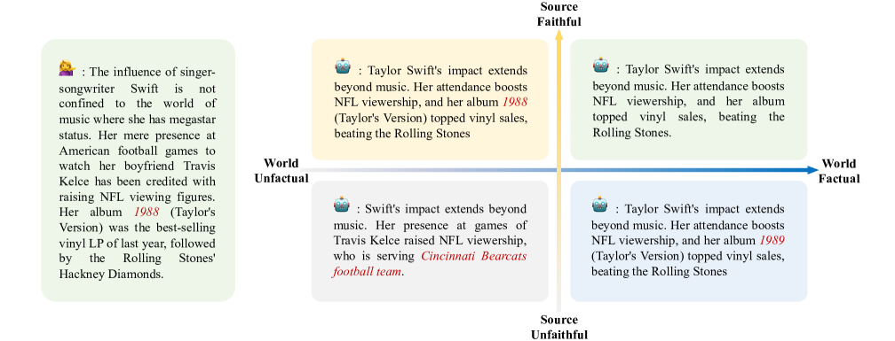

# 能否捕捉巨象？自然语言生成中幻觉评估的发展综述

发布时间：2024年04月18日

`LLM应用` `文本生成`

> Can We Catch the Elephant? The Evolvement of Hallucination Evaluation on Natural Language Generation: A Survey

# 摘要

> 自然语言生成中的“幻觉”问题，仿佛是被大家视而不见的“房间里的大象”，直到最近技术的进步显著提升了文本生成的流畅度和语法正确性，这一问题才逐渐受到关注。在大型语言模型中，幻觉现象普遍存在于多种下游任务和日常对话之中，亟需精确评估以增强模型的可信度和安全性。尽管如此，目前对幻觉现象的评估方法研究参差不齐，研究者们仍在努力寻找最合适的评估手段。随着自然语言处理研究逐步深入LLMs领域，这也带来了新的挑战。本文全面梳理了幻觉评估方法的发展历程，并针对以下三个核心问题进行了探讨：一是事实定义的多样性及其细节层次；二是自动评估工具的分类及其适用场景；三是当前尚未解决的问题及未来的研究方向。

> Hallucination in Natural Language Generation (NLG) is like the elephant in the room, obvious but often overlooked until recent achievements significantly improved the fluency and grammatical accuracy of generated text. For Large Language Models (LLMs), hallucinations can happen in various downstream tasks and casual conversations, which need accurate assessment to enhance reliability and safety. However, current studies on hallucination evaluation vary greatly, and people still find it difficult to sort out and select the most appropriate evaluation methods. Moreover, as NLP research gradually shifts to the domain of LLMs, it brings new challenges to this direction. This paper provides a comprehensive survey on the evolvement of hallucination evaluation methods, aiming to address three key aspects: 1) Diverse definitions and granularity of facts; 2) The categories of automatic evaluators and their applicability; 3) Unresolved issues and future directions.

[Arxiv](https://arxiv.org/abs/2404.12041)