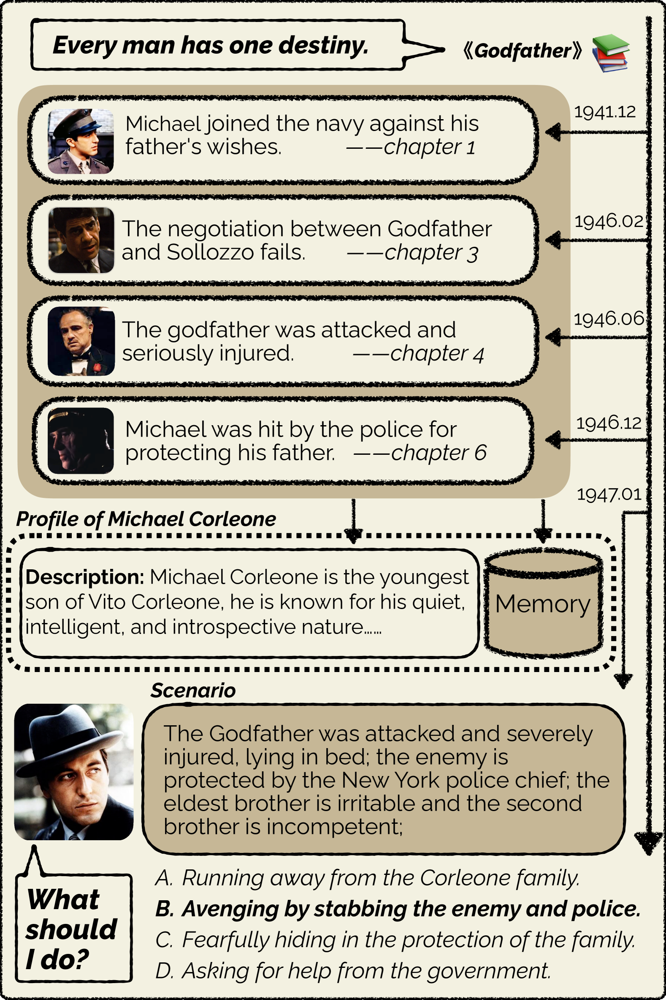
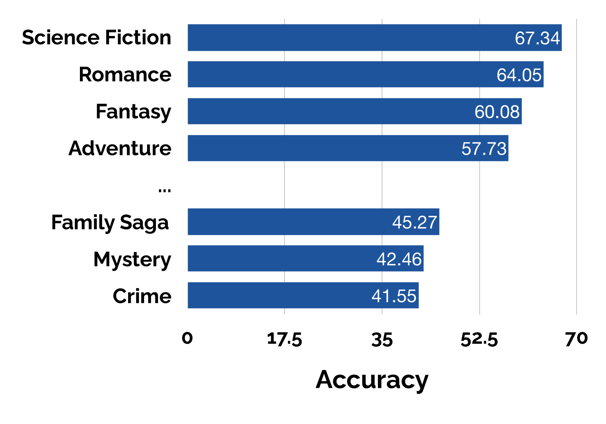
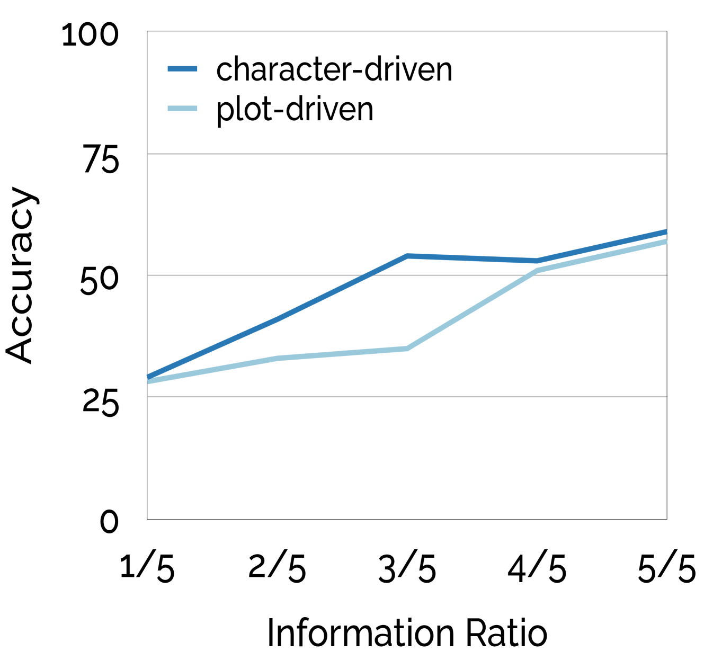
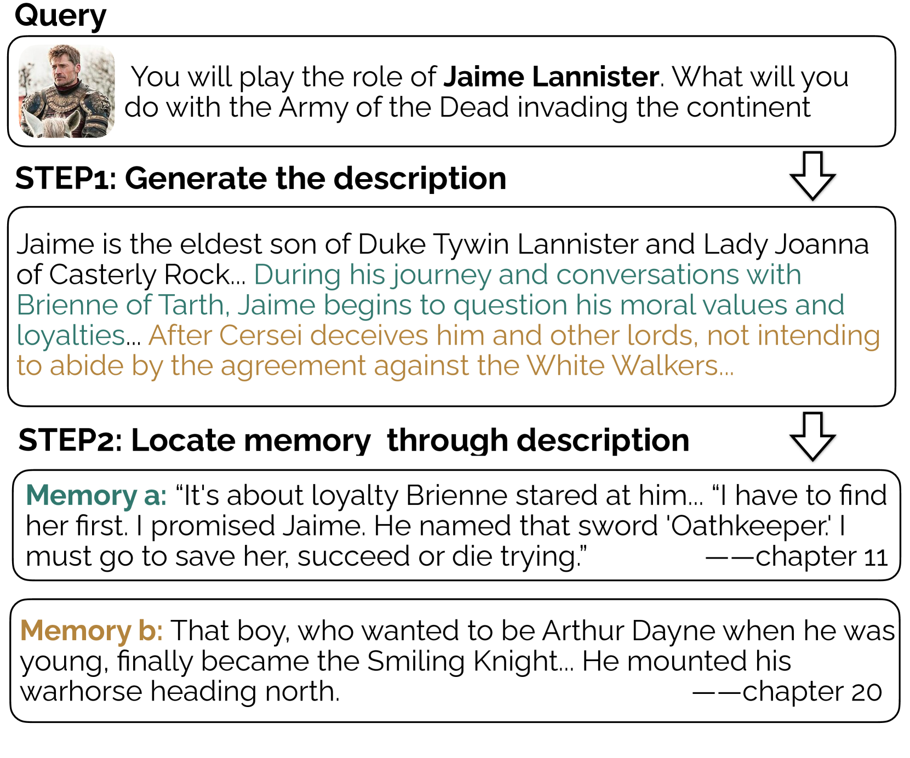

# 性格决定命运：大型语言模型能否在角色扮演游戏中模拟出由角色个性所驱动的决策过程？

发布时间：2024年04月18日

`LLM应用` `文学分析` `决策制定`

> Character is Destiny: Can Large Language Models Simulate Persona-Driven Decisions in Role-Playing?

# 摘要

> 大型语言模型能否取代人类在关键决策中的角色？最新研究展示了这些模型扮演指定角色、模拟其知识和语言习惯的潜力。但要进行有效的模仿决策，我们需要对角色有更深入的理解。本文旨在评估LLM在基于角色的决策制定中的表现。具体而言，我们探讨了LLM是否能够基于高质量小说中的前情提要来预测角色的选择。我们利用文学专家的角色分析，创建了一个包含395部书籍、1,401个角色决策点的LIFECHOICE数据集。随后，我们在该数据集上对多种LLM及其角色扮演方法进行了广泛测试。测试结果揭示了这些尖端模型在此类任务中的潜力，同时也指出了提升空间。因此，我们提出了CHARMAP方法，通过角色记忆检索功能，成功提升了6.01%的准确率。我们将向公众开放这些数据集和代码。

> Can Large Language Models substitute humans in making important decisions? Recent research has unveiled the potential of LLMs to role-play assigned personas, mimicking their knowledge and linguistic habits. However, imitative decision-making requires a more nuanced understanding of personas. In this paper, we benchmark the ability of LLMs in persona-driven decision-making. Specifically, we investigate whether LLMs can predict characters' decisions provided with the preceding stories in high-quality novels. Leveraging character analyses written by literary experts, we construct a dataset LIFECHOICE comprising 1,401 character decision points from 395 books. Then, we conduct comprehensive experiments on LIFECHOICE, with various LLMs and methods for LLM role-playing. The results demonstrate that state-of-the-art LLMs exhibit promising capabilities in this task, yet there is substantial room for improvement. Hence, we further propose the CHARMAP method, which achieves a 6.01% increase in accuracy via persona-based memory retrieval. We will make our datasets and code publicly available.

[Arxiv](https://arxiv.org/abs/2404.12138)