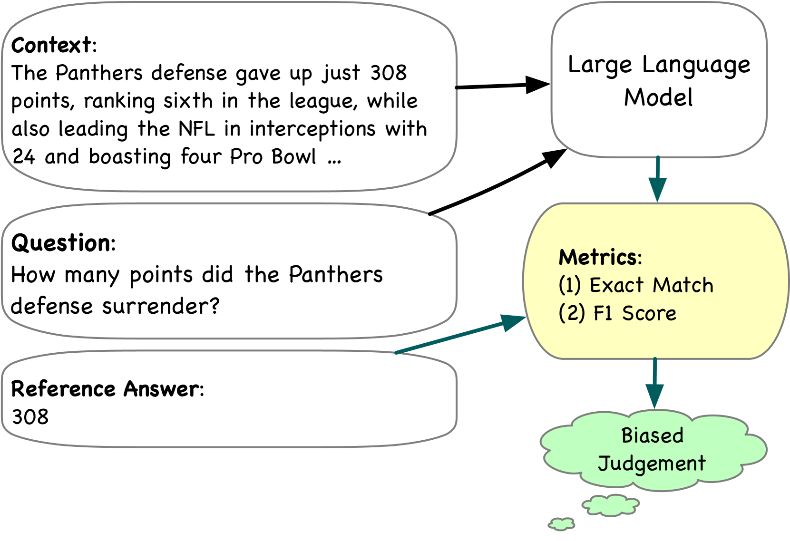
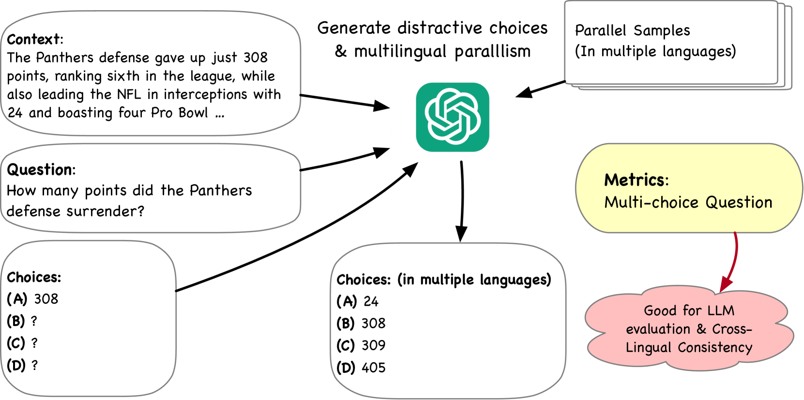
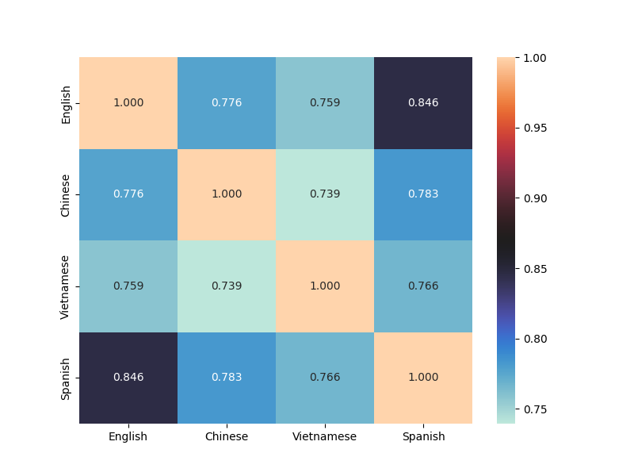
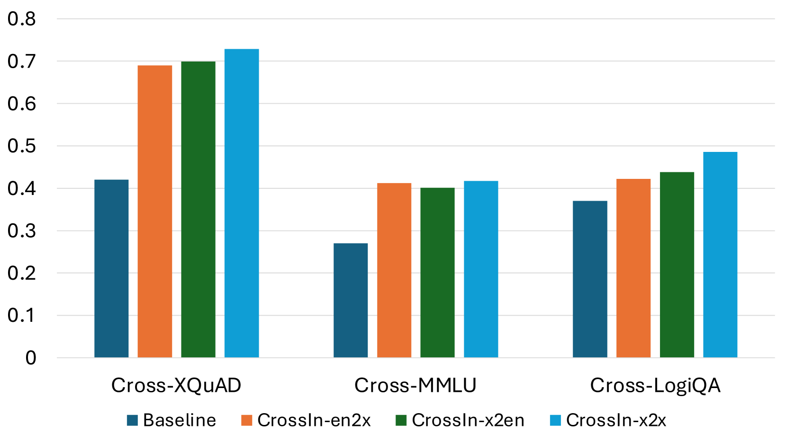
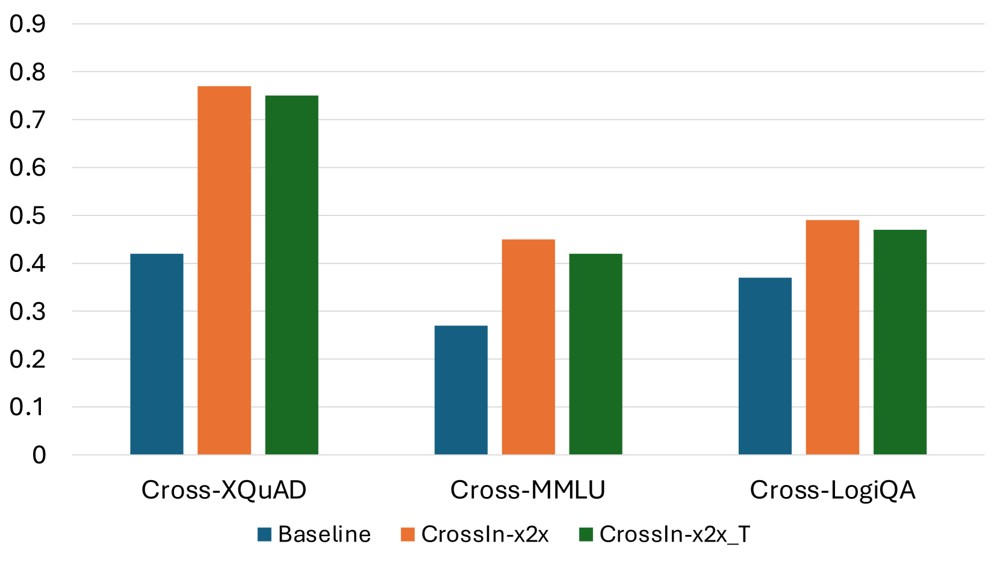
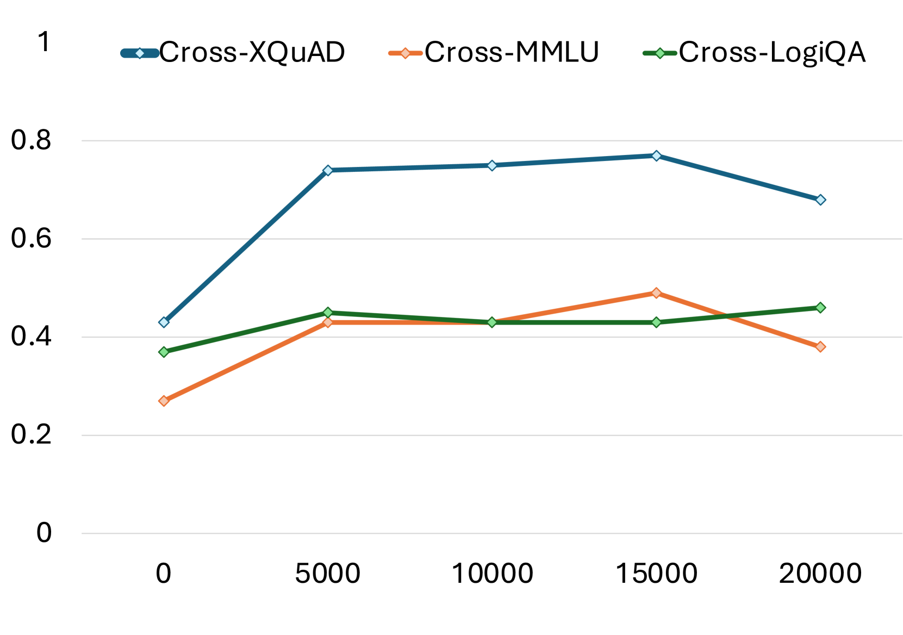
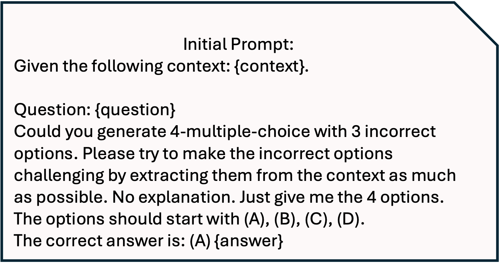

# CrossIn：一种高效指令调优策略，专为跨语言知识对齐而设计

发布时间：2024年04月18日

`LLM应用` `机器翻译`

> CrossIn: An Efficient Instruction Tuning Approach for Cross-Lingual Knowledge Alignment

# 摘要

> 掌握多语言对大型语言模型（LLMs）而言充满挑战。以英语为主导的模型在其他语言，尤其是与英语语言差异较大的语言中，表现往往不尽人意。这一问题主要源自于预训练和指令微调阶段训练数据在不同语言间的不均衡分配。为应对这一挑战，我们提出了一种创新的方法——CrossIn，它采用了跨语言指令微调数据的混合构成。该方法通过利用不同语言共有的压缩表示，在一个统一的过程中显著提升了模型的多语言处理能力和任务解决效率。同时，我们还设计了一个多任务、多维度的基准测试来评估CrossIn的效果。实验结果显示，我们的方法在各项任务和语言上都显著提高了性能，并对跨语言数据量的增加以及翻译数据整合如何增强多语言一致性和准确性提供了深入的洞察。

> Multilingual proficiency presents a significant challenge for large language models (LLMs). English-centric models are usually suboptimal in other languages, particularly those that are linguistically distant from English. This performance discrepancy mainly stems from the imbalanced distribution of training data across languages during pre-training and instruction tuning stages. To address this problem, we propose a novel approach called CrossIn, which utilizes a mixed composition of cross-lingual instruction tuning data. Our method leverages the compressed representation shared by various languages to efficiently enhance the model's task-solving capabilities and multilingual proficiency within a single process. In addition, we introduce a multi-task and multi-faceted benchmark to evaluate the effectiveness of CrossIn. Experimental results demonstrate that our method substantially improves performance across tasks and languages, and we provide extensive insights into the impact of cross-lingual data volume and the integration of translation data on enhancing multilingual consistency and accuracy.

[Arxiv](https://arxiv.org/abs/2404.11932)