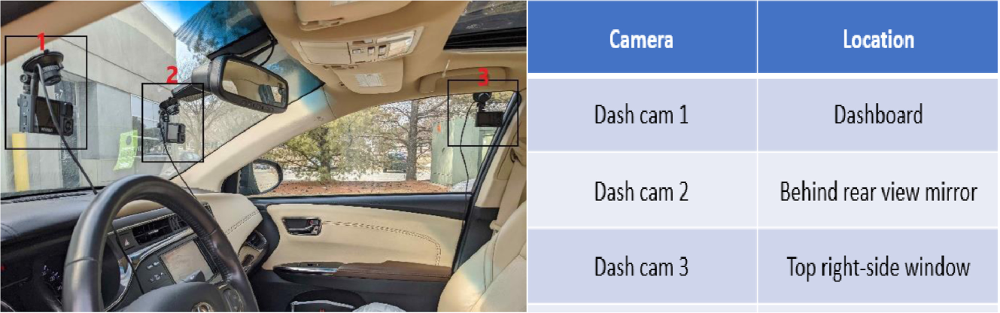
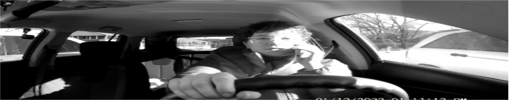
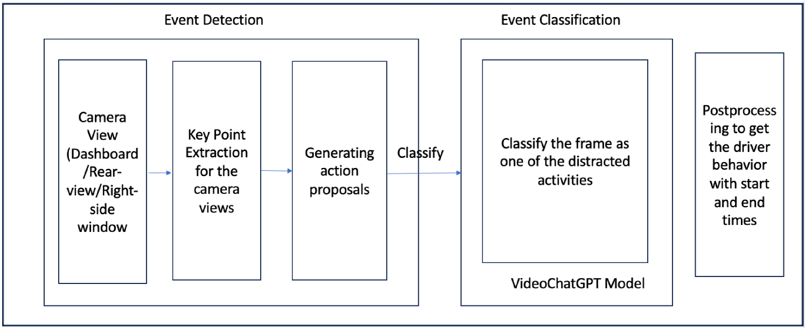
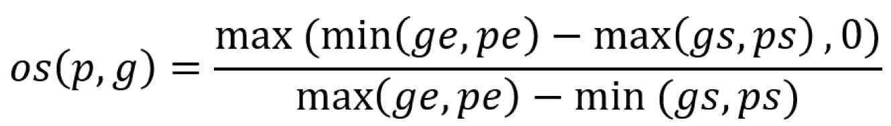
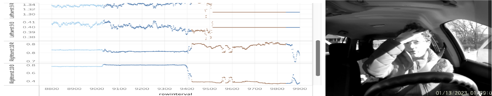
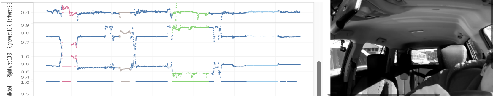
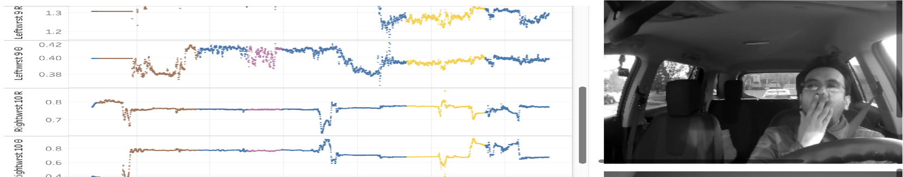
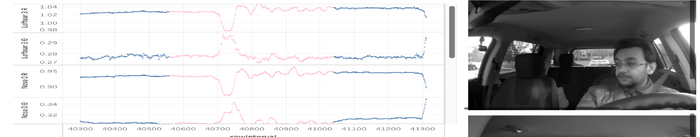
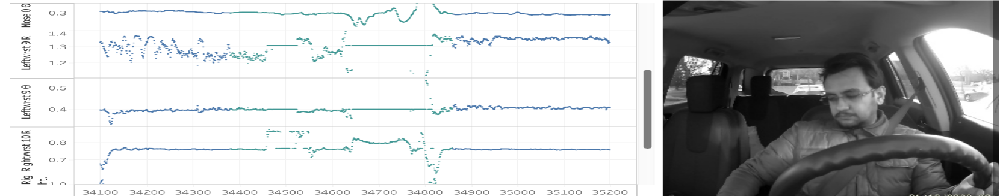

# DeepLocalization：运用变点检测技术实现动作的时序定位

发布时间：2024年04月18日

`分类：Agent

这篇论文介绍了一个名为 DeepLocalization 的实时动作定位框架，它结合了基于图的变化点检测技术和大型语言模型（Video-LLM）来监测驾驶员行为，特别是分心驾驶问题。这个框架的设计和应用涉及到智能代理（Agent）的概念，因为它们可以实时地监测和分析驾驶员的行为，从而在特定情况下采取行动。此外，该框架的设计使其能够在有限的计算资源下运行，这表明它适用于实际应用场景，进一步强调了其作为智能代理的潜力。` `交通安全` `行为监测`

> DeepLocalization: Using change point detection for Temporal Action Localization

# 摘要

> 本研究推出了 DeepLocalization，一个创新的实时动作定位框架，专为监测驾驶员行为而设计。该框架旨在解决分心驾驶问题，这是引发交通事故的一个重要原因。我们采用了双重策略：一方面，使用基于图的变化点检测技术精确定位动作发生的时间；另一方面，利用视频大型语言模型（Video-LLM）对活动进行精细分类。通过精心设计的提示工程，我们使 Video-LLM 能够巧妙地捕捉驾驶行为的细节，即便在数据不足的情况下也能保持高效的分类性能。DeepLocalization 框架轻量级且优化，适合消费级 GPU，适用于多种实际场景。在 SynDD2 数据集上的严格测试表明，该方法在事件分类上达到了 57.5% 的准确率，在事件检测上达到了 51%，突显了 DeepLocalization 在有限计算资源下准确识别多种驾驶员行为及其发生时间的巨大潜力。

> In this study, we introduce DeepLocalization, an innovative framework devised for the real-time localization of actions tailored explicitly for monitoring driver behavior. Utilizing the power of advanced deep learning methodologies, our objective is to tackle the critical issue of distracted driving-a significant factor contributing to road accidents. Our strategy employs a dual approach: leveraging Graph-Based Change-Point Detection for pinpointing actions in time alongside a Video Large Language Model (Video-LLM) for precisely categorizing activities. Through careful prompt engineering, we customize the Video-LLM to adeptly handle driving activities' nuances, ensuring its classification efficacy even with sparse data. Engineered to be lightweight, our framework is optimized for consumer-grade GPUs, making it vastly applicable in practical scenarios. We subjected our method to rigorous testing on the SynDD2 dataset, a complex benchmark for distracted driving behaviors, where it demonstrated commendable performance-achieving 57.5% accuracy in event classification and 51% in event detection. These outcomes underscore the substantial promise of DeepLocalization in accurately identifying diverse driver behaviors and their temporal occurrences, all within the bounds of limited computational resources.

[Arxiv](https://arxiv.org/abs/2404.12258)