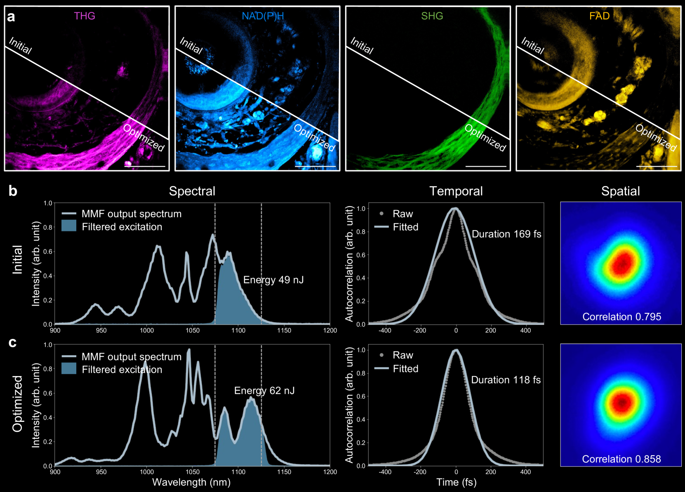
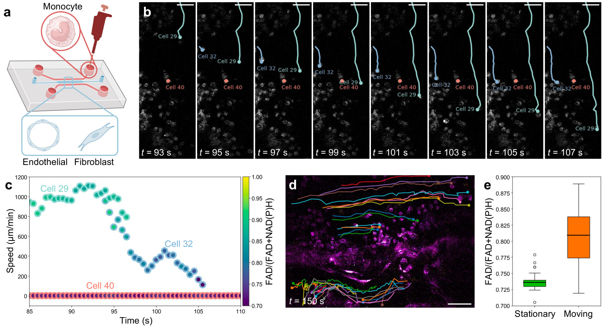

# 深入探索活体组织：动态代谢与结构成像技术。

发布时间：2024年04月18日

`分类：非以上分类

这篇论文摘要主要讨论了一种新的生物成像技术，与计算机科学、人工智能、LLM应用或LLM理论没有直接关联。因此，它不属于Agent、RAG、LLM应用、LLM理论这四个分类中的任何一个。` `生物医学成像` `生物技术`

> Deep and Dynamic Metabolic and Structural Imaging in Living Tissues

# 摘要

> 利用两光子自发荧光技术观察NAD（P）H，我们能够在活体系统中对细胞活动进行无损且高分辨率的成像。尽管如此，该技术在厚组织和类器官的成像上受限，主要是因为在NAD（P）H激发所需的大约750纳米波长处的组织散射，导致成像深度仅能维持在300微米以内。本研究中，我们通过使用基于多模光纤的低重复率、高峰值功率的三次光子激发技术，在1100纳米波长下激发NAD（P）H，成功将成像深度提升至超过700微米。这一成就是通过对1100±25纳米波段的多模非线性脉冲传播进行自适应调制，并通过紧凑的光纤整形器实现超过0.5兆瓦的峰值功率来完成的。此外，1100纳米处脉冲能量的8倍提升，加快了活体多细胞模型中单核细胞行为的成像速度。这些成果为深入且动态地观察完整活体生物系统的代谢和结构提供了重大突破。预计这种模块化设计（配备滑动式光纤整形器的多模光纤）将促进该方法在体内外成像应用中的广泛应用，包括癌症研究、自身免疫疾病和组织工程等领域。

> Label-free imaging through two-photon autofluorescence (2PAF) of NAD(P)H allows for non-destructive and high-resolution visualization of cellular activities in living systems. However, its application to thick tissues and organoids has been restricted by its limited penetration depth within 300 $μ$m, largely due to tissue scattering at the typical excitation wavelength (~750 nm) required for NAD(P)H. Here, we demonstrate that the imaging depth for NAD(P)H can be extended to over 700 $μ$m in living engineered human multicellular microtissues by adopting multimode fiber (MMF)-based low-repetition-rate high-peak-power three-photon (3P) excitation of NAD(P)H at 1100 nm. This is achieved by having over 0.5 MW peak power at the band of 1100$\pm$25 nm through adaptively modulating multimodal nonlinear pulse propagation with a compact fiber shaper. Moreover, the 8-fold increase in pulse energy at 1100 nm enables faster imaging of monocyte behaviors in the living multicellular models. These results represent a significant advance for deep and dynamic metabolic and structural imaging of intact living biosystems. The modular design (MMF with a slip-on fiber shaper) is anticipated to allow wide adoption of this methodology for demanding in vivo and in vitro imaging applications, including cancer research, autoimmune diseases, and tissue engineering.

[Arxiv](https://arxiv.org/abs/2404.11901)