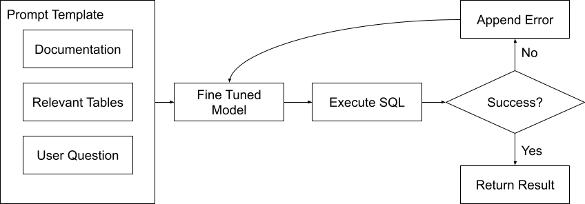
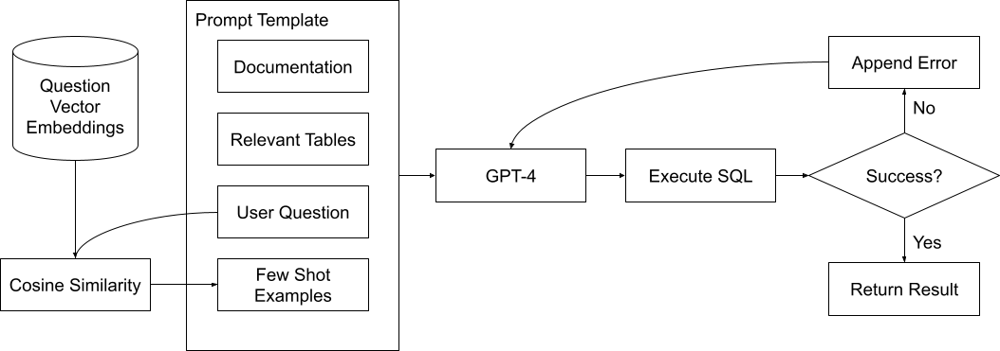
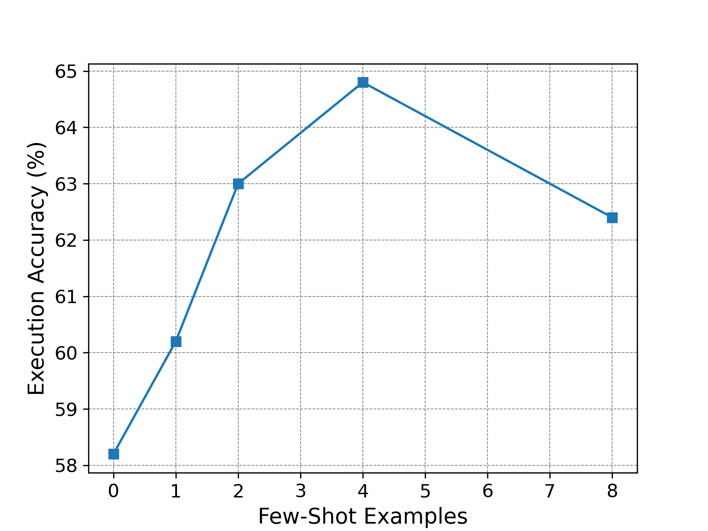

# Dubo-SQL：一种文本到SQL的生成技术，通过多样化检索增强和精细调整，以提升性能。

发布时间：2024年04月18日

`分类：RAG` `数据库查询`

> Dubo-SQL: Diverse Retrieval-Augmented Generation and Fine Tuning for Text-to-SQL

# 摘要

> 在BIRD-SQL基准测试中，自动文本到SQL的当前顶尖技术（SOTA）的执行准确率（EX）仍远不及人类专家。尽管如此，一些方法虽然准确，却因成本高昂且速度缓慢而受限。为了在降低成本、加快速度的同时提升文本到SQL的SOTA，我们研究了低成本微调、创新的多样化检索增强生成（RAG）技术，以及新的输入输出格式，这些都有助于大型语言模型（LLMs）提高EX。我们推出了两种新方法：Dubo-SQL v1和v2。Dubo-SQL v1在BIRD-SQL的独立测试集中创下了EX的新纪录，而Dubo-SQL v2在开发集上的表现更为出色。Dubo-SQL v1利用了OpenAI的LLMs，并通过使用成本较低的GPT-3.5 Turbo，超越了使用更昂贵GPT-4的下一个最佳模型。Dubo-SQL v1的性能比使用GPT-3.5的下一个最佳模型高出20%以上。Dubo-SQL v2则采用了GPT-4 Turbo和RAG技术，取代了传统的微调方法，以进一步提升EX。

> The current state-of-the-art (SOTA) for automated text-to-SQL still falls well short of expert human performance as measured by execution accuracy (EX) on the BIRD-SQL benchmark. The most accurate methods are also slow and expensive. To advance the SOTA for text-to-SQL while reducing cost and improving speed, we explore the combination of low-cost fine tuning, novel methods for diverse retrieval-augmented generation (RAG) and new input and output formats that help large language models (LLMs) achieve higher EX. We introduce two new methods, Dubo-SQL v1 and v2. Dubo-SQL v1 sets a new record for EX on the holdout test set of BIRD-SQL. Dubo-SQL v2 achieves even higher performance on the BIRD-SQL dev set. Dubo-SQL v1 relies on LLMs from OpenAI, but uses the low-cost GPT-3.5 Turbo while exceeding the performance of the next-best model using OpenAI, which instead uses the more expensive GPT-4. Dubo-SQL v1 exceeds the performance of the next-best model using GPT-3.5 by over 20%. Dubo-SQL v2 uses GPT-4 Turbo and RAG in place of fine tuning to push EX higher.

[Arxiv](https://arxiv.org/abs/2404.12560)