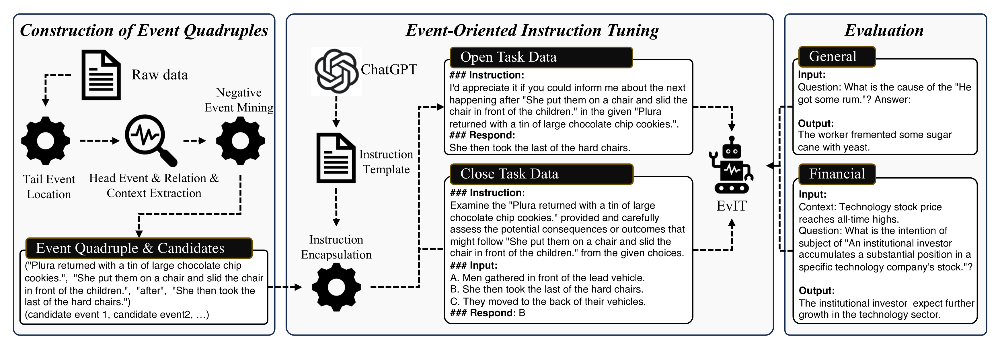
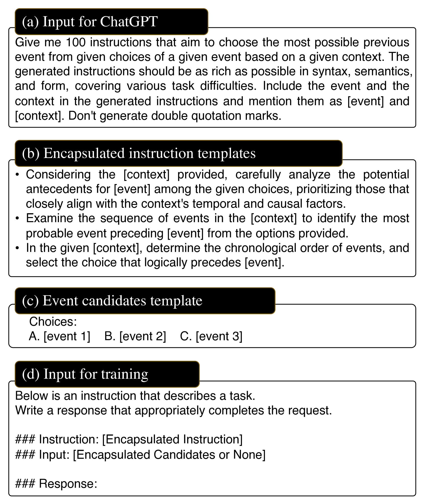
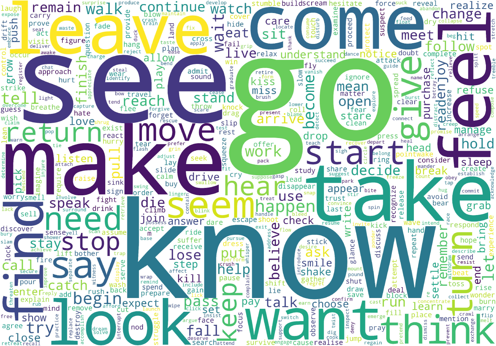
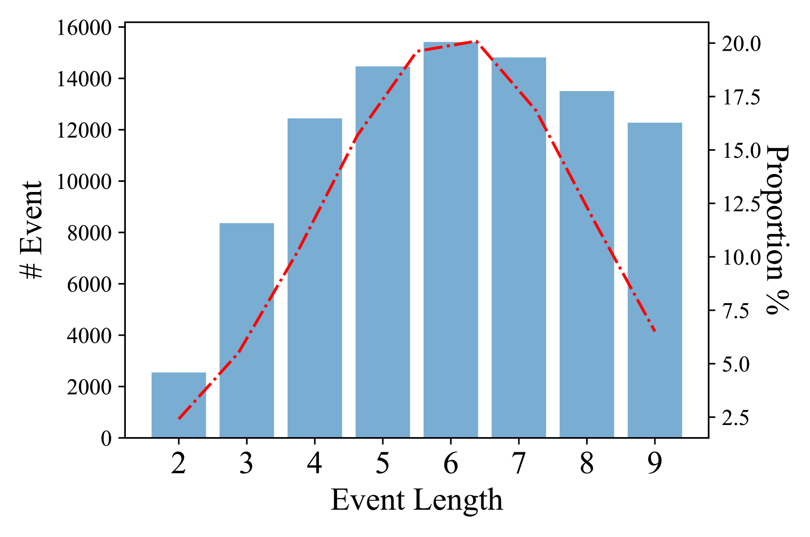
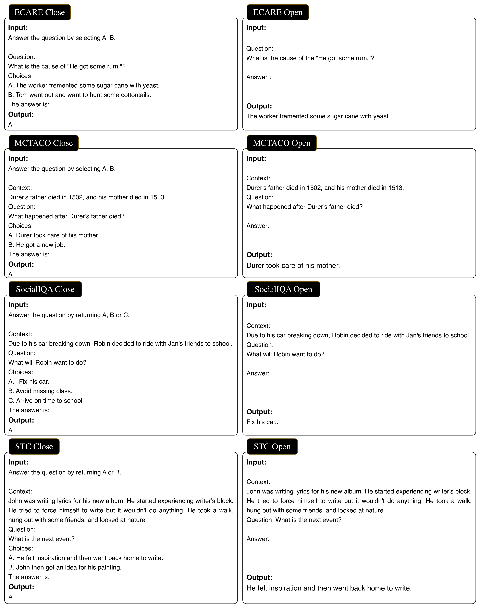
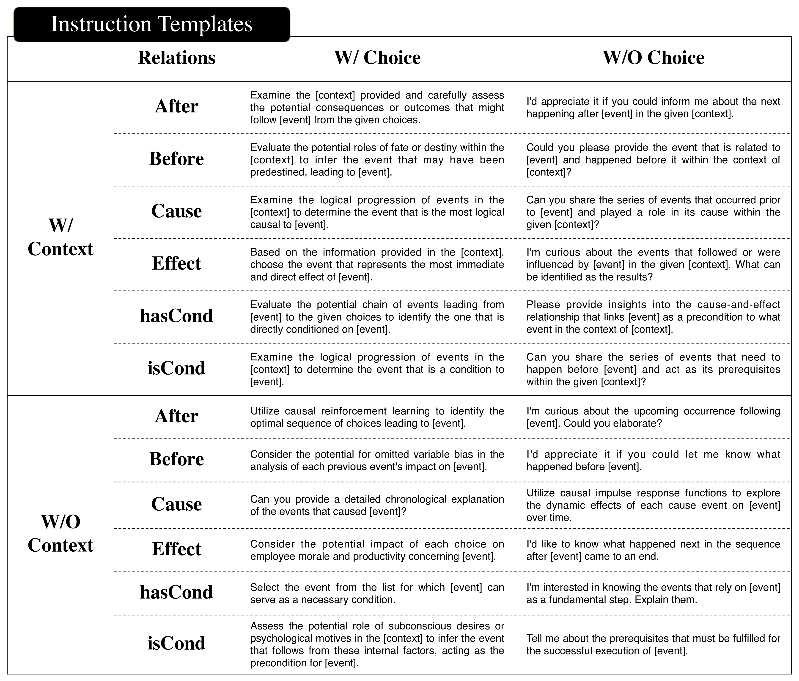

# EVIT：针对事件推理的事件驱动指令优化

发布时间：2024年04月18日

`LLM应用` `事件推理`

> EVIT: Event-Oriented Instruction Tuning for Event Reasoning

# 摘要

> 事件是指在特定情境下发生的特定事件、事故或情况。事件推理的目的是根据特定关系推断事件并预测未来可能发生的事件。这一领域的尖端技术对于多种自然语言处理应用至关重要。大型语言模型（LLMs）凭借其深厚的知识和推理能力，在事件推理方面取得了显著进步。然而，目前使用的较小指令调优模型在处理这些任务时并未始终展现出卓越的技能。这种不足主要是因为它们在指令数据中缺乏对事件及其相互联系的明确建模。这导致这些模型在理解事件结构和含义时遇到困难，并且难以将它们对事件的解释与人类的理解相匹配。此外，它们在理解事件关系方面的限制也影响了它们的事件推理能力，使得它们难以有效地推导出并整合相关事件知识。在本文中，我们提出了一种名为事件导向指令调优（EvIT）的新方法来训练我们的LLM。我们首先引入了一种新颖的事件四元组结构，它包含了事件的结构和语义，为事件表示提供了完整性。接着，我们基于这些结构设计了事件关系学习机制，并将这一学习过程融入到指令调优框架中，以增强模型的事件推理能力。我们还开发了一种启发式的无监督方法，用于从大规模语料库中提取事件四元组。最终，我们在事件导向指令调优的基础上对Llama模型进行了微调。我们在多个数据集上对事件推理任务进行了广泛的实验，自动评估和人类评估均显示EvIT在事件推理方面取得了优异的成绩。

> Events refer to specific occurrences, incidents, or happenings that take place under a particular background. Event reasoning aims to infer events according to certain relations and predict future events. The cutting-edge techniques for event reasoning play a crucial role in various natural language processing applications. Large language models (LLMs) have made significant advancements in event reasoning owing to their wealth of knowledge and reasoning capabilities. However, smaller instruction-tuned models currently in use do not consistently demonstrate exceptional proficiency in managing these tasks. This discrepancy arises from the absence of explicit modeling of events and the interconnections of them within their instruction data. Consequently, these models face challenges in comprehending event structures and semantics while struggling to bridge the gap between their interpretations and human understanding of events. Additionally, their limitations in grasping event relations lead to constrained event reasoning abilities to effectively deduce and incorporate pertinent event knowledge. In this paper, we propose Event-Oriented Instruction Tuning (EvIT) to train our LLM. Specifically, we first propose a novel structure named event quadruple which contains the structure and semantics of events and is complete in the event representation. We then design event-relation learning based on the structures. We encapsulate the learning into the instruction-tuning formulation to better stimulate the event reasoning capacity of our model. We design a heuristic unsupervised method to mine event quadruple from a large-scale corpus. At last, we finetune a Llama model on our Event-Oriented Instruction Tuning. We conduct extensive experiments on event reasoning tasks on several datasets. Automatic and human evaluations demonstrate EvIT achieves competitive performances on event reasoning.

[Arxiv](https://arxiv.org/abs/2404.11978)