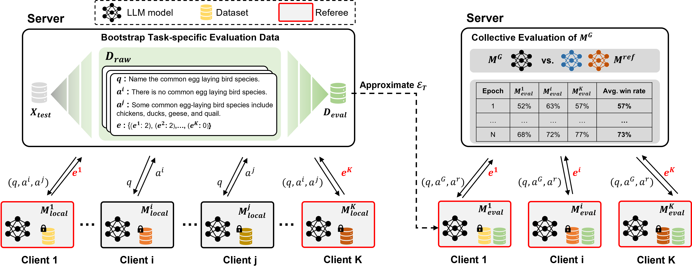

# FedEval-LLM：借助集体智慧，对大型语言模型在下游任务中的性能进行联合评估。

发布时间：2024年04月18日

`LLM应用` `联邦学习` `语言模型评估`

> FedEval-LLM: Federated Evaluation of Large Language Models on Downstream Tasks with Collective Wisdom

# 摘要

> 联邦学习（FL）正崭露头角，成为共同培育大型语言模型（LLMs）的有力途径。但LLMs的融入也带来了新挑战，尤其是在模型评估方面。传统评估手段依赖于有限的标记数据集和相似性度量，难以全面捕捉LLMs在创造性任务上的真实表现。尽管基于高级LLMs的自动化评估方法具有潜力，却存在数据泄露风险和缺乏领域知识导致的性能不佳问题。为应对这些挑战，我们设计了一种名为FedEval-LLM的联邦评估框架，旨在无需标记数据集和外部工具的情况下，为LLMs在下游任务上的性能提供可靠的度量，确保了卓越的隐私保护。FedEval-LLM借助参与者提供的个性化LLMs作为评审团，注入领域知识和集体评估力，以适应不同的下游任务，减少单一评审可能带来的不确定性和偏见。实验结果显示，个性化评估模型在下游任务上的评估能力显著提升。应用于FL时，这些模型与人工偏好和RougeL得分在精心挑选的测试集上高度一致。FedEval-LLM突破了传统评估方法的局限，减少了对外部服务的依赖，为协作训练环境中LLMs的评估提供了一个充满希望的新框架。

> Federated Learning (FL) has emerged as a promising solution for collaborative training of large language models (LLMs). However, the integration of LLMs into FL introduces new challenges, particularly concerning the evaluation of LLMs. Traditional evaluation methods that rely on labeled test sets and similarity-based metrics cover only a subset of the acceptable answers, thereby failing to accurately reflect the performance of LLMs on generative tasks. Meanwhile, although automatic evaluation methods that leverage advanced LLMs present potential, they face critical risks of data leakage due to the need to transmit data to external servers and suboptimal performance on downstream tasks due to the lack of domain knowledge. To address these issues, we propose a Federated Evaluation framework of Large Language Models, named FedEval-LLM, that provides reliable performance measurements of LLMs on downstream tasks without the reliance on labeled test sets and external tools, thus ensuring strong privacy-preserving capability. FedEval-LLM leverages a consortium of personalized LLMs from participants as referees to provide domain knowledge and collective evaluation capability, thus aligning to the respective downstream tasks and mitigating uncertainties and biases associated with a single referee. Experimental results demonstrate a significant improvement in the evaluation capability of personalized evaluation models on downstream tasks. When applied to FL, these evaluation models exhibit strong agreement with human preference and RougeL-score on meticulously curated test sets. FedEval-LLM effectively overcomes the limitations of traditional metrics and the reliance on external services, making it a promising framework for the evaluation of LLMs within collaborative training scenarios.

[Arxiv](https://arxiv.org/abs/2404.12273)