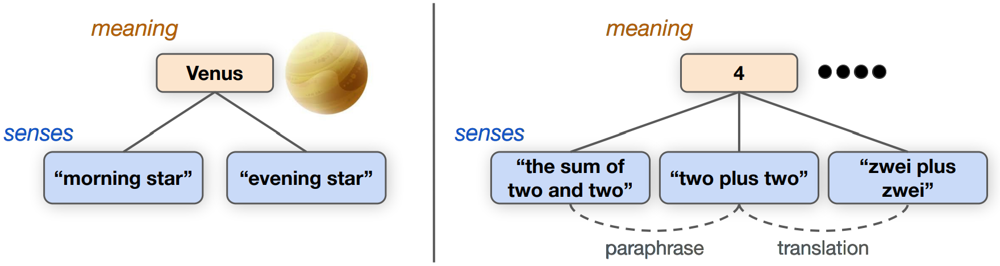
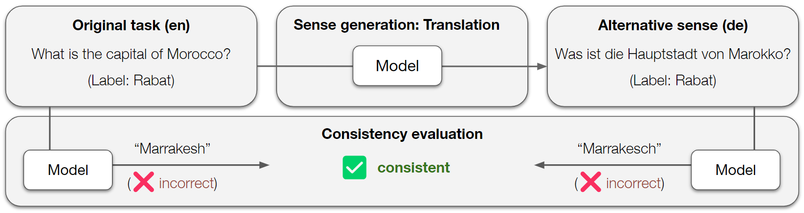

# 由表及里：透过多义一致性，深入挖掘语言模型的语义内涵。

发布时间：2024年04月18日

`LLM理论` `人工智能`

> From Form(s) to Meaning: Probing the Semantic Depths of Language Models Using Multisense Consistency

# 摘要

> 大型语言模型（LLMs）的能力增长速度令人震惊，这从一系列广泛采用的自然语言理解（NLU）基准测试中可见一斑，这引发了关于语言模型的“理解”究竟为何物，以及它与人类理解相比如何的诸多疑问。鉴于许多LLMs仅在文本上进行训练，人们不禁怀疑它们在这些基准测试中的卓越表现是否真的代表了对这些问题的深刻理解，还是仅仅因为LLMs擅长生成与理解问题的人可能会说的话相匹配的文本形式。在这项哲学启发的研究中，我们旨在通过一系列测试来区分形式与意义，这些测试基于一个观点：对世界的理解和呈现方式应该是一致的——这一观点受到了弗雷格意义的启发。具体而言，我们关注的是跨语言的一致性以及对同一意义的不同表述。以GPT-3.5为研究对象，我们在五种不同语言和多种任务中评估了多义词的一致性。我们的评估从控制环境中开始，询问模型一些基本事实，然后转向四个流行的NLU基准测试。我们发现模型在多义词一致性方面存在不足，并通过几项后续分析确认了这种不一致性是由于任务理解依赖于特定的意义。我们得出结论，就这一方面而言，LLMs的理解与人类的一致性和类人理解还有很大差距，并对这种差异如何影响它们在人类语言学习和理解方面的应用进行了深入探讨。

> The staggering pace with which the capabilities of large language models (LLMs) are increasing, as measured by a range of commonly used natural language understanding (NLU) benchmarks, raises many questions regarding what "understanding" means for a language model and how it compares to human understanding. This is especially true since many LLMs are exclusively trained on text, casting doubt on whether their stellar benchmark performances are reflective of a true understanding of the problems represented by these benchmarks, or whether LLMs simply excel at uttering textual forms that correlate with what someone who understands the problem would say. In this philosophically inspired work, we aim to create some separation between form and meaning, with a series of tests that leverage the idea that world understanding should be consistent across presentational modes - inspired by Fregean senses - of the same meaning. Specifically, we focus on consistency across languages as well as paraphrases. Taking GPT-3.5 as our object of study, we evaluate multisense consistency across five different languages and various tasks. We start the evaluation in a controlled setting, asking the model for simple facts, and then proceed with an evaluation on four popular NLU benchmarks. We find that the model's multisense consistency is lacking and run several follow-up analyses to verify that this lack of consistency is due to a sense-dependent task understanding. We conclude that, in this aspect, the understanding of LLMs is still quite far from being consistent and human-like, and deliberate on how this impacts their utility in the context of learning about human language and understanding.

[Arxiv](https://arxiv.org/abs/2404.12145)