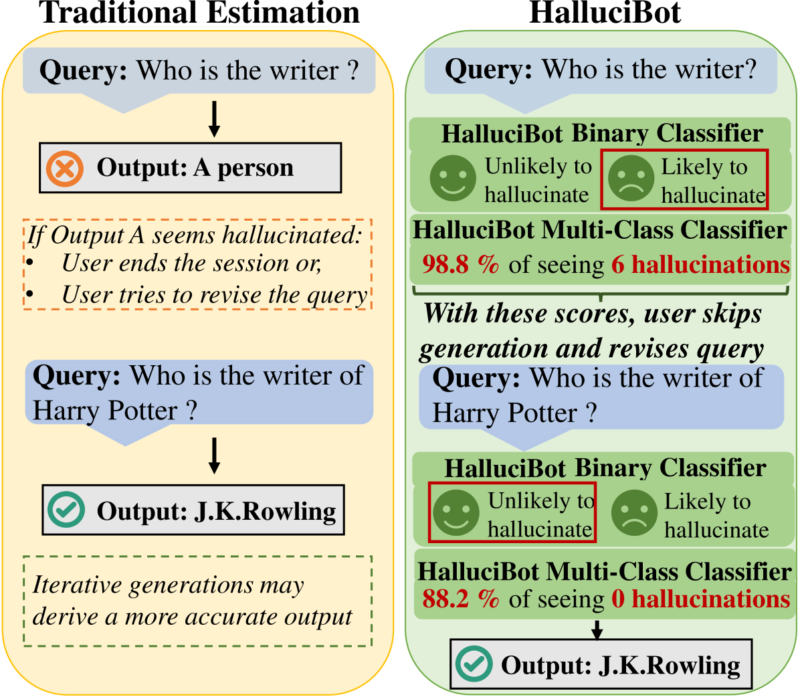
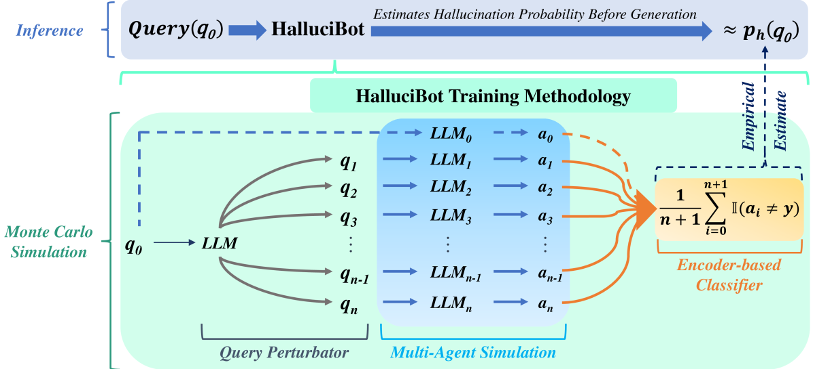
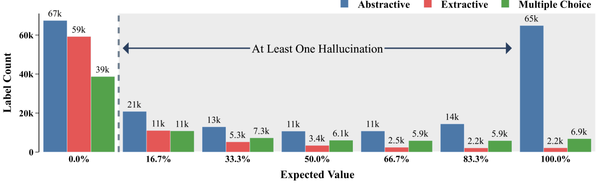
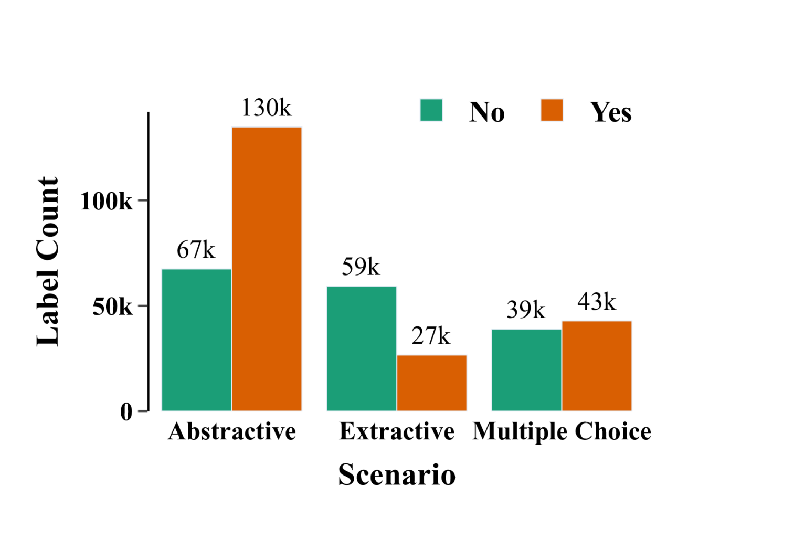

# HalluciBot：世上真的不存在坏问题吗？

发布时间：2024年04月18日

`LLM应用` `人工智能`

> HalluciBot: Is There No Such Thing as a Bad Question?

# 摘要

> 幻觉一直是大型语言模型（LLM）机构采纳之路上的一大难题。众多研究致力于生成后的优化工作——无论是通过反馈优化结果、分析对数输出值，还是从输出特征中寻找线索。本研究提出了HalluciBot，这是一个能够在LLM生成之前预测幻觉发生概率的模型。HalluciBot在推理阶段不进行任何生成操作。为了验证HalluciBot的有效性，我们采用了多智能体蒙特卡洛模拟方法，并引入了查询扰动器，在训练阶段为每个查询生成n个变体。这一设计灵感来源于我们对幻觉的新定义——“真实幻觉”。我们的训练策略针对一个包含369,837个查询的训练集，生成了2,219,022个概率估计，覆盖了13个多样化的数据集和3种问答情境。HalluciBot能够预测幻觉的二元和多类概率，从而评估查询可能导致幻觉的风险。这不仅有助于在生成前对查询进行修正或取消，避免不必要的计算资源浪费，还为评估用户对可能导致幻觉的查询负责提供了清晰的度量手段。

> Hallucination continues to be one of the most critical challenges in the institutional adoption journey of Large Language Models (LLMs). In this context, an overwhelming number of studies have focused on analyzing the post-generation phase - refining outputs via feedback, analyzing logit output values, or deriving clues via the outputs' artifacts. We propose HalluciBot, a model that predicts the probability of hallucination $\textbf{before generation}$, for any query imposed to an LLM. In essence, HalluciBot does not invoke any generation during inference. To derive empirical evidence for HalluciBot, we employ a Multi-Agent Monte Carlo Simulation using a Query Perturbator to craft $n$ variations per query at train time. The construction of our Query Perturbator is motivated by our introduction of a new definition of hallucination - $\textit{truthful hallucination}$. Our training methodology generated 2,219,022 estimates for a training corpus of 369,837 queries, spanning 13 diverse datasets and 3 question-answering scenarios. HalluciBot predicts both binary and multi-class probabilities of hallucination, enabling a means to judge the query's quality with regards to its propensity to hallucinate. Therefore, HalluciBot paves the way to revise or cancel a query before generation and the ensuing computational waste. Moreover, it provides a lucid means to measure user accountability for hallucinatory queries.

[Arxiv](https://arxiv.org/abs/2404.12535)