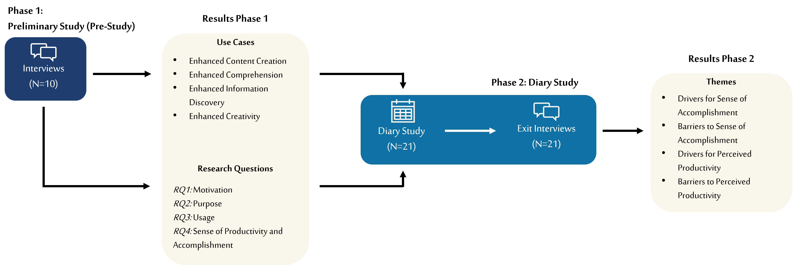
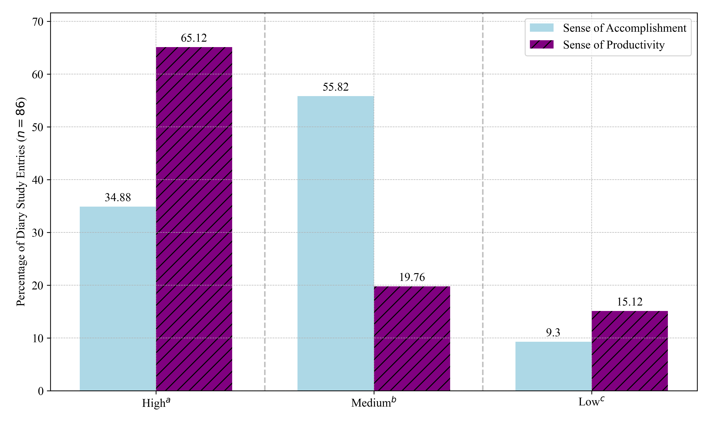

# 机器若能与我匹敌，我的价值何在？——探讨 ChatGPT 如何重塑年轻职场人士对效率与成就的认知

发布时间：2024年04月18日

`LLM应用` `职场效率` `人工智能应用`

> "If the Machine Is As Good As Me, Then What Use Am I?" -- How the Use of ChatGPT Changes Young Professionals' Perception of Productivity and Accomplishment

# 摘要

> 像ChatGPT这样的大型语言模型在职场中备受青睐。本研究旨在了解ChatGPT如何影响年轻职场人士对工作效率和成就的感受。通过初步调研，我们了解了LLMs在知识工作中的应用场景，并以此为基础，开展了为期两周的日记研究，追踪了21位年轻专业人士使用ChatGPT的情况。研究发现，ChatGPT通过激发创意和提高工具使用效率，提升了部分用户的工作效率和满足感。然而，也有参与者因缺乏归属感、挑战性不足和成果平庸而感到工作效率和成就感下降。此外，ChatGPT在任务分配上的适用性因任务类型而异，它尤其适合于理解复杂主题、激发创新解决方案和挖掘新信息，但在需要严格验证的研究任务中，由于其可能产生的错误信息，适用性较低。

> Large language models (LLMs) like ChatGPT have been widely adopted in work contexts. We explore the impact of ChatGPT on young professionals' perception of productivity and sense of accomplishment. We collected LLMs' main use cases in knowledge work through a preliminary study, which served as the basis for a two-week diary study with 21 young professionals reflecting on their ChatGPT use. Findings indicate that ChatGPT enhanced some participants' perceptions of productivity and accomplishment by enabling greater creative output and satisfaction from efficient tool utilization. Others experienced decreased perceived productivity and accomplishment, driven by a diminished sense of ownership, perceived lack of challenge, and mediocre results. We found that the suitability of task delegation to ChatGPT varies strongly depending on the task nature. It's especially suitable for comprehending broad subject domains, generating creative solutions, and uncovering new information. It's less suitable for research tasks due to hallucinations, which necessitate extensive validation.

[Arxiv](https://arxiv.org/abs/2404.12549)