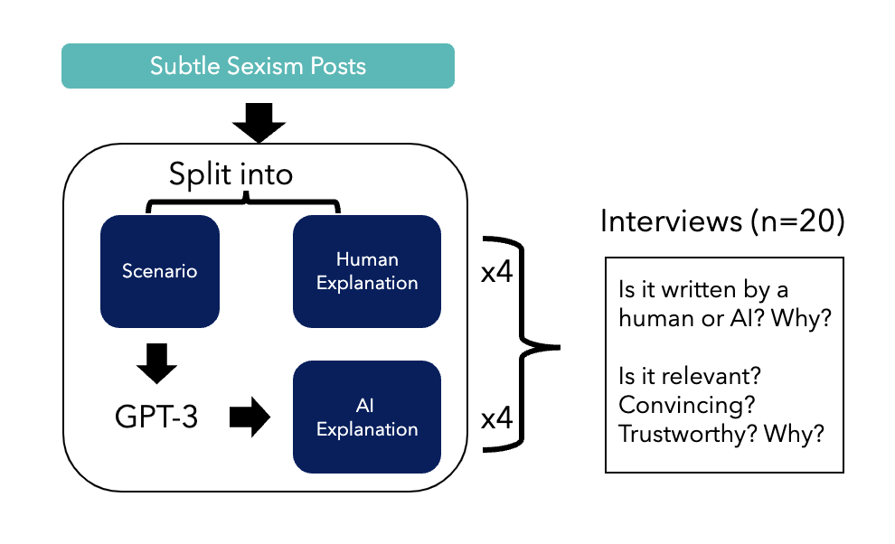

# 《与我相似：观点与个人经历在主观决策中对解释感知的影响》

发布时间：2024年04月18日

`分类：LLM应用

这篇论文主要探讨了大型语言模型（LLMs）在模拟人类辩证能力方面的应用，特别是在主观决策过程中提供多样化的论点和视角。论文通过访谈研究验证了LLM输出在人类主观决策中的实用性，并讨论了其中的一些现象和挑战。因此，这篇论文可以归类为LLM应用。` `人工智能伦理` `决策支持`

> Just Like Me: The Role of Opinions and Personal Experiences in The Perception of Explanations in Subjective Decision-Making

# 摘要

> 随着大型语言模型（LLMs）的发展，它们在特定情境下能够模拟人类的辩证能力，这拓宽了人类与人工智能协作的适用场景。我们特别关注那些依赖个人信仰和价值观、具有开放性解释空间的主观决策过程。在这些情况下，提供多样化的论点和视角对于决策者尤为有益。以在线微妙性别歧视为例，这是一个在主观决策中较少被研究的领域，我们提出LLM的输出能够为人类的主观决策提供丰富的多元论证。为了验证这一应用的可行性，我们开展了一项访谈研究，共有20名参与者对人类和AI生成的解释性文本进行了评价，这些文本是对互联网上微妙性别歧视现象的回应。在本研讨会论文中，我们关注了研究结果中一个令人关注的趋势：LLM在论证中展现的个人意见和经历。我们发现，当这些意见和经历与参与者自身的观点和经历相吻合时，参与者倾向于认为这些解释更具说服力和可信度。我们阐述了这一发现，并讨论了确认偏误在其中扮演的角色，同时指出了AI在生成类似人类经历时所面临的伦理挑战。

> As large language models (LLMs) advance to produce human-like arguments in some contexts, the number of settings applicable for human-AI collaboration broadens. Specifically, we focus on subjective decision-making, where a decision is contextual, open to interpretation, and based on one's beliefs and values. In such cases, having multiple arguments and perspectives might be particularly useful for the decision-maker. Using subtle sexism online as an understudied application of subjective decision-making, we suggest that LLM output could effectively provide diverse argumentation to enrich subjective human decision-making. To evaluate the applicability of this case, we conducted an interview study (N=20) where participants evaluated the perceived authorship, relevance, convincingness, and trustworthiness of human and AI-generated explanation-text, generated in response to instances of subtle sexism from the internet. In this workshop paper, we focus on one troubling trend in our results related to opinions and experiences displayed in LLM argumentation. We found that participants rated explanations that contained these characteristics as more convincing and trustworthy, particularly so when those opinions and experiences aligned with their own opinions and experiences. We describe our findings, discuss the troubling role that confirmation bias plays, and bring attention to the ethical challenges surrounding the AI generation of human-like experiences.

[Arxiv](https://arxiv.org/abs/2404.12558)