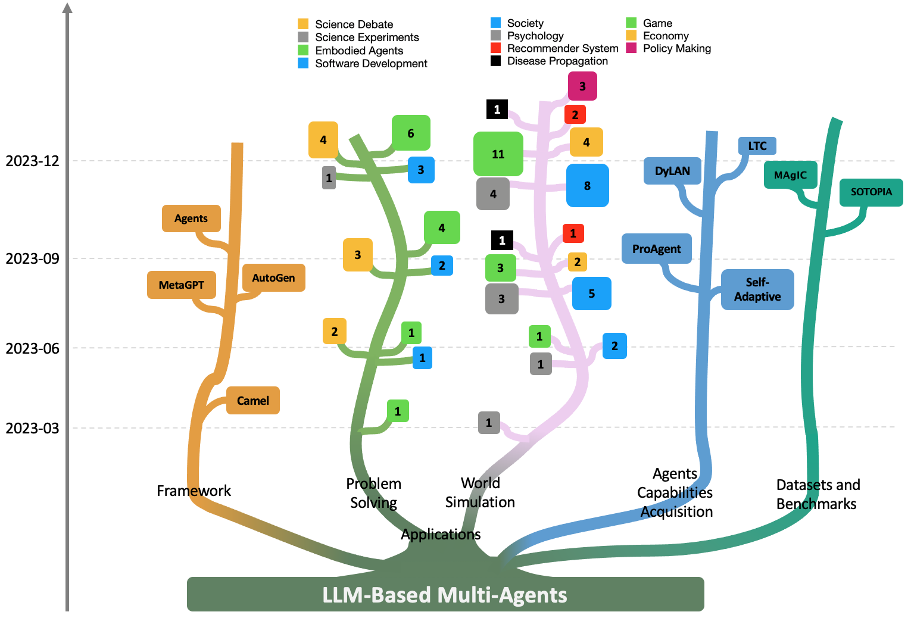
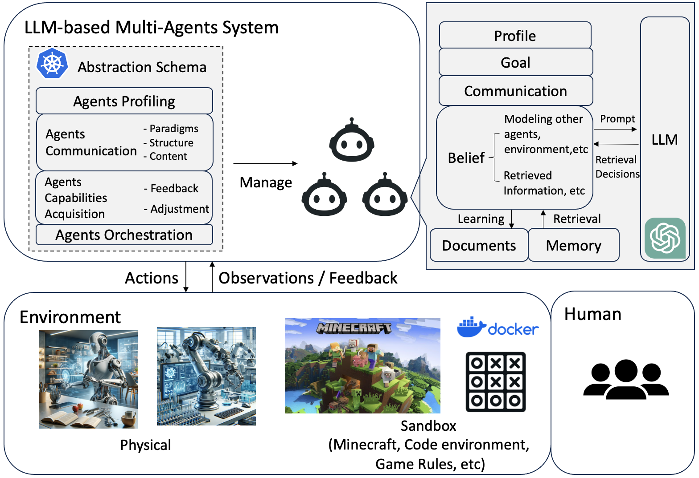
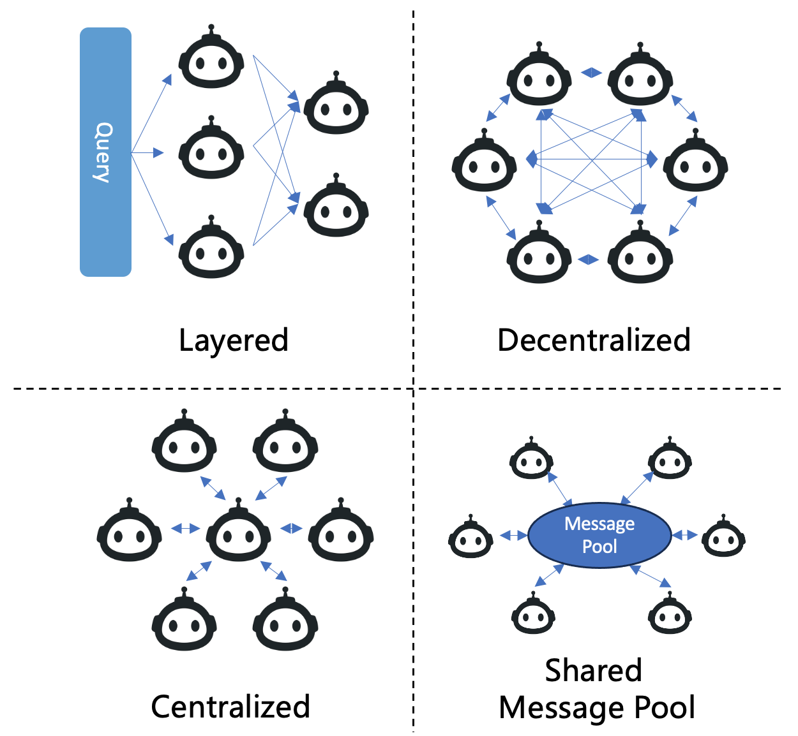

# 大型语言模型驱动的多智能体研究：进展与挑战综述

发布时间：2024年04月18日

`Agent` `人工智能` `自动化`

> Large Language Model based Multi-Agents: A Survey of Progress and Challenges

# 摘要

> 大型语言模型（LLMs）在众多任务上取得了卓越成就。凭借其卓越的规划和推理能力，LLMs 被广泛用作自动化任务的自主智能体。最近，基于单一 LLM 作为规划或决策智能体的多智能体系统，在解决复杂问题和模拟世界构建方面取得了显著进步。为了向学术界提供一个全面的视角，我们提供了这篇综述，深入探讨了基于 LLM 的多智能体系统的核心要素及其面临的挑战。我们希望读者能够对以下问题有更深刻的理解：基于 LLM 的多智能体模拟了哪些领域和环境？这些智能体如何被定义，它们之间如何交流？是什么机制推动了智能体能力的提升？对于渴望深入这一研究领域的学者，我们还汇总了常用的数据集和基准测试，以便他们能够轻松获取。为了使研究人员能够及时了解最新的研究成果，我们维护了一个开源的 GitHub 仓库，专门用于追踪基于 LLM 的多智能体系统的研究进展。

> Large Language Models (LLMs) have achieved remarkable success across a wide array of tasks. Due to the impressive planning and reasoning abilities of LLMs, they have been used as autonomous agents to do many tasks automatically. Recently, based on the development of using one LLM as a single planning or decision-making agent, LLM-based multi-agent systems have achieved considerable progress in complex problem-solving and world simulation. To provide the community with an overview of this dynamic field, we present this survey to offer an in-depth discussion on the essential aspects of multi-agent systems based on LLMs, as well as the challenges. Our goal is for readers to gain substantial insights on the following questions: What domains and environments do LLM-based multi-agents simulate? How are these agents profiled and how do they communicate? What mechanisms contribute to the growth of agents' capacities? For those interested in delving into this field of study, we also summarize the commonly used datasets or benchmarks for them to have convenient access. To keep researchers updated on the latest studies, we maintain an open-source GitHub repository, dedicated to outlining the research on LLM-based multi-agent systems.

[Arxiv](https://arxiv.org/abs/2402.01680)