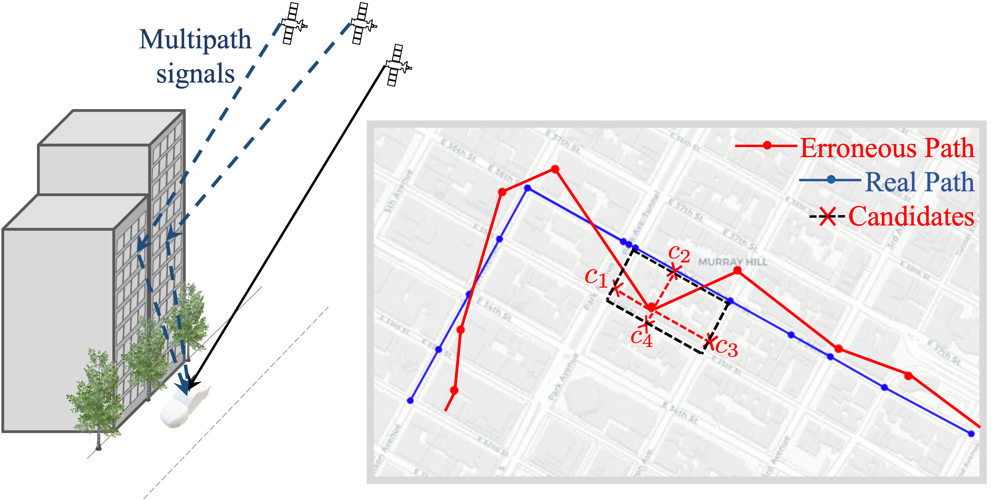
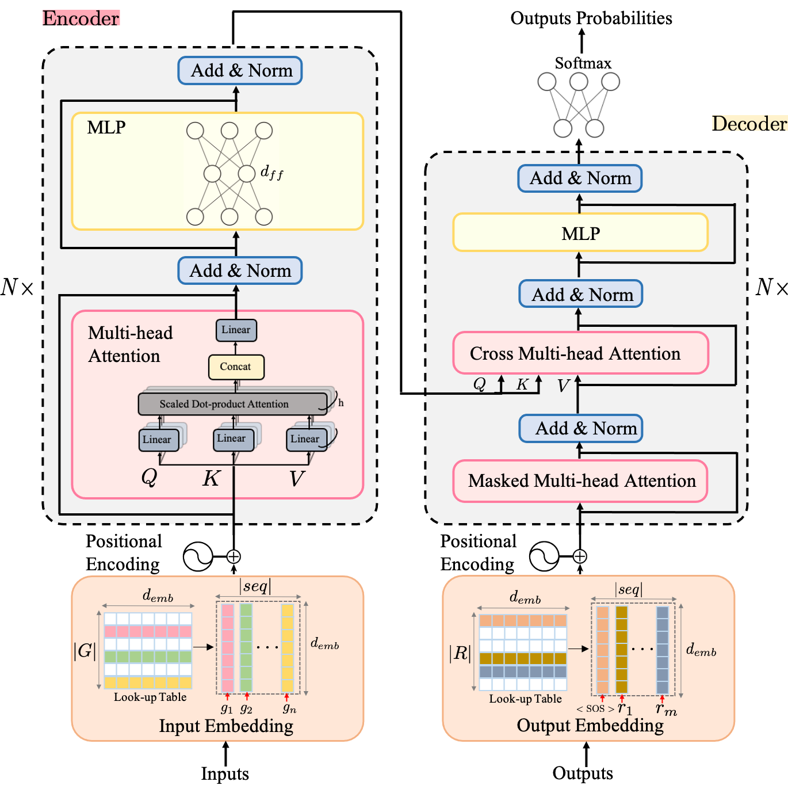
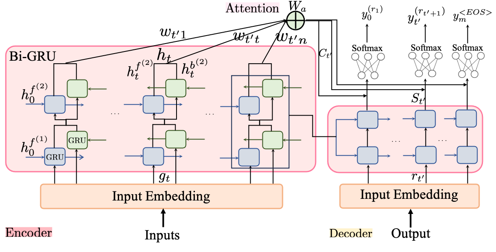
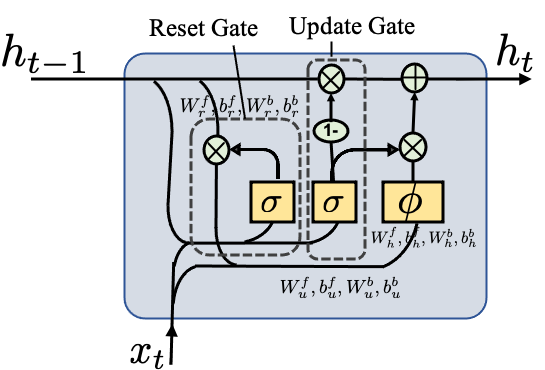
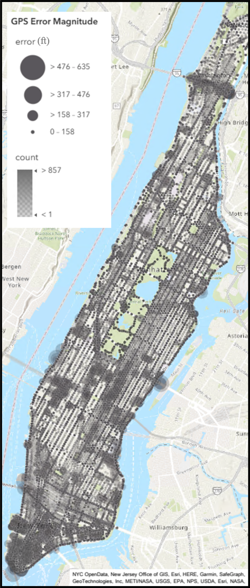
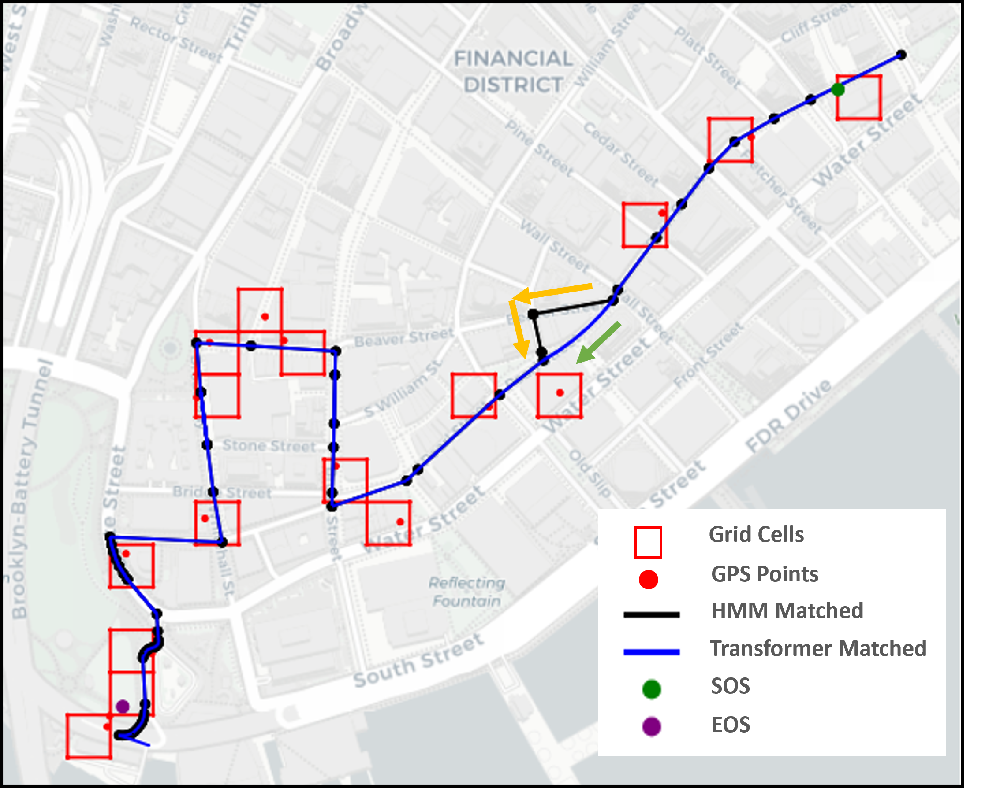

# 利用变换器序列对序列模型，实现城市路网中基于自然语言处理（NLP）的轨迹地图匹配技术。

发布时间：2024年04月18日

`Agent` `智能交通系统`

> NLP-enabled trajectory map-matching in urban road networks using transformer sequence-to-sequence model

# 摘要

> 大规模的车载地理定位远程信息处理数据能够显著提升智能城市的移动基础设施和操作系统。要充分利用这些数据，关键在于将地理定位信息精确匹配到相应的道路段。但这一过程因采样率低和城市环境中的多径效应而变得复杂。传统上，隐马尔可夫模型等统计建模技术被广泛用于地图匹配，但这些基于规则的方法对噪声敏感且处理大规模数据效率不高。相比之下，深度学习方法能够直接从数据中学习观测数据与道路网络的关系，无需依赖手工制定的规则或领域知识，这使得它们在处理大规模数据集时更为高效和鲁棒。本文提出了一种基于序列到序列的深度学习模型，即基于变换器的编码器-解码器模型，用于替代传统的地图匹配算法。该模型首先将一系列噪声GPS点编码为能够自动捕捉自回归行为和空间相关性的表示，然后解码器将这些数据点与道路网络特征关联，最终将表示转换为一系列道路段。在纽约曼哈顿收集的GPS轨迹上进行训练和评估后，该模型达到了76%的准确率，显示出在将噪声GPS数据转换为城市道路网络中的导航路线方面的潜力。

> Large-scale geolocation telematics data acquired from connected vehicles has the potential to significantly enhance mobility infrastructures and operational systems within smart cities. To effectively utilize this data, it is essential to accurately match the geolocation data to the road segments. However, this matching is often not trivial due to the low sampling rate and errors exacerbated by multipath effects in urban environments. Traditionally, statistical modeling techniques such as Hidden-Markov models incorporating domain knowledge into the matching process have been extensively used for map-matching tasks. However, rule-based map-matching tasks are noise-sensitive and inefficient in processing large-scale trajectory data. Deep learning techniques directly learn the relationship between observed data and road networks from the data, often without the need for hand-crafted rules or domain knowledge. This renders them an efficient approach for map-matching large-scale datasets and makes them more robust to the noise. This paper introduces a sequence-to-sequence deep-learning model, specifically the transformer-based encoder-decoder model, to perform as a surrogate for map-matching algorithms. The encoder-decoder architecture initially encodes the series of noisy GPS points into a representation that automatically captures autoregressive behavior and spatial correlations between GPS points. Subsequently, the decoder associates data points with the road network features and thus transforms these representations into a sequence of road segments. The model is trained and evaluated using GPS traces collected in Manhattan, New York. Achieving an accuracy of 76%, transformer-based encoder-decoder models extensively employed in natural language processing presented a promising performance for translating noisy GPS data to the navigated routes in urban road networks.

[Arxiv](https://arxiv.org/abs/2404.12460)