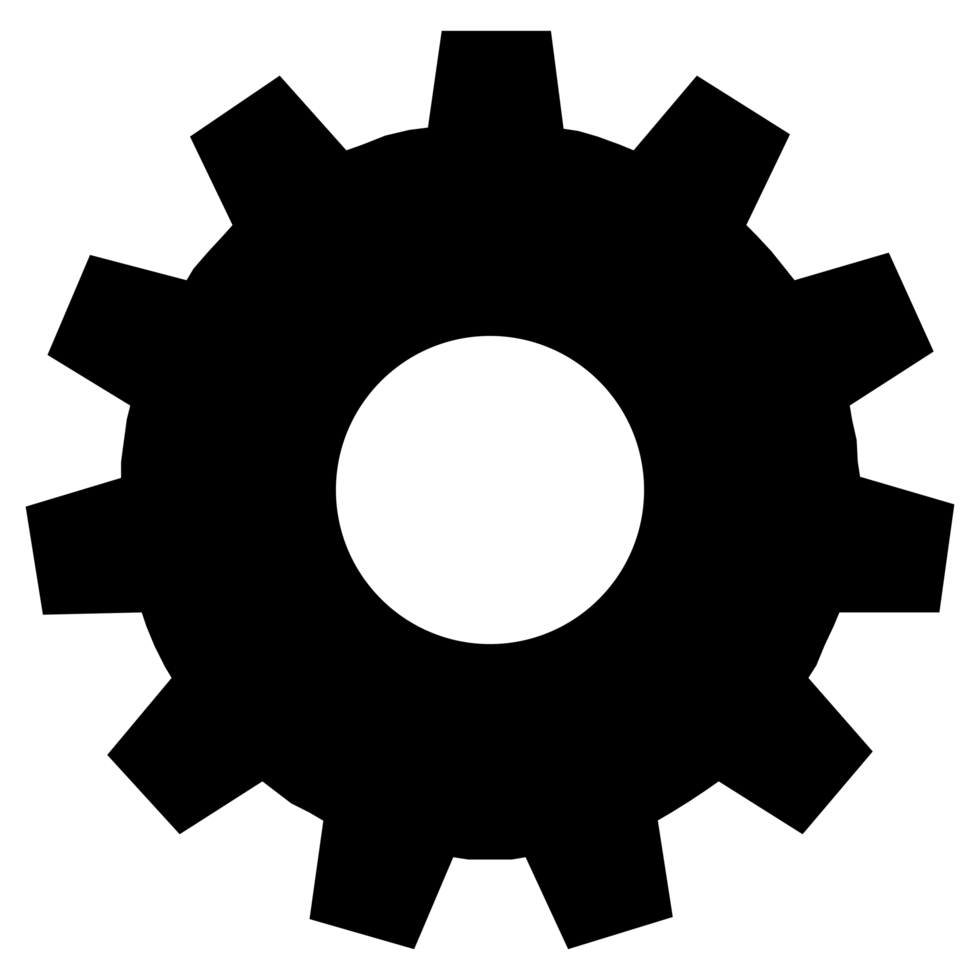
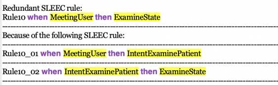
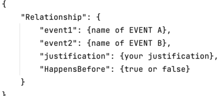
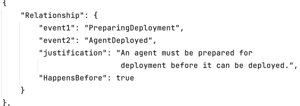
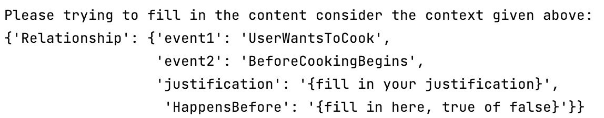
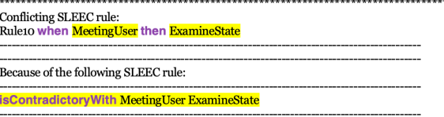

# 通过大型语言模型，将规范性要求转化为可操作的标准。

发布时间：2024年04月18日

`分类：Agent

这篇论文讨论了如何利用大型语言模型来提炼系统功能抽象表示间的语义联系，以帮助非技术利益相关者（如伦理学家、律师、社会科学家等）分析和确保系统的规范性需求。这个过程涉及到智能代理（Agent）的概念，因为它们需要理解和处理非技术利益相关者的需求，并将这些需求转化为可以由自动化推理技术处理的形式。此外，智能代理还需要能够处理和分析多个真实世界的案例研究，以证明其方法的有效性。因此，这篇论文可以归类为Agent。` `系统工程` `伦理学`

> Normative Requirements Operationalization with Large Language Models

# 摘要

> 规范性非功能性需求界定了系统需遵循的界限，以防社会、法律、伦理、同理心及文化规范受到违反。这些需求多由不同专业背景的非技术利益相关者（如伦理学家、律师、社会科学家等）设定，确保其规范性和一致性颇具挑战。近期研究采用特定领域语言将规范需求表述为规则，以便通过形式化方法分析其一致性。本文提出了一种新方法，利用大型语言模型提炼系统功能抽象表示间的语义联系。这些联系往往是非技术利益相关者基于常识或领域知识隐含假定的，随后用于增强自动化推理技术，以引出并分析规范性需求的一致性。我们通过多个真实世界的案例研究，证明了该方法在规范性需求引出和实施化方面的高效性。

> Normative non-functional requirements specify constraints that a system must observe in order to avoid violations of social, legal, ethical, empathetic, and cultural norms. As these requirements are typically defined by non-technical system stakeholders with different expertise and priorities (ethicists, lawyers, social scientists, etc.), ensuring their well-formedness and consistency is very challenging. Recent research has tackled this challenge using a domain-specific language to specify normative requirements as rules whose consistency can then be analysed with formal methods. In this paper, we propose a complementary approach that uses Large Language Models to extract semantic relationships between abstract representations of system capabilities. These relations, which are often assumed implicitly by non-technical stakeholders (e.g., based on common sense or domain knowledge), are then used to enrich the automated reasoning techniques for eliciting and analyzing the consistency of normative requirements. We show the effectiveness of our approach to normative requirements elicitation and operationalization through a range of real-world case studies.

[Arxiv](https://arxiv.org/abs/2404.12335)