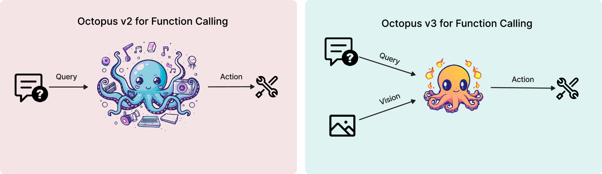

# 章鱼 v3：设备端亿级以下多模态人工智能代理技术报告

发布时间：2024年04月18日

`Agent` `AI代理` `边缘计算`

> Octopus v3: Technical Report for On-device Sub-billion Multimodal AI Agent

# 摘要

> 多模态AI代理擅长处理和学习自然语言、视觉和音频等多种数据类型，以此来指导其行为。尽管在整合视觉信息的大型语言模型如GPT-4V方面取得了进展，但将图像数据有效转换为AI代理的可执行成果依然充满挑战。本文提出了一种新型多模态模型，它特别设计了功能性标记，专为AI代理应用而优化。为适应边缘设备，该模型精简至不到10亿参数。与GPT-4相似，它能够处理中英文输入。我们展示了该模型在包括树莓派在内的多种边缘设备上都能高效运作。

> A multimodal AI agent is characterized by its ability to process and learn from various types of data, including natural language, visual, and audio inputs, to inform its actions. Despite advancements in large language models that incorporate visual data, such as GPT-4V, effectively translating image-based data into actionable outcomes for AI agents continues to be challenging. In this paper, we introduce a multimodal model that incorporates the concept of functional token specifically designed for AI agent applications. To ensure compatibility with edge devices, our model is optimized to a compact size of less than 1B parameters. Like GPT-4, our model can process both English and Chinese. We demonstrate that this model is capable of operating efficiently on a wide range of edge devices, including as constrained as a Raspberry Pi.

[Arxiv](https://arxiv.org/abs/2404.11459)