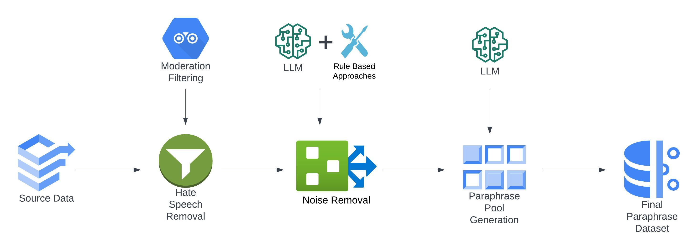
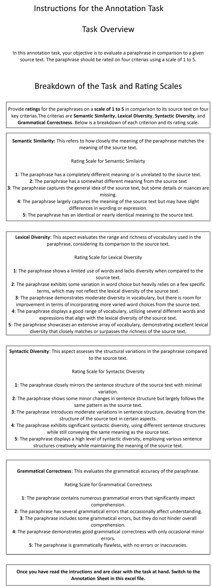

# ParaFusion 是一个由大型语言模型（LLM）驱动的英语释义数据集，它注入了丰富的词汇和句法多样性，为语言模型的训练和评估提供了高质量的语料。

发布时间：2024年04月18日

`LLM应用`

> ParaFusion: A Large-Scale LLM-Driven English Paraphrase Dataset Infused with High-Quality Lexical and Syntactic Diversity

# 摘要

> 句子改写在自然语言处理领域占据核心地位。然而，现有数据集在句法和词汇上多样性不足，导致生成的改写句子与原文过于相似。更甚的是，这些数据集中还充斥着仇恨言论和杂音，有时还混入了非英语文本。为了解决这些问题，本研究推出了 ParaFusion——一个使用大型语言模型精心打造的大规模、高水准英语改写数据集。ParaFusion 不仅为现有数据集注入了高质量的数据，极大丰富了词汇和句法的多样性，而且保持了语义的高度一致性。它还有效减少了仇恨言论和噪声的干扰，提供了一个更为纯净、专注的英语学习资源。实验数据表明，ParaFusion 在多个衡量标准上至少提升了25%的句法和词汇多样性。此外，本文还旨在建立一个改写评估的黄金准则，其全面的评价策略是迄今为止最为详尽的。这些成果凸显了 ParaFusion 在推动自然语言处理应用发展上的巨大潜力。

> Paraphrase generation is a pivotal task in natural language processing (NLP). Existing datasets in the domain lack syntactic and lexical diversity, resulting in paraphrases that closely resemble the source sentences. Moreover, these datasets often contain hate speech and noise, and may unintentionally include non-English language sentences. This research introduces ParaFusion, a large-scale, high-quality English paraphrase dataset developed using Large Language Models (LLM) to address these challenges. ParaFusion augments existing datasets with high-quality data, significantly enhancing both lexical and syntactic diversity while maintaining close semantic similarity. It also mitigates the presence of hate speech and reduces noise, ensuring a cleaner and more focused English dataset. Results show that ParaFusion offers at least a 25% improvement in both syntactic and lexical diversity, measured across several metrics for each data source. The paper also aims to set a gold standard for paraphrase evaluation as it contains one of the most comprehensive evaluation strategies to date. The results underscore the potential of ParaFusion as a valuable resource for improving NLP applications.

[Arxiv](https://arxiv.org/abs/2404.12010)