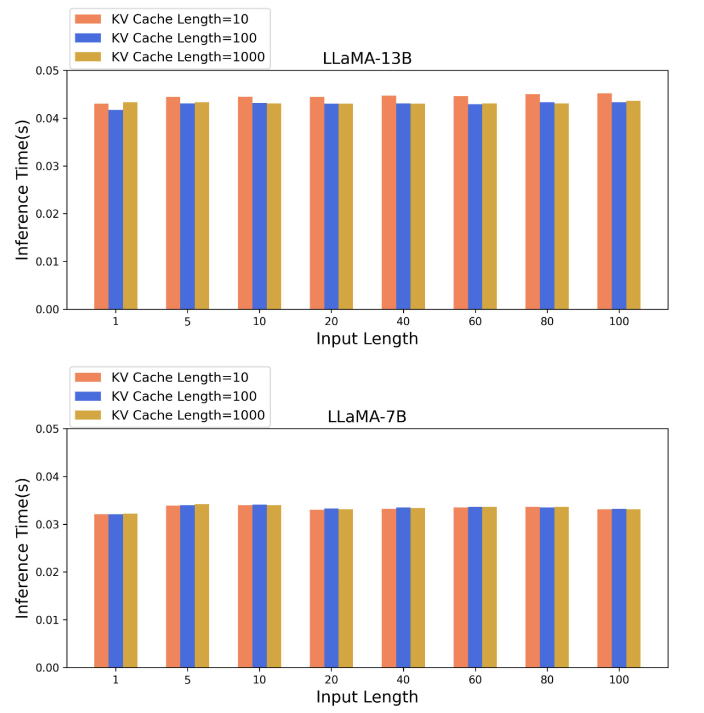
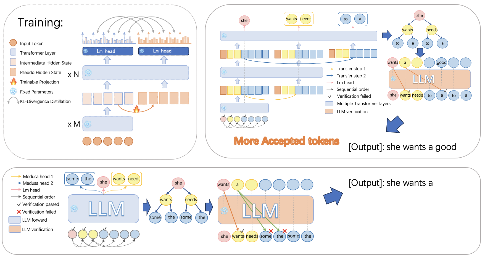
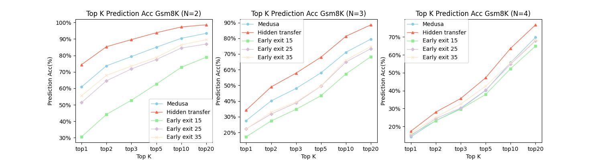
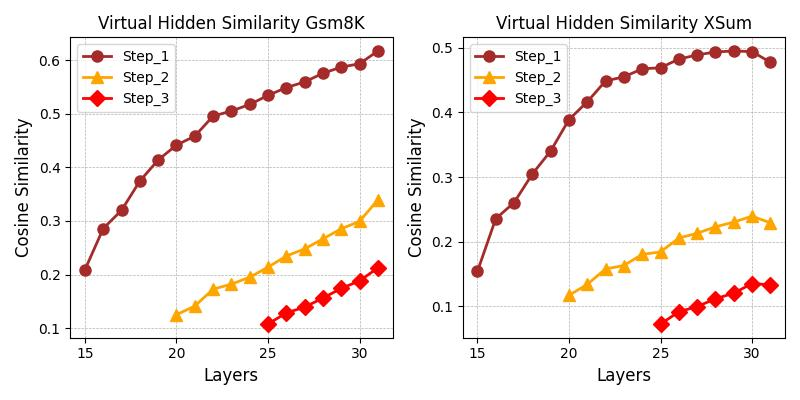
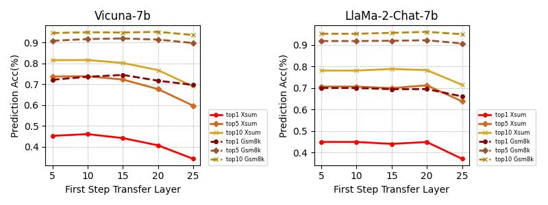
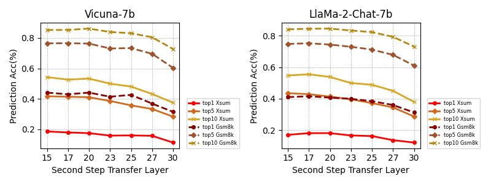
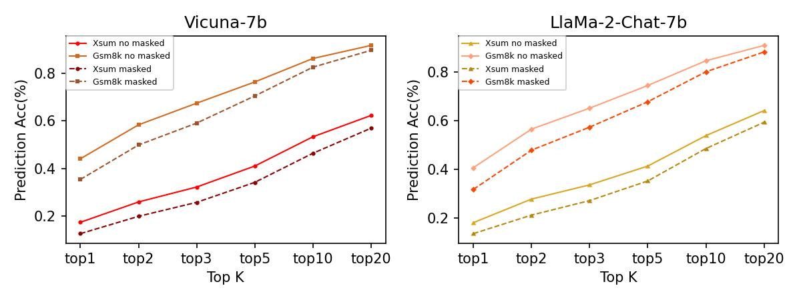

# 采用隐藏层传输技术，实现大型语言模型的并行解码，从而加速模型的无损运行。

发布时间：2024年04月18日

`LLM理论` `并行计算`

> Parallel Decoding via Hidden Transfer for Lossless Large Language Model Acceleration

# 摘要

> 近期，大型语言模型（LLMs）在众多任务上展现了非凡的成果。但模型中的海量参数使得在推理时出现明显的延迟，尤其是在使用逐个生成令牌的自回归解码方法时，这限制了GPU并行计算能力的发挥。本文提出了一种创新的并行解码技术——“隐藏转移”，它能够在单次前向传播中同时解码多个连续的令牌。核心思想在于将前文的中间隐藏状态传递给未来生成令牌的“伪”隐藏状态，这些状态随后会通过后续的变换层，以获取更多语义信息，提高对后续令牌的预测准确性。此外，我们还采用了一种新颖的树状注意力机制，用以同时生成并校验多个输出序列的候选，确保了生成的无损性，并进一步提升了生成效率。实验结果证明了我们方法的有效性。我们开展了大量的分析实验，以验证我们的初衷。在加速指标上，我们超越了包括Medusa和自我推测解码在内的所有单一模型加速技术。

> Large language models (LLMs) have recently shown remarkable performance across a wide range of tasks. However, the substantial number of parameters in LLMs contributes to significant latency during model inference. This is particularly evident when utilizing autoregressive decoding methods, which generate one token in a single forward process, thereby not fully capitalizing on the parallel computing capabilities of GPUs. In this paper, we propose a novel parallel decoding approach, namely \textit{hidden transfer}, which decodes multiple successive tokens simultaneously in a single forward pass. The idea is to transfer the intermediate hidden states of the previous context to the \textit{pseudo} hidden states of the future tokens to be generated, and then the pseudo hidden states will pass the following transformer layers thereby assimilating more semantic information and achieving superior predictive accuracy of the future tokens.
  Besides, we use the novel tree attention mechanism to simultaneously generate and verify multiple candidates of output sequences, which ensure the lossless generation and further improves the generation efficiency of our method. Experiments demonstrate the effectiveness of our method. We conduct a lot of analytic experiments to prove our motivation. In terms of acceleration metrics, we outperform all the single-model acceleration techniques, including Medusa and Self-Speculative decoding.

[Arxiv](https://arxiv.org/abs/2404.12022)