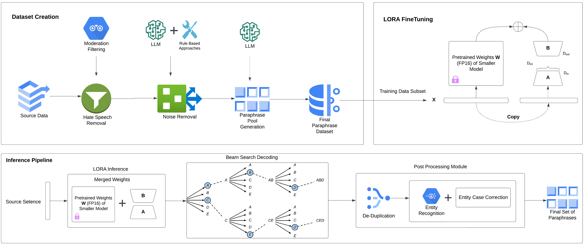

# 通过序列层级的知识蒸馏技术，实现参数高效且多样化的释义生成。

发布时间：2024年04月18日

`LLM应用` `文本改写`

> Parameter Efficient Diverse Paraphrase Generation Using Sequence-Level Knowledge Distillation

# 摘要

> 过去一年，自然语言生成（NLG）领域迎来了爆炸性增长，这主要得益于大型语言模型（LLMs）的问世。这些模型在自然语言处理和生成的多个领域内展现了卓越的性能。但在特定领域任务，如改写，它们的应用仍面临重大挑战。由于参数众多，这些模型在商业硬件上运行困难，且推理时间漫长，导致生产成本高昂。本研究通过采用序列级知识蒸馏方法，利用LLMs构建了三种不同的改写模型，有效解决了这些问题。这些精炼后的模型不仅保持了LLM生成改写的高品质，还显著提升了推理速度，并能够产生质量相当的多样化改写。这些模型的显著特点在于，它们在保持词汇多样性的同时，还能展现句法多样性，这在以往因数据集质量问题而不常见的特性，在基于神经网络的方法中也极为罕见。人类评估显示，与用于蒸馏的LLM教师模型相比，这些模型的性能仅下降了4%，而模型大小却缩小了1000倍。本研究为NLG领域带来了重大突破，提供了一种更高效、更经济的改写任务解决方案。

> Over the past year, the field of Natural Language Generation (NLG) has experienced an exponential surge, largely due to the introduction of Large Language Models (LLMs). These models have exhibited the most effective performance in a range of domains within the Natural Language Processing and Generation domains. However, their application in domain-specific tasks, such as paraphrasing, presents significant challenges. The extensive number of parameters makes them difficult to operate on commercial hardware, and they require substantial time for inference, leading to high costs in a production setting. In this study, we tackle these obstacles by employing LLMs to develop three distinct models for the paraphrasing field, applying a method referred to as sequence-level knowledge distillation. These distilled models are capable of maintaining the quality of paraphrases generated by the LLM. They demonstrate faster inference times and the ability to generate diverse paraphrases of comparable quality. A notable characteristic of these models is their ability to exhibit syntactic diversity while also preserving lexical diversity, features previously uncommon due to existing data quality issues in datasets and not typically observed in neural-based approaches. Human evaluation of our models shows that there is only a 4% drop in performance compared to the LLM teacher model used in the distillation process, despite being 1000 times smaller. This research provides a significant contribution to the NLG field, offering a more efficient and cost-effective solution for paraphrasing tasks.

[Arxiv](https://arxiv.org/abs/2404.12596)